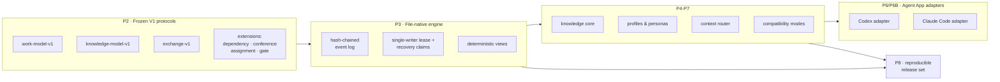

<div align="center">

# TCRN Workflow

### Vos agents IA disent « c'est fait ». Ce cadre les oblige à le prouver.

**Une livraison gouvernée pour les agents IA — chaque capacité est une revendication vérifiée par la machine, pas une promesse.**

[English](./README.md) · [简体中文](./README.zh-CN.md) · [日本語](./README.ja.md) · [한국어](./README.ko.md) · Français

   

    

[Pourquoi ce projet existe](#pourquoi-ce-projet-existe) · [Est-ce fait pour vous](#est-ce-fait-pour-vous) · [Ce que vous obtenez](#ce-que-vous-obtenez) · [Démarrage rapide](#démarrage-rapide) · [Réponses directes](#réponses-directes) · [Licence](#licence)

`Verified claims: 65 (hygiene 13 · inertness 13 · runtime 39)`

</div>

---

> **Toute l'idée en une phrase :** chaque garantie que ce cadre énonce est inscrite dans un registre lisible par machine, liée à un test que vous pouvez exécuter vous-même sur votre propre machine — et dès qu'une garantie cesse d'être vraie, **la compilation échoue**.

## Pourquoi ce projet existe

Faire écrire du code à un agent IA est devenu facile. Obtenir **une raison de croire ce qu'il vous dit** ne l'est pas.

Si vous avez travaillé avec des agents, vous avez rencontré les trois :

1. **« Faites-moi confiance, j'ai testé. »** L'agent dit que les tests passent. Ce que vous avez réellement, c'est une ligne de texte dans une fenêtre de chat. Rien ne relie ce que le workflow *prétend* garantir à ce que son code *impose réellement* — et à mesure que le code évolue, la revendication se périme en silence.
2. **Un historique qui s'évapore.** Les décisions vivent dans une conversation défilée et des fichiers mutables. Quand quelque chose casse à deux heures du matin, il n'y a rien à rejouer, rien à comparer, rien à remettre à un relecteur.
3. **Des installations à l'aveugle.** Une compétence ou un workflow arrive d'un dépôt, et rien ne prouve que les octets que vous allez exécuter sont ceux que quelqu'un a réellement relus.

TCRN Workflow ferme ces trois brèches — en traitant la livraison pilotée par agents comme on traite une release critique pour la sécurité :

- **Chaque capacité est une revendication dans un registre**, et chaque revendication est liée à un nom d'erreur stable (*reason code*) prouvé par un test qui s'exécute hors ligne.
- **Chaque modification de votre espace de travail est une entrée dans un journal inviolable** — chaque entrée est chaînée cryptographiquement à la précédente, de sorte que l'historique ne peut être que complété, jamais réécrit discrètement.
- **Chaque release peut être reconstruite octet pour octet** et confrontée aux empreintes publiées.

Une seule règle tient l'ensemble, et c'est la partie que l'on croit le moins avant de l'avoir essayée : **la surdéclaration est un échec de compilation, pas une question de style.** Changez ce que couvre une revendication sans la reprouver, et la chaîne s'arrête.

## Est-ce fait pour vous

| | |
| --- | --- |
| ✅ **Oui, si** | vous faites travailler des agents sur des sujets à conséquences — code de production, livraison régulée ou auditée, passages de relais multi-agents où plus personne ne se souvient qui a décidé quoi. Vous voulez un artefact qu'un relecteur peut *vérifier*, pas une transcription qu'il doit *croire*. Et vous voulez que tout reste sur votre machine : pas de base de données, pas de démon, pas de réseau, pas de télémétrie. |
| ❌ **Probablement pas, si** | vous voulez un assistant conversationnel sans configuration, vous avez besoin de synchronisation cloud ou d'un tableau de bord hébergé, ou votre travail est assez exploratoire pour qu'une piste d'audit en ajout seul soit une friction plutôt qu'une valeur. La rigueur ici n'est pas gratuite — c'est un échange délibéré : du confort contre des preuves. |

## Ce que vous obtenez

| Capacité | Ce que cela signifie concrètement |
| --- | --- |
| **Un espace de travail qui n'est que des fichiers** | Tout votre graphe de travail (Initiative → Epic → Story → Subtask) vit dans des fichiers JSON simples et canoniques avec une chaîne de hachage — pas de base de données, pas de démon. Vous pouvez l'auditer avec `cat` et `sha256sum`, et les exports sont reproductibles octet pour octet. |
| **Une commande, vingt portes** | `pnpm verify:p1` exécute toute la chaîne de vérification : format, lint, typage, build, ~40 fichiers de tests, matrice de confiance, politiques archive/SBOM/licences/vulnérabilités, liste blanche des sources, frontière hors ligne, analyse de confidentialité, durcissement CI, carte de vérification et preuve d'historique propre. La moindre surprise arrête la chaîne. |
| **Un registre de revendications lisible par machine** | `verification-map.yaml` lie 65 revendications — 13 framework-hygiene, 13 inertness-proof, 39 runtime-capability — à des reason codes observables. Si le sujet d'une revendication change, sa preuve doit être rejouée. |
| **Des gardes qui prouvent qu'ils mordent encore** | `pnpm guard-check` retire par mutation chaque garde enregistrée du code source et exige que le test qui la couvre passe au rouge — 12 gardes, vérifiées avant chaque push. Une protection dont la disparition ne serait remarquée par personne n'est pas une protection. |
| **Des délibérations au dossier** | Conférences et portes de décision sont ajoutées au même journal inviolable. Une porte non satisfaite *bloque* le passage de son élément de travail à `done` (`WORKSPACE_GATE_PENDING`) — à la commande, puis de nouveau au rejeu — et clore une conférence distille chaque décision en une candidate de connaissance qui y renvoie. |
| **Chaque décision reçoit un nom** | Activez l'attestation d'acteur et chaque modification ultérieure doit déclarer qui a agi — le moteur et son rejeu échouent tous deux en fermeture sur tout événement dépourvu d'identifiant d'acteur. Les espaces de travail qui ne l'activent jamais restent identiques octet pour octet. |
| **Une activation réversible** | Trois étapes explicites transforment le bundle Claude Code inerte en une session gouvernée active, et la désinstallation restaure `.claude/settings.json` octet pour octet — observé sur un hôte réel, aux côtés d'un hook préexistant de l'utilisateur qui continue de fonctionner. Toute erreur du hook de session ressort proprement en Claude Code ordinaire. Rien sous `~/.claude` n'est jamais nommé ni écrit. |
| **Des sauvegardes qui se prouvent elles-mêmes** | Un instantané produit un manifeste déterministe fichier par fichier ; le runbook boucle instantané → effacement → restauration à l'octet près, et les deux modes d'échec qui comptent (restauration partielle ou déplacée) échouent en fermeture. |
| **Deux hôtes, une seule vérité** | Les adaptateurs Codex et Claude Code partagent une mécanique neutre identique octet pour octet, avec une empreinte de parité inter-hôtes prouvée. Les deux ne génèrent par défaut que des données de gabarit non installées ; **Claude Code peut ensuite être activé, Codex non** — voir « Statut, honnêtement ». |
| **Hors ligne par construction** | Le mode développement installe une garde réseau au niveau du processus et n'émet aucune télémétrie. La porte de confidentialité balaie chaque octet suivi, tout l'historique git atteignable et l'archive de release à la recherche d'identifiants personnels et de chemins machine. |
| **Des releases que vous pouvez redériver** | Une release est une étiquette immuable plus un ensemble d'artefacts reproductibles, reconstruits et comparés octet par octet par `pnpm verify:p8`. Les consommateurs externes vérifient via le projet compagnon `tcrn-workflow-helper`, dont l'empreinte est publiée là où vous pouvez la contrôler indépendamment. |

<details>
<summary><b>Cinq termes, en clair</b> (cliquer pour déplier)</summary>

- **Échec en fermeture (fail-closed)** — dès que quelque chose paraît anormal, le système s'arrête avec un nom d'erreur stable plutôt que de deviner et de continuer. Il n'y a pas d'avertissements qui défilent : soit vert, soit arrêté.
- **Chaîne de hachage** — chaque entrée du journal contient l'empreinte de la précédente. Réécrire l'historique changerait les empreintes, et le rejeu le refuserait.
- **reason code** — un nom d'erreur stable et lisible par machine (par exemple `WORKSPACE_GATE_PENDING`). Outils et agents peuvent brancher dessus ; le texte d'erreur en prose n'est jamais le contrat.
- **Hermétique** — un test qui s'exécute entièrement à partir d'entrées locales et épinglées. Mêmes entrées, même résultat, sur n'importe quelle machine.
- **CAS / version attendue** — chaque écriture déclare sur quelle version elle croit s'appuyer. Si quelqu'un a écrit avant, l'écriture est refusée au lieu d'écraser en silence.

</details>

## Démarrage rapide

Il vous faut la chaîne d'outils épinglée : **Node 24.16.0** et **pnpm 11.3.0**. Les scripts de cycle de vie des dépendances restent désactivés — rien n'exécute de code à l'installation.

```sh
# 1. Install the pinned dev dependencies (explicit, frozen, script-free)
pnpm install --offline --frozen-lockfile --ignore-scripts

# 2. Watch the framework prove itself (20 gates, fully offline)
pnpm verify:p1

# 3. Build, then drive the governed CLI
pnpm build
node scripts/tcrn-workflow.mjs workspace --help
```

Commandes gouvernées typiques — toutes locales, sans réseau, sans base de données :

```sh
# validate a workspace and materialize its deterministic views
node scripts/tcrn-workflow.mjs workspace validate --workspace <dir> --now <iso-instant>

# create and transition work records with version-checked writes
node scripts/tcrn-workflow.mjs work-create ...
node scripts/tcrn-workflow.mjs work-transition ...

# knowledge core: metadata-first reads, explicit body access, promotion CAS
node scripts/tcrn-workflow.mjs knowledge-list ...
```

Chaque modification exige un chemin d'espace de travail explicite, un horodatage RFC 3339 strict et une version attendue — la sûreté concurrente est imposée par le moteur, pas par convention.

## L'architecture en soixante secondes



Des protocoles gelés à la base, un moteur natif fichiers au-dessus, des couches de capacités par-dessus, et des adaptateurs d'hôtes au sommet — inertes jusqu'à l'activation, que seul Claude Code possède. Les protocoles sont en ajout seul : `work-model-v1` est gelé, et chaque extension s'enregistre sans toucher aux schémas acceptés.

## Réponses directes

### Pourquoi un seul rédacteur à la fois, alors que les agents adorent le parallélisme

Parce que la couche de stockage et la couche de raisonnement répondent à des questions différentes :

1. **La couche de stockage est mono-rédacteur par conception.** Une chaîne de hachage n'a qu'un seul successeur véridique par événement — des rédacteurs parallèles corrompraient la chaîne ou exigeraient un protocole de consensus qui détruirait la propriété « auditable avec `cat` et `sha256sum` ». Le moteur impose donc un rédacteur à la fois via un bail exclusif doublé d'un protocole de reprise sur disque : le bail d'un rédacteur planté est mis en quarantaine et récupéré en fermeture, et chaque acquisition est vérifiée en version.
2. **Le parallélisme vit au-dessus de la couche de stockage.** Lancez autant de fils sous-agents indépendants et à contexte neuf que vous voulez — ouvriers d'implémentation, comités de relecture, vérificateurs adverses. Leurs conclusions reviennent sous forme de données ; un fil canonique détient l'autorité de décision et écrit le registre. Vous obtenez le débit du parallélisme *et* une lignée de décisions linéaire et auditable.
3. **La gouvernance exige un récit sérialisable.** La chaîne donne un ordre des décisions linéaire et inviolable, et — dès qu'un espace de travail active l'attestation d'acteur — chaque décision est liée à un acteur déclaré et auditable. C'est une identité *déclarée* inscrite dans un registre ordonné, pas une affirmation d'identité authentifiée ni de vérité d'horloge murale. Une nuée de fils pairs modifiant un état partagé n'a ni l'ordre ni le lien.

<details>
<summary><b>Les tests derrière cette réponse</b> (tous dans <code>tests/p3-file-engine.test.mjs</code>, exécutés par <code>pnpm verify:p3</code>)</summary>

- *Le plantage de bail et la contention sur reprise sont récupérables et mono-rédacteur* — un rédacteur est planté en pleine création, son bail périmé est mis en quarantaine, les concurrents s'affrontent et exactement un l'emporte ; le perdant échoue en fermeture avec un reason code stable.
- *Éviction du créateur retardé* — un créateur de bail suspendu dont le répertoire a été récupéré doit observer la reprise active et échouer en fermeture (`WORKSPACE_LEASE_INVALID`) au lieu de coloniser la nouvelle génération. Trouvé et corrigé sur Linux ext4 en CI réelle, puis prouvé par un test déterministe.
- *Injection de SIGKILL à chaque point effectif du cycle de vie* — l'inventaire des pannes du moteur est découvert à partir d'opérations réelles, et un vrai `SIGKILL` est délivré à chaque point ; la reprise doit converger vers un état propre, sans résidu.
- *64 permutations réelles d'ordre d'insertion* produisent des index, listes et points de contrôle identiques octet pour octet — le déterminisme est prouvé, pas supposé.
- 4 cas de concurrence, 57 cas négatifs et une matrice d'attaques du système de fichiers (liens symboliques, liens physiques, fichiers spéciaux, courses au remplacement) complètent la preuve.

</details>

### Pourquoi des fichiers plutôt qu'une base de données

Parce que la frontière de confiance doit rester inspectable avec des outils standards. Chaque enregistrement est du JSON canonique (clés triées, un LF final), chaque événement porte ses `priorHash`/`eventHash`, et tout le magasin se vérifie en quelques lignes dans n'importe quel langage. Une base de données ajouterait un démon, un format binaire et une dépendance de confiance implicite — autant de passifs pour un cadre dont la promesse centrale est *« vous pouvez tout vérifier vous-même, hors ligne »*.

### Pourquoi hors ligne d'abord et échec en fermeture

Un cadre d'agents qui atteint le réseau en silence est un canal d'exfiltration qui n'attend qu'à servir. Le mode développement installe une garde réseau au niveau du processus ; la chaîne de vérification prouve que le code du projet n'a aucun chemin réseau implicite ; les seules étapes réseau (acquisition des dépendances, amorçage CI) sont explicites et épinglées. Échouer en fermeture signifie que chaque validateur s'arrête avec un reason code stable au premier octet inattendu.

### Que signifie « active » pour l'adaptateur Claude Code

Qu'une véritable session Claude Code reçoit un **résumé en lecture seule** de l'autorité qui gouverne l'espace de travail, et rien au-delà. Cela a été mesuré et non supposé : on a demandé à une session une valeur qui n'existait que dans ce résumé, tous les outils désactivés, afin qu'elle n'ait pas pu la lire sur le disque.

Tout le reste est délibérément laissé dehors. Le framework n'arbitre **pas** l'usage des outils de l'hôte, ne supprime ni ne réécrit **aucune** réponse, n'écrit **jamais** sous `~/.claude`, ne promeut **pas** de connaissance sans action explicite et n'orchestre **pas** les sessions. Un hook qui échoue n'imprime rien et la session continue en Claude Code ordinaire — le seul endroit où ce dépôt échoue en s'ouvrant plutôt qu'en se fermant, parce qu'une couche de gouvernance capable de casser une session est pire qu'une couche qui se tait.

Codex n'a pas d'équivalent. Son adaptateur génère et simule ; il n'installe pas, et rien ici n'écrit sur un hôte Codex.

### Comment une release devient-elle digne de confiance

Une release est une étiquette annotée immuable plus un ensemble d'artefacts reproductibles (archive source canonique, SBOM, provenance, sommes de contrôle, notes), reconstruits et comparés octet par octet par `pnpm verify:p8`. Les consommateurs externes vérifient via le compagnon **tcrn-workflow-helper** : un amorceur sans dépendances, dont le SHA-256 est publié là où vous pouvez le contrôler indépendamment du téléchargement, et qui refuse toute release dont les octets ne correspondent pas aux empreintes compilées en lui — avant qu'une seule ligne de Workflow ne s'exécute.

## Des chiffres vérifiés, pas promis

Chaque chiffre ci-dessous est imposé par une porte — si l'un dérive, une compilation échoue quelque part.

- **20 portes** dans la chaîne `verify:p1`, chacune avec un reason code terminal stable.
- **65 revendications vérifiées par la machine** dans `verification-map.yaml` — 13 framework-hygiene, 13 inertness-proof, 39 runtime-capability. Le badge de revendications ci-dessus est analysé et confronté au registre à chaque exécution.
- **12 gardes enregistrées**, chacune prouvée encore mordante en la retirant par mutation et en observant son test passer au rouge.
- **~40 fichiers de tests hermétiques**, dont une injection de panne `SIGKILL` réelle, des preuves de déterminisme à 64 permutations dans trois couches indépendantes, et une matrice d'attaques du système de fichiers.
- **1 preuve phare de bout en bout** (`pnpm verify:e2e`) — un rejeu hermétique de la boucle gouvernée complète (initiative → epic → story → gate → conference → distill → promote → trace), chaque commande du tutoriel exécutée mot pour mot.
- **19 entrées au registre public des exigences AOS** (11 vérifiées par fixture, 8 spécifiées) — la maturité est consignée ligne par ligne, jamais gonflée.
- **Porte de confidentialité** sur les 250 fichiers sources de la liste blanche (une liste à correspondance exacte — un fichier ajouté ou retiré fait échouer la porte), chaque objet git atteignable et l'archive de release.

<details>
<summary><b>Référence complète des cibles de vérification</b> (cliquer pour déplier)</summary>

| Cible | Ce qu'elle prouve |
| --- | --- |
| `verify:p1` | La chaîne complète de 20 portes sur un arbre committé propre. |
| `verify:p2` | Contrats de protocoles V1 gelés, vecteurs déterministes, tests négatifs/de propriétés, registre d'exigences, schémas clos. |
| `verify:p3` | Espace de travail natif fichiers : baux/CAS, reprise après plantage, quarantaine, migrations, vues déterministes, matrice d'attaques du système de fichiers. |
| `verify:p4` / `verify:p4:knowledge` | Budgets du cycle de vie des artefacts, caviardage, apply/restore d'archive jetable ; séparation métadonnées/corps du noyau de connaissances, CAS de promotion, parité à 64 permutations. |
| `verify:p5` | Modèle de confiance de profil générique clos, empreintes de politique effective, graphe de démarrage à froid, huit personas Core Reference inertes. |
| `verify:p6` / `verify:p6:adapter` / `verify:p6b` | Contrôles de portée/risque/budget du routeur de contexte et corpus hostile ; pont de l'adaptateur Codex ; adaptateur Claude Code (bundle de gabarit à quatre fichiers, fragment de settings réversible, rejet des chemins interdits, repli CLAUDE.md, empreinte de parité inter-hôtes). |
| `verify:p7` / `verify:p7:compatibility` | Échange canonique, manifeste de compatibilité, plancher anti-retour, plans déterministes d'import/point de contrôle/repli. |
| `verify:p8` | Candidat de release reproductible : reconstruction de l'archive source et comparaison octet par octet, SBOM, provenance, sommes de contrôle, bundle clos de six fichiers, matrice négative de confiance externe. |
| `verify:privacy` | Aucun identifiant personnel ni chemin machine dans le moindre octet suivi, objet git ou archive. |
| `verify:isolated` | La même chaîne P1 depuis une matérialisation hermétique des dépendances (contrôlée en CI). |

Le mode développement est hors ligne avec une garde réseau au niveau du processus et zéro télémétrie. L'espace de travail compte exactement trois dépendances de développement (`ajv@8.17.1` pour la parité de schémas Draft 2020-12 hors ligne, `typescript@5.9.3` comme porte de typage épinglée, `@types/node@24.13.2`), chacune acquise via une frontière de registre explicite avec scripts de cycle de vie désactivés. P1 conserve quatre frontières externes explicites : la continuité de `rootVersion` entre invocations requiert un plancher externe ; il n'y a pas de bac à sable réseau au niveau du système ; aucune analyse externe fraîche d'avis de sécurité n'est effectuée hors ligne ; l'ensemble d'expressions régulières de confidentialité est un contrôle de politique ciblé, pas un DLP généraliste.

</details>

## Organisation du dépôt

| Chemin | Contenu |
| --- | --- |
| `packages/core/` | Moteur, adaptateurs, noyau de connaissances, profils, routeur, échange (TypeScript, contrôlé par le compilateur épinglé). |
| `schemas/` · `specs/` | Schémas de protocoles V1 gelés (clos, parité Draft 2020-12 prouvée) et leurs spécifications normatives. |
| `tests/` | La suite de preuves hermétique. |
| `scripts/` | CLI gouvernée, tâches de vérification, vérificateur de gardes, générateur d'artefacts de preuve, portes de confidentialité et de politique. |
| `fixtures/` | Vecteurs de protocole déterministes, corpus hostiles, références du registre d'exigences. |
| `docs/` | Architecture, confiance de release, versionnage, notes de version. |
| `verification-map.yaml` | Le registre des revendications — commencez ici pour voir ce qui est réellement prouvé. |

## Ce que ce cadre ne gouverne pas

La plupart des projets cachent leurs limites. Les nôtres sont porteuses — la discipline même qui prouve les revendications ci-dessus exige aussi de dire précisément où elles s'arrêtent. Ces quatre frontières sont écrites parce qu'un lecteur attentif a tout de même lu les deux premières trop largement :

- **L'arbre source de votre produit.** Le bail mono-rédacteur gouverne la chaîne d'événements de l'espace de travail. Deux agents modifiant `src/foo.ts` en même temps ne sont protégés par rien ici — utilisez l'isolation par worktree, ou faites passer ces modifications par l'espace de travail vous-même.
- **La chaîne d'approvisionnement de votre produit.** La garde réseau couvre le processus qui exécute les commandes projet P1. Le shell de votre propre agent, et la construction de votre produit, sont en dehors. Zéro dépendance d'exécution est une propriété de *ce* cadre, pas de ce que vous construisez avec.
- **La correction de votre code.** Le registre garantit qu'une capacité *déclarée* conserve une preuve exécutable, et que la surdéclaration fait échouer la compilation. Il ne peut pas vous dire que l'ensemble des revendications est le bon. Choisir quoi revendiquer relève irréductiblement du jugement humain, et aucune provenance ne s'y substitue.
- **L'identité et le temps.** L'attestation d'acteur enregistre un identifiant d'acteur *déclaré*, non authentifié, et la chaîne prouve l'ordre, non la vérité de l'horloge murale. La chaîne est inviolable de manière détectable en son sein ; elle n'est pas ancrée en dehors du système de fichiers où elle réside.

## Statut, honnêtement

- `0.1.0-rc.6` est un **candidat de pré-version**. L'API publique n'est pas encore stable.
- **L'activation de Claude Code est active et a été observée sur un hôte réel**. Les étapes 1 à 3 installent, activent et désinstallent face à Claude Code `2.1.201` ; neuf observations ont été consignées, dont le fait que le résumé d'autorité parvient réellement au contexte du modèle. Une fois active, elle injecte un résumé en lecture seule au démarrage de la session, rien de plus — ce qu'elle s'interdit délibérément figure dans la liste des limites ci-dessus. Reçu : `docs/verification/host/claude-code.json`.
- **Codex s'arrête à la lecture seule**. `adapter-generate`, `-validate`, `-simulate`, `-fallback` et `-rollback-plan` sont un outillage réel, déterministe et neutre vis-à-vis de l'hôte. Il n'existe ni installateur ni activation Codex, donc rien ici n'écrit sur un hôte Codex.
- **Échelle**. Un espace de travail devient perceptiblement plus lent dès **quelques milliers** d'événements, et une commande unique franchit la seconde vers **6 600** (extrapolé d'une mesure sur Apple M3 ; `docs/verification/2026-07-20-event-chain-ceiling-samples.json`). Cela touche les lectures autant que les écritures. **Découpez les espaces de travail par projet ou par initiative** plutôt que de faire tourner une organisation entière sur une seule chaîne.
- `supportedAosReleases` est vide : aucune compatibilité AOS externe n'est revendiquée.
- Le mode release exige que le compagnon accepte les octets : son empreinte d'amorceur est publiée indépendamment, et les empreintes de release acceptées y sont compilées.

## Contribution, support, sécurité

- Questions d'usage → GitHub Discussions. Défauts reproductibles → Issues (voir `SUPPORT.md`).
- Rapports de sécurité → signalement privé de vulnérabilité selon `SECURITY.md`.
- Les contributions doivent garder toutes les portes au vert — voir `CONTRIBUTING.md`. Le critère est : *si votre revendication n'est pas dans la carte de vérification avec une preuve qui passe, elle n'est pas revendiquée.*

## Licence

[Apache-2.0](./LICENSE)
