[English](./README.md) | [简体中文](./README.zh-CN.md) | [日本語](./README.ja.md) | [한국어](./README.ko.md) | **Français**

# TCRN Workflow

**Un cadre déterministe et hors-ligne d'abord pour le travail gouverné des agents IA — où chaque capacité est une affirmation vérifiée par la machine, pas une promesse.**

`Statut : 0.1.0-rc.4 (candidat de pré-version)` · `Licence : Apache-2.0` · `Node 24.16.0` · `pnpm 11.3.0` · `Affirmations vérifiées : 65`

---

## Pourquoi ce projet existe

On demande de plus en plus aux agents IA de *livrer* : planifier le travail, écrire du code, relire des changements, produire des versions. Mais la plupart des workflows d'agents partagent trois faiblesses structurelles :

1. **Des affirmations invérifiables.** « L'agent l'a testé » signifie en général une ligne de journal, pas une preuve. Il n'existe aucun lien vérifiable par machine entre ce qu'un workflow *dit* garantir et ce que son code *impose* réellement.
2. **Un état non reproductible.** Le travail piloté par conversation laisse son historique dans des journaux de discussion opaques et des bases de données mutables. Quand quelque chose tourne mal, il n'existe aucun enregistrement d'événements déterministe à rejouer, auditer ou remettre à un relecteur.
3. **Un angle mort de chaîne d'approvisionnement.** Les compétences et workflows d'agents s'installent depuis des dépôts sans identité de version, sans signature, sans plancher anti-retour-arrière, et sans moyen de prouver que les octets exécutés sont les octets relus.

TCRN Workflow a été construit pour combler ces trois lacunes à la fois. Il traite la livraison pilotée par agents avec la même rigueur qu'une version logicielle critique : **chaque capacité correspond à un code de raison stable prouvé par un test hermétique hors ligne**, chaque mutation d'espace de travail est un événement en append-only chaîné par hachage, et chaque version est un ensemble d'artefacts immuable, reproductible et signé.

## Ce que vous obtenez

| Capacité | Ce que cela signifie en pratique |
| --- | --- |
| **Espace de travail déterministe natif fichiers** | Un graphe de travail local à événements (Initiative → Epic → Story → Subtask) stocké en fichiers JSON canoniques avec chaîne de hachage — pas de base de données, pas de démon, exports reproductibles à l'octet près. |
| **Chaîne de vérification fail-closed** | Une commande (`pnpm verify:p1`) exécute 20 portes : format, lint, vérification de types, build, ~40 fichiers de tests, matrice de confiance, politiques d'archive/SBOM/licence/vulnérabilités, liste d'autorisation des sources, frontière hors ligne, analyse de confidentialité, durcissement CI, carte de vérification et preuve d'historique propre. Tout imprévu arrête la chaîne. |
| **Registre d'affirmations lisible par machine** | `verification-map.yaml` lie 65 affirmations de capacités à des codes de raison observables. Si le sujet d'une affirmation change, sa preuve doit être rejouée — la surenchère est un échec de build, pas une question de style. |
| **Délibération, portes et distillation gouvernées** | Neuf verbes CLI gouvernés animent des conférences de pré-engagement et des portes de décision sous forme d'événements additifs chaînés par hachage, et la clôture d'une conférence distille chaque décision du procès-verbal en une fiche de connaissance qui la rétro-lie. L'application des portes est fail-closed : une porte en attente bloque la transition de son élément de travail vers `done` (`WORKSPACE_GATE_PENDING`, au verbe puis de nouveau au rejeu), et une porte n'atteint `satisfied` que face à une preuve de procès-verbal de conférence résoluble. |
| **Attestation d'acteur, imposée à la frontière** | L'ajout de l'événement à sens unique `attestation.actor.enabled` rend un identifiant d'acteur obligatoire sur chaque mutation ultérieure — l'ajout en direct comme le rejeu échouent fail-closed `WORKSPACE_ACTOR_REQUIRED` sur tout événement qui l'omet. Les espaces de travail qui ne l'activent jamais restent identiques à l'octet près ; une fois activée, elle ne peut plus être désactivée. |
| **Échelle d'activation optionnelle** | Trois étapes explicites et réversibles à l'octet transforment le lot Claude Code inerte en une session gouvernée active : installer le gabarit à quatre fichiers (étape 1), fusionner exactement un hook `SessionStart` fail-open (étape 2) et rendre l'unique persona consultatif Verity dans un budget de 1024 octets (étape 3). Le gestionnaire est la seule surface fail-open autorisée — toute erreur sort en 0 comme un Claude Code ordinaire — et rien sous `~/.claude` n'est jamais nommé ni écrit. |
| **Sauvegarde par instantané et restauration hermétique** | Un `snapshot-manifest` tenu sous bail émet un manifeste déterministe par fichier ; le runbook effectue un aller-retour instantané → effacement → restauration identique à l'octet près au chemin d'origine, les deux modes d'échec doctrinaux (restauration partielle ou relocalisée) échouant fail-closed. Un niveau git tier-2 optionnel ne sert que de témoin d'intégrité. |
| **Adaptateurs Agent App bi-hôtes** | Codex et Claude Code sont les deux hôtes officiellement pris en charge en V1, partageant une mécanique neutre identique à l'octet près, prouvée par un condensat de parité inter-hôtes. Les deux adaptateurs sont par défaut des **candidats inertes en simulation** : ils ne génèrent que des données de gabarits non installés, et la prise en charge d'hôte en production ne s'atteint que par l'échelle d'activation optionnelle et gouvernée ci-dessus. |
| **Hors ligne d'abord, confidentialité propre** | Le mode développement impose un garde réseau au niveau du processus Node et zéro télémétrie. La porte de confidentialité analyse chaque octet suivi, tout l'historique git accessible et l'archive de version à la recherche d'identifiants personnels et de chemins machine. |
| **Confiance de version signée** | Les versions sont liées par identité de tag (commit, tree, tag object) et vérifiées en externe par un contrat de racine de confiance Ed25519 — voir le dépôt compagnon `tcrn-workflow-helper`. |

## Démarrage rapide

Nécessite la chaîne d'outils épinglée : **Node 24.16.0** et **pnpm 11.3.0** (les scripts de cycle de vie des dépendances restent désactivés).

```sh
# 1. Acquérir l'unique dépendance de développement (explicite, gelée, sans scripts)
pnpm install --offline --frozen-lockfile --ignore-scripts

# 2. Exécuter la porte de vérification complète (hors ligne)
pnpm verify:p1

# 3. Construire, puis utiliser la CLI gouvernée
pnpm build
node scripts/tcrn-workflow.mjs workspace --help
```

Commandes gouvernées typiques (tout en local, sans réseau, sans base de données) :

```sh
# valider un espace de travail et matérialiser ses vues déterministes
node scripts/tcrn-workflow.mjs workspace validate --workspace <dir> --now <instant-iso>

# créer et faire évoluer des enregistrements de travail avec contrôle CAS des versions
node scripts/tcrn-workflow.mjs work-create ...
node scripts/tcrn-workflow.mjs work-transition ...

# noyau de connaissances : lecture métadonnées d'abord, accès explicite au corps, promotion CAS
node scripts/tcrn-workflow.mjs knowledge-list ...
```

Les commandes de mutation exigent un chemin d'espace de travail explicite, un horodatage RFC 3339 strict et une version attendue — la concurrence optimiste est imposée par le moteur, pas par convention.

## L'architecture en un coup d'œil

```mermaid
flowchart LR
    subgraph Protocols["P2 · Protocoles V1 gelés"]
        WM[work-model-v1]
        KM[knowledge-model-v1]
        EX[exchange-v1]
        XT[extensions :<br/>dependency · conference<br/>assignment · gate]
    end
    subgraph Engine["P3 · Moteur natif fichiers"]
        EV[journal d'événements<br/>chaîné par hachage]
        LS[bail à écrivain unique +<br/>revendications de reprise]
        VW[vues déterministes]
    end
    subgraph Layers["P4-P7"]
        KC[noyau de connaissances]
        PF[profils & personas]
        CR[routeur de contexte]
        CM[modes de compatibilité]
    end
    subgraph Hosts["P6/P6B · Adaptateurs Agent App (inertes)"]
        CX[Adaptateur Codex]
        CL[Adaptateur Claude Code]
    end
    REL[P8 · ensemble de version<br/>signé et reproductible]
    Protocols --> Engine --> Layers --> Hosts
    Engine --> REL
    Layers --> REL
```



Les protocoles n'évoluent que par ajout : `work-model-v1` est gelé, et chaque extension (dependency, conference, assignment, gate) s'enregistre sans toucher aux schémas acceptés.

## Questions-réponses de conception

### Pourquoi un fil de conversation canonique unique avec des fils de sous-agents, plutôt que du multithreading ?

C'est la question la plus fréquente, et la réponse a trois niveaux :

1. **La couche de stockage est à écrivain unique par conception.** L'espace de travail est un journal d'événements append-only chaîné par hachage sur un simple système de fichiers. Une chaîne de hachage n'a exactement qu'un successeur véridique par événement — des écrivains parallèles corrompraient la chaîne, ou exigeraient un protocole de consensus qui détruirait la propriété « auditable avec `cat` et `sha256sum` ». Le moteur impose donc **un seul écrivain à la fois** via un bail exclusif et un protocole de revendication de reprise sur disque : le bail d'un écrivain planté est mis en quarantaine et récupéré en fail-closed, et chaque acquisition est contrôlée par CAS.
2. **Le parallélisme du raisonnement vit au-dessus de la couche de stockage.** La concurrence est partout — mais sous forme de *fils de sous-agents indépendants à contexte neuf* (exécutants d'implémentation, comités de relecture multi-rôles, vérificateurs adverses) dont les conclusions reviennent comme des données. Un fil canonique détient l'autorité de décision et écrit l'enregistrement ; N sous-fils explorent, relisent et réfutent en parallèle sans contaminer leurs contextes ni se disputer l'état. Vous obtenez le débit du parallélisme avec une lignée de décision linéaire et auditable.
3. **La gouvernance exige un récit sérialisable.** La chaîne à écrivain unique fournit un *ordre* linéaire et infalsifiable des décisions, et lier chaque décision à un acteur responsable est désormais imposé : dès qu'un espace de travail active l'extension d'attestation d'acteur, chaque événement admis par la chaîne doit déclarer un identifiant d'acteur — le moteur et sa relecture échouent tous deux en fermeture sur tout événement qui en omet un — de sorte qu'un espace de travail attesté lie chaque décision à un acteur déclaré et auditable. Il s'agit d'une identité déclarée inscrite dans l'enregistrement ordonné, non d'une affirmation d'identité authentifiée ni de vérité d'horloge murale ; les espaces de travail qui laissent l'attestation désactivée se comportent exactement comme avant et font reposer la responsabilité sur les reçus du fil de gouvernance. Un essaim de fils pairs mutant un état partagé n'a ni l'ordre ni la liaison.

**Les tests derrière cette réponse** (tous dans `tests/p3-file-engine.test.mjs`, exécutés par `pnpm verify:p3`) :

- *Le plantage de création de bail et la contention des revendications de reprise sont récupérables et à écrivain unique* — un écrivain est planté en pleine création, son bail périmé est mis en quarantaine, les concurrents s'affrontent et exactement un gagne ; le perdant échoue fermé avec un code de raison stable.
- *Éviction du créateur retardé* — un créateur de bail en pause dont le répertoire a été récupéré doit observer la revendication de reprise active et échouer fermé (`WORKSPACE_LEASE_INVALID`) au lieu de coloniser la nouvelle génération. Cela protège de la réutilisation des tuples d'inodes sur les systèmes de fichiers qui recyclent les inodes (découvert et corrigé sur Linux ext4 via la vraie CI, puis fixé par un test déterministe).
- *Injection de SIGKILL réels à chaque point de cycle de vie effectif* — l'inventaire des fautes est découvert à partir d'opérations réelles, et un vrai `SIGKILL` est délivré à chaque point ; la reprise doit converger vers un état propre sans résidu.
- *64 permutations réelles d'ordre d'insertion* produisent des index, listes et points de contrôle identiques à l'octet — le déterminisme est prouvé, pas supposé.
- 4 cas de concurrence, 57 cas négatifs et une matrice d'attaques du système de fichiers (liens symboliques, liens durs, fichiers spéciaux, courses au remplacement) complètent la preuve.

### Pourquoi des fichiers plutôt qu'une base de données ?

Parce que la frontière de confiance doit être inspectable avec des outils standard. Chaque enregistrement est du JSON canonique (clés triées, un LF final), chaque événement porte son `priorHash`/`eventHash`, et tout le magasin peut être vérifié dans n'importe quel langage en quelques lignes. Une base de données ajouterait un démon, un format binaire et une dépendance de confiance implicite — autant de passifs pour un cadre dont la promesse centrale est *« vous pouvez tout vérifier vous-même, hors ligne »*.

### Pourquoi hors ligne d'abord et fail-closed ?

Un cadre d'agents qui atteint silencieusement le réseau est un canal d'exfiltration en puissance. Le mode développement installe un garde réseau au niveau du processus ; la chaîne de vérification prouve que le code du projet n'a aucun chemin réseau implicite ; les seules étapes réseau (acquisition des dépendances, amorçage CI) sont explicites et épinglées. Fail-closed signifie que chaque validateur lève un code de raison stable au premier octet inattendu — pas d'avertissements qui défilent, seulement vert ou arrêt.

### Pourquoi les adaptateurs Codex et Claude Code sont-ils des « candidats inertes » ?

Parce que revendiquer une prise en charge d'hôte en production avant qu'une route de version gouvernée ne l'accepte serait une surenchère — exactement le mode d'échec que ce cadre existe pour empêcher. Les adaptateurs génèrent des lots de gabarits déterministes non installés (prouvés à l'octet près, y compris un fragment de hook `.claude/settings.json` réversible qui n'écrase jamais le contenu utilisateur et rejette tout chemin `.claude` de niveau utilisateur). L'activation est une décision distincte et gardée.

### Comment une version est-elle digne de confiance ?

Une version est un tag annoté immuable plus un ensemble d'artefacts reproductible (archive source USTAR canonique, SBOM, manifeste, provenance, sommes de contrôle, notes), reconstruit et comparé à l'octet par `pnpm verify:p8`. Les consommateurs externes vérifient via le compagnon **tcrn-workflow-helper** : un manifeste et une politique de version signés Ed25519 avec un plancher d'époque anti-retour-arrière, validés par un amorceur sans dépendances avant l'exécution de tout code Workflow.

### Que prouvent réellement les tests — en chiffres ?

- **20 portes** dans la chaîne `verify:p1`, chacune avec un code de raison terminal stable.
- **~40 fichiers de tests** couvrant le moteur, le noyau de connaissances, le cycle de vie des artefacts, les profils, les personas, le routeur de contexte, les deux adaptateurs, l'échange, la compatibilité, le registre d'exigences, le candidat de version, la frontière de confidentialité, le générateur d'artefacts de preuve, la matrice de confiance, le magasin d'événements conférence/porte et l'application fail-closed des portes, l'attestation d'acteur, la sauvegarde et la restauration par instantané, l'échelle d'activation et la boucle gouvernée de bout en bout.
- **1 preuve phare de bout en bout** (`pnpm verify:e2e`) — un rejeu hermétique de la boucle gouvernée complète (initiative → epic → story → porte → conférence → distillation → promotion → traçage), chaque commande du tutoriel exécutée mot pour mot et chaque condensat produit tracé jusqu'à son producteur.
- **65 affirmations vérifiées par machine** dans `verification-map.yaml`.
- **Preuves de déterminisme à 64 permutations** dans trois couches indépendantes (ordres d'insertion du moteur, ordres de couches de profils, ordres d'entrée des adaptateurs).
- **Registre public d'exigences AOS à 19 lignes** (11 vérifiées par fixtures, 8 spécifiées) — la maturité est consignée ligne par ligne, jamais gonflée.
- **Porte de confidentialité** sur ~200 fichiers sources suivis, ~1 470 objets git, tout l'historique accessible et l'archive de version.

<details>
<summary><b>Référence complète des cibles de vérification</b> (cliquer pour déplier)</summary>

| Cible | Ce qu'elle prouve |
| --- | --- |
| `verify:p1` | La chaîne complète de 20 portes sur un arbre committé propre. |
| `verify:p2` | Contrats de protocoles V1 gelés, vecteurs déterministes, tests négatifs/de propriétés, registre d'exigences, schémas fermés. |
| `verify:p3` | Espace de travail natif fichiers : baux/CAS, reprise après plantage, quarantaine, migrations, vues déterministes, matrice d'attaques du système de fichiers. |
| `verify:p4` / `verify:p4:knowledge` | Budgets de cycle de vie des artefacts, caviardage, application/restauration d'archives jetables ; séparation métadonnées/corps du noyau de connaissances, promotion CAS, parité à 64 permutations. |
| `verify:p5` | Modèle de confiance des profils génériques fermé, condensats de politique effective, graphe de démarrage à froid, huit personas Core Reference inertes. |
| `verify:p6` / `verify:p6:adapter` / `verify:p6b` | Contrôles portée/risque/budget du routeur de contexte et corpus hostile ; pont de l'adaptateur Codex ; adaptateur Claude Code (lot de gabarits à quatre fichiers, fragment de réglages réversible, rejet des chemins interdits, repli CLAUDE.md, condensat de parité inter-hôtes). |
| `verify:p7` / `verify:p7:compatibility` | Échange canonique, manifeste de compatibilité, plancher anti-retour-arrière, plans déterministes d'import/point de contrôle/repli. |
| `verify:p8` | Candidat de version reproductible : reconstruction de l'archive source + comparaison à l'octet, SBOM, provenance, sommes de contrôle, lot fermé de six fichiers, matrice négative de confiance externe. |
| `verify:privacy` | Aucun identifiant personnel ni chemin machine dans aucun octet suivi, objet git ou archive. |
| `verify:isolated` | La même chaîne P1 depuis une matérialisation hermétique des dépendances (portée CI). |

Le mode développement est hors ligne avec un garde réseau de processus et zéro télémétrie. L'espace de travail n'a qu'une seule dépendance de développement (`ajv@8.17.1`, pour la preuve de parité de schémas Draft 2020-12 hors ligne), acquise via une frontière de registre explicite avec scripts de cycle de vie désactivés. P1 conserve quatre frontières externes explicites : la continuité du `rootVersion` entre invocations exige un plancher externe ; il n'y a pas de bac à sable réseau au niveau OS ; aucune analyse d'avis externe fraîche n'est effectuée hors ligne ; le jeu d'expressions régulières de confidentialité est un contrôle de politique ciblé, pas un DLP généraliste.

</details>

## Organisation du dépôt

| Chemin | Contenu |
| --- | --- |
| `packages/core/` | Moteur, adaptateurs, noyau de connaissances, profils, routeur, échange (TypeScript, construit par le moteur de transformation de types Node épinglé). |
| `schemas/` · `specs/` | Schémas de protocoles V1 gelés (fermés, parité Draft 2020-12 prouvée) et leurs spécifications normatives. |
| `tests/` | La suite de preuves hermétique. |
| `scripts/` | CLI gouvernée, tâches de vérification, générateur d'artefacts de preuve, portes de confidentialité/politique. |
| `fixtures/` | Vecteurs de protocole déterministes, corpus hostiles, références du registre d'exigences. |
| `docs/` | Architecture, confiance de version, gestion des versions, notes de version. |
| `verification-map.yaml` | Le registre des affirmations — commencez ici pour voir ce qui est réellement prouvé. |

## Statut, honnêtement

- `0.1.0-rc.4` est un **candidat de pré-version**. L'API publique n'est pas encore stable.
- Les deux adaptateurs d'hôtes sont des candidats inertes en simulation ; **aucune prise en charge en production de Codex ou Claude Code n'est revendiquée**.
- `supportedAosReleases` est vide : aucune compatibilité AOS externe n'est revendiquée.
- Le mode version est indisponible tant que la vérification de confiance Ed25519 externe ne réussit pas.

## Contribution, support, sécurité

- Questions d'usage → GitHub Discussions. Défauts reproductibles → Issues (voir `SUPPORT.md`).
- Rapports de sécurité → signalement privé de vulnérabilités selon `SECURITY.md`.
- Les contributions doivent garder toutes les portes au vert — voir `CONTRIBUTING.md`. La règle : *si votre affirmation n'est pas dans la carte de vérification avec une preuve qui passe, elle n'est pas affirmée.*

## Licence

[Apache-2.0](./LICENSE)
