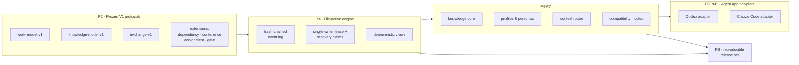

<div align="center">

# TCRN Workflow

### Vos agents IA disent « c'est fait ». Ce cadre les oblige à le prouver.

**Une livraison gouvernée pour les agents IA — chaque capacité est une revendication vérifiée par la machine, pas une promesse.**

[English](./README.md) · [简体中文](./README.zh-CN.md) · [日本語](./README.ja.md) · [한국어](./README.ko.md) · Français

   

    

[Pourquoi ce projet existe](#pourquoi-ce-projet-existe) · [Est-ce fait pour vous](#est-ce-fait-pour-vous) · [Ce que vous obtenez](#ce-que-vous-obtenez) · [Démarrage rapide](#démarrage-rapide) · [L'utiliser](#lutiliser-pour-de-vrai) · [Réponses directes](#réponses-directes) · [Limites connues](#limites-connues) · [Licence](#licence)

`Verified claims: 78 (hygiene 13 · inertness 13 · runtime 52)`

</div>

---

> **Toute l'idée en une phrase :** chaque garantie que ce cadre énonce est inscrite dans un registre lisible par machine, liée à un test que vous pouvez exécuter vous-même sur votre propre machine — et dès qu'une garantie cesse d'être vraie, **la compilation échoue**.

## Pourquoi ce projet existe

Faire écrire du code à un agent IA est devenu facile. Obtenir **une raison de croire ce qu'il vous dit** ne l'est pas.

Si vous avez travaillé avec des agents, vous avez rencontré les trois :

1. **« Faites-moi confiance, j'ai testé. »** L'agent dit que les tests passent. Ce que vous avez réellement, c'est une ligne de texte dans une fenêtre de chat. Rien ne relie ce que le workflow *prétend* garantir à ce que son code *impose réellement* — et à mesure que le code évolue, la revendication se périme en silence.
2. **Un historique qui s'évapore.** Les décisions vivent dans une conversation défilée et des fichiers mutables. Quand quelque chose casse à deux heures du matin, il n'y a rien à rejouer, rien à comparer, rien à remettre à un relecteur.
3. **Des installations à l'aveugle.** Une compétence ou un workflow arrive d'un dépôt, et rien ne prouve que les octets que vous allez exécuter sont ceux que quelqu'un a réellement relus.

TCRN Workflow ferme ces trois brèches — en traitant la livraison pilotée par agents comme on traite une release critique pour la sécurité :

- **Chaque capacité est une revendication dans un registre**, et chaque revendication est liée à un nom d'erreur stable (*reason code*) prouvé par un test qui s'exécute hors ligne.
- **Chaque modification de votre espace de travail est une entrée dans un journal inviolable** — chaque entrée est chaînée cryptographiquement à la précédente, de sorte que l'historique ne peut être que complété, jamais réécrit discrètement.
- **Chaque release peut être reconstruite octet pour octet** et confrontée aux empreintes publiées.

Une seule règle tient l'ensemble, et c'est la partie que l'on croit le moins avant de l'avoir essayée : **la surdéclaration est un échec de compilation, pas une question de style.** Changez ce que couvre une revendication sans la reprouver, et la chaîne s'arrête.

## Est-ce fait pour vous

| | |
| --- | --- |
| ✅ **Oui, si** | vous faites travailler des agents sur des sujets à conséquences — code de production, livraison régulée ou auditée, passages de relais multi-agents où plus personne ne se souvient qui a décidé quoi. Vous voulez un artefact qu'un relecteur peut *vérifier*, pas une transcription qu'il doit *croire*. Et vous voulez que tout reste sur votre machine : pas de base de données, pas de démon, pas de réseau, pas de télémétrie. Et vos agents sont d'un niveau frontière, capables de suivre une discipline stricte — voir « Limites connues ». |
| ❌ **Probablement pas, si** | vous voulez un assistant conversationnel sans configuration, vous avez besoin de synchronisation cloud ou d'un tableau de bord hébergé, ou votre travail est assez exploratoire pour qu'une piste d'audit en ajout seul soit une friction plutôt qu'une valeur. La rigueur ici n'est pas gratuite — c'est un échange délibéré : du confort contre des preuves. |

## Ce que vous obtenez

| Capacité | Ce que cela signifie concrètement |
| --- | --- |
| **Un espace de travail qui n'est que des fichiers** | Tout votre graphe de travail (Initiative → Epic → Story → Subtask) vit dans des fichiers JSON simples et canoniques avec une chaîne de hachage — pas de base de données, pas de démon. Vous pouvez l'auditer avec `cat` et `sha256sum`, et les exports sont reproductibles octet pour octet. |
| **Une commande, vingt portes** | `pnpm verify:p1` exécute toute la chaîne de vérification : format, lint, typage, build, ~56 fichiers de tests, matrice de confiance, politiques archive/SBOM/licences/vulnérabilités, liste blanche des sources, frontière hors ligne, analyse de confidentialité, durcissement CI, carte de vérification et preuve d'historique propre. La moindre surprise arrête la chaîne. |
| **Un registre de revendications lisible par machine** | `verification-map.yaml` lie 77 revendications — 13 framework-hygiene, 13 inertness-proof, 51 runtime-capability — à des reason codes observables. Si le sujet d'une revendication change, sa preuve doit être rejouée. |
| **Des gardes qui prouvent qu'ils mordent encore** | `pnpm guard-check` retire par mutation chaque garde enregistrée du code source et exige que le test qui la couvre passe au rouge — 30 gardes, vérifiées avant chaque push. Une protection dont la disparition ne serait remarquée par personne n'est pas une protection. |
| **Des délibérations au dossier** | Conférences et portes de décision sont ajoutées au même journal inviolable. Une porte non satisfaite *bloque* le passage de son élément de travail à `done` (`WORKSPACE_GATE_PENDING`) — à la commande, puis de nouveau au rejeu — et clore une conférence distille chaque décision en une candidate de connaissance qui y renvoie. |
| **Chaque décision reçoit un nom** | Activez l'attestation d'acteur et chaque modification ultérieure doit déclarer qui a agi — le moteur et son rejeu échouent tous deux en fermeture sur tout événement dépourvu d'identifiant d'acteur. Les espaces de travail qui ne l'activent jamais restent identiques octet pour octet. |
| **Une activation réversible** | Claude Code et Codex disposent de chemins d'activation réversibles en trois étapes. Les commandes actuelles lient une racine absolue admise et sont prouvées par code et fixture ; les anciens reçus hôte couvrent des octets remplacés. Codex exige toujours l'approbation `/hooks` de chaque définition exacte, et l'installation seule ne prouve jamais l'activation hôte. |
| **Des sauvegardes qui se prouvent elles-mêmes** | Un instantané produit un manifeste déterministe fichier par fichier ; le runbook boucle instantané → effacement → restauration à l'octet près, et les deux modes d'échec qui comptent (restauration partielle ou déplacée) échouent en fermeture. |
| **Deux hôtes, une seule vérité** | Codex et Claude Code partagent les mécanismes neutres d'authority et de reçus. Tous deux restent inertes par défaut et disposent d'une activation SessionStart étroite et fail-open. Codex consigne la frontière d'approbation de la définition exacte sans prétendre que le trust hash opaque de l'hôte soit exporté. |
| **Hors ligne par construction** | Le mode développement installe une garde réseau au niveau du processus et n'émet aucune télémétrie. La porte de confidentialité balaie chaque octet suivi, tout l'historique git atteignable et l'archive de release à la recherche d'identifiants personnels et de chemins machine. |
| **Des releases que vous pouvez redériver** | Une release est une étiquette immuable plus un ensemble d'artefacts reproductibles, reconstruits et comparés octet par octet par `pnpm verify:p8`. Les consommateurs externes vérifient via le projet compagnon `tcrn-workflow-helper`, dont l'empreinte est publiée là où vous pouvez la contrôler indépendamment. |
| **Les défauts sont de première classe** | Le chemin de création admet le type `Incident`, de sorte qu'un défaut obtient son propre enregistrement et sa propre lignée au lieu de se faire passer pour un `Story` ; `Review`, `Release` et `Knowledge` restent fermés à la création directe. Retirer un enregistrement de connaissance récupère son corps et la recherche porte sur les résumés, de sorte que le magasin organisé reste léger et trouvable. |
| **Les charges en arrière-plan ne laissent aucun résidu** | Un détecteur neutre vis-à-vis de l'hôte enregistre le groupe de processus qu'une session possède et, à partir d'un instantané de la table des processus, signale tout groupe possédé actif ou orphelin réattaché à init correspondant à un motif enregistré — prouvé par un test rouge attestant que l'orphelin injecté est toujours capturé. Le déclenchement automatique en fin de session reste conditionné par l'Owner sur les deux hôtes. |
| **Livrez par lots, pas en enchevêtrements** | Un type de travail `Release` est un conteneur de sprint de premier niveau : `work-annotate --sprint` enrôle des Initiatives dans un train de livraison nommé au moyen d'une référence consultative non contraignante — capable de franchir les partitions, le statut propre des membres restant intact — et `work-list --sprint` relit le train. L'axe du timebox n'enchevêtre jamais l'arbre de la portée de travail. |
| **Une grande chaîne reste lisible** | `export` fonctionne en tout ou rien et refuse tout espace de travail dont la forme canonique dépasse un Mio — une ligne qu'une chaîne franchit d'elle-même en grandissant. Les lectures paginées répondent malgré tout : les résumés de `work-list` portent l'`externalKey` lisible par un humain, `conference-position-list` et `conference-minutes-list` atteignent les positions et les procès-verbaux qui n'étaient visibles que par `export`, et `event-list` renvoie chaque événement **mot pour mot** — `priorHash`, `payloadHash`, `eventHash` compris — de sorte qu'un consommateur peut redériver la chaîne page après page. Une page dont les charges utiles ne tiennent pas est refusée nommément (`CLI_EVENT_PAGE_OVERSIZED`), avec le drapeau à baisser, jamais raccourcie en silence : une page écourtée est indiscernable de la fin de la chaîne. |

<details>
<summary><b>Cinq termes, en clair</b> (cliquer pour déplier)</summary>

- **Échec en fermeture (fail-closed)** — dès que quelque chose paraît anormal, le système s'arrête avec un nom d'erreur stable plutôt que de deviner et de continuer. Il n'y a pas d'avertissements qui défilent : soit vert, soit arrêté.
- **Chaîne de hachage** — chaque entrée du journal contient l'empreinte de la précédente. Réécrire l'historique changerait les empreintes, et le rejeu le refuserait.
- **reason code** — un nom d'erreur stable et lisible par machine (par exemple `WORKSPACE_GATE_PENDING`). Outils et agents peuvent brancher dessus ; le texte d'erreur en prose n'est jamais le contrat.
- **Hermétique** — un test qui s'exécute entièrement à partir d'entrées locales et épinglées. Mêmes entrées, même résultat, sur n'importe quelle machine.
- **CAS / version attendue** — chaque écriture déclare sur quelle version elle croit s'appuyer. Si quelqu'un a écrit avant, l'écriture est refusée au lieu d'écraser en silence.

</details>

## Démarrage rapide

Il vous faut la chaîne d'outils épinglée : **Node 24.16.0** et **pnpm 11.3.0**. Les scripts de cycle de vie des dépendances restent désactivés — rien n'exécute de code à l'installation.

```sh
# 1. Install the pinned dev dependencies (explicit, frozen, script-free)
pnpm install --offline --frozen-lockfile --ignore-scripts

# 2. Watch the framework prove itself (20 gates, fully offline)
pnpm verify:p1

# 3. Build, then drive the governed CLI
pnpm build
node scripts/tcrn-workflow.mjs commands
```

Commandes gouvernées typiques — toutes locales, sans réseau, sans base de données :

```sh
# validate a workspace and materialize its deterministic views
node scripts/tcrn-workflow.mjs validate --workspace <dir>

# create and transition work records with version-checked writes
node scripts/tcrn-workflow.mjs work-create ...
node scripts/tcrn-workflow.mjs work-transition ...

# knowledge core: metadata-first reads, explicit body access, promotion CAS
node scripts/tcrn-workflow.mjs knowledge-list ...
```

Chaque modification exige un chemin d'espace de travail explicite, un horodatage RFC 3339 strict et une version attendue — la sûreté concurrente est imposée par le moteur, pas par convention.

## L'utiliser pour de vrai

Le démarrage rapide ci-dessus prouve le framework. L'*utiliser* est une autre activité — et ce n'est délibérément pas taper des commandes.

**Pour parcourir une fois la boucle gouvernée entière, à la main** — espace de travail → initiative → épopée → récit → porte → conférence → savoir distillé → traçage — suivez [le tutoriel](docs/tutorial/governed-loop.md). Chaque commande y est exécutée mot pour mot par `pnpm verify:e2e`, elle ne peut donc pas pourrir en silence.

**Pour le vrai travail, votre agent tient la plume et vous décidez.** L'opérateur prévu est un agent IA — Claude Code ou Codex — avec la Skill compagnon **tcrn-workflow-helper** (publiée aux côtés de ce dépôt) placée dans son dossier de skills. Cette Skill porte la discipline d'exploitation : un assistant de première exécution qui met en place la confiance et l'espace de travail en expliquant chaque étape en langage clair, un guidage qui fait correspondre chaque moment de travail au verbe qui l'enregistre, et une discipline d'enregistrement traversée par une règle dure — **rien ne s'écrit sans votre oui explicite**.

Une session de travail ressemble alors à ceci :

1. **Vous discutez de la direction avec votre agent, comme d'habitude.** Quand la conversation produit quelque chose qui porte à conséquence — une décision, une décomposition, un livrable achevé — l'agent *propose* de l'enregistrer, en nommant l'enregistrement et le verbe. Votre oui l'écrit ; votre non l'abandonne.
2. **Un « terminé » contesté passe par une porte.** Une porte en attente refuse la transition — à la commande, puis encore au rejeu — jusqu'à sa satisfaction par la citation d'un compte rendu de conférence clos ; une porte `owner_intent_required` refuse en outre tout acteur que votre registre hors bande ne permet pas.
3. **Les délibérations sont des conférences, argumentées comme des rôles nommés.** Le moteur embarque huit *personas Core Reference* inertes — un registre de rôles lié par empreinte, chacun avec une mission, une frontière d'autorité et des refus explicites : **Minerva** (architecture du workflow), **Verity** (vérification), **Sable** (sécurité et confidentialité), **Janus** (acceptation), **Ilya** (implémentation), **Mara** (produit), **Mneme** (connaissance), **Arturo** (orchestration). Ce sont des **données de référence, pas des agents en exécution**. Votre agent pilote argumente *en tant qu'*eux : une question contestée est distribuée aux rôles dont les mandats s'opposent réellement, et chaque position est consignée mot pour mot sous son **rôle** — non sous un nom de modèle — de sorte que le dossier montre quel mandat a soutenu quoi, et pourquoi ils devaient se parler. Les comptes rendus tranchent la délibération ; les décisions closes peuvent se distiller en savoir organisé.
4. **Entre les sessions, le dossier est la mémoire.** `status` et les verbes de liste le relisent, `work-show` porte la portée faisant autorité de chaque élément et le compte rendu qui l'a décidée, et les instantanés protègent la chaîne au rythme que vous avez choisi.

Vous restez le décideur ; le moteur applique ce qui a été décidé ; la chaîne en est la preuve. Un agent en deçà de la discipline patine sur les codes de raison au lieu de rien corrompre — « Limites connues » énonce exactement ce que la discipline exige.

## L'architecture en soixante secondes


```mermaid
flowchart LR
    subgraph Protocols["P2 · Frozen V1 protocols"]
        WM[work-model-v1]
        KM[knowledge-model-v1]
        EX[exchange-v1]
        XT[extensions:<br/>dependency · conference<br/>assignment · gate]
    end
    subgraph Engine["P3 · File-native engine"]
        EV[hash-chained<br/>event log]
        LS[single-writer lease +<br/>recovery claims]
        VW[deterministic views]
    end
    subgraph Layers["P4-P7"]
        KC[knowledge core]
        PF[profiles & personas]
        CR[context router]
        CM[compatibility modes]
    end
    subgraph Hosts["P6/P6B · Agent App adapters"]
        CX[Codex adapter]
        CL[Claude Code adapter]
    end
    REL[P8 · reproducible<br/>release set]
    Protocols --> Engine --> Layers --> Hosts
    Engine --> REL
    Layers --> REL
```

Des protocoles gelés à la base, un moteur natif fichiers au-dessus, des couches de capacités par-dessus, et des adaptateurs d'hôtes au sommet — inertes jusqu'à un barreau d'activation explicitement approuvé. Les protocoles sont en ajout seul : `work-model-v1` est gelé, et chaque extension s'enregistre sans toucher aux schémas acceptés.

## Réponses directes

### Pourquoi un seul rédacteur à la fois, alors que les agents adorent le parallélisme

Parce que la couche de stockage et la couche de raisonnement répondent à des questions différentes :

1. **La couche de stockage est mono-rédacteur par conception.** Une chaîne de hachage n'a qu'un seul successeur véridique par événement — des rédacteurs parallèles corrompraient la chaîne ou exigeraient un protocole de consensus qui détruirait la propriété « auditable avec `cat` et `sha256sum` ». Le moteur impose donc un rédacteur à la fois via un bail exclusif doublé d'un protocole de reprise sur disque : le bail d'un rédacteur planté est mis en quarantaine et récupéré en fermeture, et chaque acquisition est vérifiée en version.
2. **Le parallélisme vit au-dessus de la couche de stockage.** Lancez autant de fils sous-agents indépendants et à contexte neuf que vous voulez — ouvriers d'implémentation, comités de relecture, vérificateurs adverses. Leurs conclusions reviennent sous forme de données ; un fil canonique détient l'autorité de décision et écrit le registre. Vous obtenez le débit du parallélisme *et* une lignée de décisions linéaire et auditable.
3. **La gouvernance exige un récit sérialisable.** La chaîne donne un ordre des décisions linéaire et inviolable, et — dès qu'un espace de travail active l'attestation d'acteur — chaque décision est liée à un acteur déclaré et auditable. C'est une identité *déclarée* inscrite dans un registre ordonné, pas une affirmation d'identité authentifiée ni de vérité d'horloge murale. Une nuée de fils pairs modifiant un état partagé n'a ni l'ordre ni le lien.

<details>
<summary><b>Les tests derrière cette réponse</b> (tous dans <code>tests/p3-file-engine.test.mjs</code>, exécutés par <code>pnpm verify:p3</code>)</summary>

- *Le plantage de bail et la contention sur reprise sont récupérables et mono-rédacteur* — un rédacteur est planté en pleine création, son bail périmé est mis en quarantaine, les concurrents s'affrontent et exactement un l'emporte ; le perdant échoue en fermeture avec un reason code stable.
- *Éviction du créateur retardé* — un créateur de bail suspendu dont le répertoire a été récupéré doit observer la reprise active et échouer en fermeture (`WORKSPACE_LEASE_INVALID`) au lieu de coloniser la nouvelle génération. Trouvé et corrigé sur Linux ext4 en CI réelle, puis prouvé par un test déterministe.
- *Injection de SIGKILL à chaque point effectif du cycle de vie* — l'inventaire des pannes du moteur est découvert à partir d'opérations réelles, et un vrai `SIGKILL` est délivré à chaque point ; la reprise doit converger vers un état propre, sans résidu.
- *64 permutations réelles d'ordre d'insertion* produisent des index, listes et points de contrôle identiques octet pour octet — le déterminisme est prouvé, pas supposé.
- 4 cas de concurrence, 57 cas négatifs et une matrice d'attaques du système de fichiers (liens symboliques, liens physiques, fichiers spéciaux, courses au remplacement) complètent la preuve.

</details>

### Pourquoi des fichiers plutôt qu'une base de données

Parce que la frontière de confiance doit rester inspectable avec des outils standards. Chaque enregistrement est du JSON canonique (clés triées, un LF final), chaque événement porte ses `priorHash`/`eventHash`, et tout le magasin se vérifie en quelques lignes dans n'importe quel langage. Une base de données ajouterait un démon, un format binaire et une dépendance de confiance implicite — autant de passifs pour un cadre dont la promesse centrale est *« vous pouvez tout vérifier vous-même, hors ligne »*.

### Pourquoi hors ligne d'abord et échec en fermeture

Un cadre d'agents qui atteint le réseau en silence est un canal d'exfiltration qui n'attend qu'à servir. Le mode développement installe une garde réseau au niveau du processus ; la chaîne de vérification prouve que le code du projet n'a aucun chemin réseau implicite ; les seules étapes réseau (acquisition des dépendances, amorçage CI) sont explicites et épinglées. Échouer en fermeture signifie que chaque validateur s'arrête avec un reason code stable au premier octet inattendu.

### Que prouvait le reçu live historique de Claude Code

Il prouvait que l'ancienne définition à chemin relatif livrait à une véritable session Claude Code un **résumé de frontière d'autorité limité au Workflow**, et rien au-delà. Ce résumé historique limitait les mutations du Workflow ; il ne rendait pas le fil principal en lecture seule. La commande actuelle à racine absolue change les octets exacts de la définition : ce reçu est historique et aucune activation Claude live actuelle n'est revendiquée.

Tout le reste est délibérément laissé dehors. Le framework n'arbitre **pas** l'usage des outils de l'hôte, ne supprime ni ne réécrit **aucune** réponse, n'écrit **jamais** sous `~/.claude`, ne promeut **pas** de connaissance sans action explicite et n'orchestre **pas** les sessions. Un hook qui échoue n'imprime rien et la session continue en Claude Code ordinaire — le seul endroit où ce dépôt échoue en s'ouvrant plutôt qu'en se fermant, parce qu'une couche de gouvernance capable de casser une session est pire qu'une couche qui se tait.

Codex possède désormais un équivalent volontairement étroit. `adapter-install`
reste inerte ; `adapter-activate` ajoute ensuite un seul hook de notification
`SessionStart` local au projet, dont le handler et le résumé de 1024 octets sont
liés par digest. Codex décide toujours s'il s'exécute : l'opérateur doit
approuver la définition exacte via `/hooks`, toute modification de la définition
exige une nouvelle approbation, et le reçu d'installation reste
`pending_host_approval`. `adapter-deactivate` désenregistre d'abord le hook et
revient au barreau inerte. Le résumé v2 injecté ne lie aucun Core Reference
persona, ne rend pas le fil principal en lecture seule et ne limite que
l'autorité du Workflow, et non l'autorisation explicite de l'utilisateur pour le
travail ordinaire sur le dépôt. Aucune application PreToolUse/approbation ni
Controller App Server actif n'est revendiqué.

### Comment une release devient-elle digne de confiance

Une release est une étiquette annotée immuable plus un ensemble d'artefacts reproductibles (archive source canonique, SBOM, provenance, sommes de contrôle, notes), reconstruits et comparés octet par octet par `pnpm verify:p8`. Les consommateurs externes vérifient via le compagnon **tcrn-workflow-helper** : un amorceur sans dépendances, dont le SHA-256 est publié là où vous pouvez le contrôler indépendamment du téléchargement, et qui refuse toute release dont les octets ne correspondent pas aux empreintes compilées en lui — avant qu'une seule ligne de Workflow ne s'exécute.

## Des chiffres vérifiés, pas promis

Chaque chiffre ci-dessous est imposé par une porte — si l'un dérive, une compilation échoue quelque part.

- **20 portes** dans la chaîne `verify:p1`, chacune avec un reason code terminal stable.
- **77 revendications vérifiées par la machine** dans `verification-map.yaml` — 13 framework-hygiene, 13 inertness-proof, 51 runtime-capability. Le badge de revendications ci-dessus est analysé et confronté au registre à chaque exécution.
- **30 gardes enregistrées**, chacune prouvée encore mordante en la retirant par mutation et en observant son test passer au rouge.
- **~56 fichiers de tests hermétiques**, dont une injection de panne `SIGKILL` réelle, des preuves de déterminisme à 64 permutations dans trois couches indépendantes, et une matrice d'attaques du système de fichiers.
- **1 preuve phare de bout en bout** (`pnpm verify:e2e`) — un rejeu hermétique de la boucle gouvernée complète (initiative → epic → story → gate → conference → distill → promote → trace), chaque commande du tutoriel exécutée mot pour mot.
- **19 entrées au registre public des exigences AOS** (11 vérifiées par fixture, 8 spécifiées) — la maturité est consignée ligne par ligne, jamais gonflée.
- **Porte de confidentialité** sur les 340 fichiers sources de la liste blanche (une liste à correspondance exacte — un fichier ajouté ou retiré fait échouer la porte), chaque objet git atteignable et l'archive de release.

<details>
<summary><b>Référence complète des cibles de vérification</b> (cliquer pour déplier)</summary>

| Cible | Ce qu'elle prouve |
| --- | --- |
| `verify:p1` | La chaîne complète de 20 portes sur un arbre committé propre. |
| `verify:p2` | Contrats de protocoles V1 gelés, vecteurs déterministes, tests négatifs/de propriétés, registre d'exigences, schémas clos. |
| `verify:p3` | Espace de travail natif fichiers : baux/CAS, reprise après plantage, quarantaine, migrations, vues déterministes, matrice d'attaques du système de fichiers. |
| `verify:p4` / `verify:p4:knowledge` | Budgets du cycle de vie des artefacts, caviardage, apply/restore d'archive jetable ; séparation métadonnées/corps du noyau de connaissances, CAS de promotion, parité à 64 permutations. |
| `verify:p5` | Modèle de confiance de profil générique clos, empreintes de politique effective, graphe de démarrage à froid, huit personas Core Reference inertes. |
| `verify:p6` / `verify:p6:adapter` / `verify:p6b` | Contrôles de portée/risque/budget du routeur de contexte et corpus hostile ; pont de l'adaptateur Codex ; adaptateur Claude Code (bundle de gabarit à quatre fichiers, fragment de settings réversible, rejet des chemins interdits, repli CLAUDE.md, empreinte de parité inter-hôtes). |
| `verify:act4` / `verify:act9` / `verify:act10` / `verify:act11` / `verify:act12` / `verify:act13` | Installation Codex inerte ; activation SessionStart indépendamment autorisée et sans persona, avec dérive de définition exacte et approbation live actuelle en attente ; un collecteur read-only plus une comparaison exacte entre le reçu du flux App Server live et sa relecture ; matrice inter-hôtes ; preuve depuis un cwd hostile que les commandes Codex/Claude ne nomment que le chemin absolu admis du handler, la résolution de l'interpréteur via le `PATH` au moment du déclenchement étant exécutée et divulguée comme résidu ouvert ; et reçus d'activation porteurs d'autorité gardés par une autorisation de sortie exacte et une observation hôte épinglée. |
| `verify:p7` / `verify:p7:compatibility` | Échange canonique, manifeste de compatibilité, plancher anti-retour, plans déterministes d'import/point de contrôle/repli. |
| `verify:authority-mcp` | Autorité opérateur épinglée hors bande, refus de rotation/révocation et lectures/écritures MCP structurées et neutres vis-à-vis de l'hôte. |
| `verify:p8` | Candidat de release reproductible : reconstruction de l'archive source et comparaison octet par octet, SBOM, provenance, sommes de contrôle, bundle clos de six fichiers, matrice négative de confiance externe. |
| `verify:privacy` | Aucun identifiant personnel ni chemin machine dans le moindre octet suivi, objet git ou archive. |
| `verify:isolated` | La même chaîne P1 depuis une matérialisation hermétique des dépendances (contrôlée en CI). |

Le mode développement est hors ligne avec une garde réseau au niveau du processus et zéro télémétrie. L'espace de travail compte exactement trois dépendances de développement (`ajv@8.17.1` pour la parité de schémas Draft 2020-12 hors ligne, `typescript@5.9.3` comme porte de typage épinglée, `@types/node@24.13.2`), chacune acquise via une frontière de registre explicite avec scripts de cycle de vie désactivés. P1 conserve quatre frontières externes explicites : la continuité de `rootVersion` entre invocations requiert un plancher externe ; il n'y a pas de bac à sable réseau au niveau du système ; aucune analyse externe fraîche d'avis de sécurité n'est effectuée hors ligne ; l'ensemble d'expressions régulières de confidentialité est un contrôle de politique ciblé, pas un DLP généraliste.

</details>

## Organisation du dépôt

| Chemin | Contenu |
| --- | --- |
| `packages/core/` | Moteur, adaptateurs, noyau de connaissances, profils, routeur, échange (TypeScript, contrôlé par le compilateur épinglé). |
| `schemas/` · `specs/` | Schémas de protocoles V1 gelés (clos, parité Draft 2020-12 prouvée) et leurs spécifications normatives. |
| `tests/` | La suite de preuves hermétique. |
| `scripts/` | CLI gouvernée, tâches de vérification, vérificateur de gardes, générateur d'artefacts de preuve, portes de confidentialité et de politique. |
| `fixtures/` | Vecteurs de protocole déterministes, corpus hostiles, références du registre d'exigences. |
| `docs/` | Architecture, confiance de release, versionnage, notes de version. |
| `verification-map.yaml` | Le registre des revendications — commencez ici pour voir ce qui est réellement prouvé. |

## Ce que ce cadre ne gouverne pas

La plupart des projets cachent leurs limites. Les nôtres sont porteuses — la discipline même qui prouve les revendications ci-dessus exige aussi de dire précisément où elles s'arrêtent. Ces quatre frontières sont écrites parce qu'un lecteur attentif a tout de même lu les deux premières trop largement :

- **L'arbre source de votre produit.** Le bail mono-rédacteur gouverne la chaîne d'événements de l'espace de travail. Deux agents modifiant `src/foo.ts` en même temps ne sont protégés par rien ici — utilisez l'isolation par worktree, ou faites passer ces modifications par l'espace de travail vous-même.
- **La chaîne d'approvisionnement de votre produit.** La garde réseau couvre le processus qui exécute les commandes projet P1. Le shell de votre propre agent, et la construction de votre produit, sont en dehors. Zéro dépendance d'exécution est une propriété de *ce* cadre, pas de ce que vous construisez avec.
- **La correction de votre code.** Le registre garantit qu'une capacité *déclarée* conserve une preuve exécutable, et que la surdéclaration fait échouer la compilation. Il ne peut pas vous dire que l'ensemble des revendications est le bon. Choisir quoi revendiquer relève irréductiblement du jugement humain, et aucune provenance ne s'y substitue.
- **L'identité et le temps.** L'attestation d'acteur enregistre un identifiant d'acteur *déclaré*, non authentifié, et la chaîne prouve l'ordre, non la vérité de l'horloge murale. La chaîne est inviolable de manière détectable en son sein ; elle n'est pas ancrée en dehors du système de fichiers où elle réside.

## Limites connues

Les quatre frontières ci-dessus sont des décisions de conception permanentes. Les limites ci-dessous sont les faits opérationnels de cette version : chacune est imposée par un reason code, fixée par une mesure, ou déclarée franchement comme un territoire non testé.

**Topologie des espaces de travail et échelle**

- **Un seul rédacteur par espace de travail.** Chaque mutation se sérialise sur un bail à l'intérieur de l'arbre de contrôle ; les concurrents échouent en se fermant puis réessaient. Le parallélisme appartient au-dessus de la couche de stockage : multipliez les espaces de travail, pas les rédacteurs.
- **Découpez les espaces de travail par projet ou par initiative.** Un espace de travail ralentit perceptiblement dès quelques milliers d'événements, et une commande unique franchit la seconde vers 6 600 (Apple M3, extrapolé ; échantillons bruts dans `docs/verification/2026-07-20-event-chain-ceiling-samples.json`). Les lectures paient le même prix que les écritures et la chaîne n'a pas de compaction — un espace de travail à l'échelle d'une organisation est exactement la forme punie.
- **Partager un espace de travail entre plusieurs projets déployés séparément va contre la conception.** Mécaniquement, cela fonctionne — chaque verbe prend un chemin absolu explicite — mais tous les rédacteurs font la queue sur un seul bail, chaque accédant doit présenter des chemins canoniques identiques pour les cinq racines (`WORKSPACE_SCHEMA_INVALID` sinon), et l'historique fusionné atteint la limite d'échelle plus tôt. Servir plusieurs projets est le travail d'une couche au-dessus de celle-ci ; le contrat AOS livré ici n'est qu'un registre de nommage et de liaison, et `supportedAosReleases` est vide.
- **`export` reste en tout ou rien.** Il refuse tout espace de travail dont la forme canonique dépasse un Mio (`INPUT_OVERSIZED`), et trois des quatre chaînes de cette plateforme ont déjà franchi cette ligne. Une grande chaîne se lit par les verbes paginés — `work-list`, `conference-position-list`, `conference-minutes-list` et, depuis `0.8.0`, `event-list`. `export` n'a pas été rendu incrémental, et `event-list` ne promet qu'une chose : une page qui ne tient pas le dit.
- **Plusieurs espaces de travail côte à côte : c'est la forme prise en charge.** Rien ne les enregistre ni ne les découvre ; chacun est un domaine indépendant à rédacteur unique, et ils peuvent partager un même checkout du framework et une même racine de confiance de release.

**Sauvegarde et portabilité**

- **La restauration est même-chemin-uniquement.** L'identité des cinq racines est fixée à l'init et revérifiée à chaque resolve (`WORKSPACE_SCHEMA_INVALID`) ; restaurer vers un autre chemin ou une autre machine est hors du périmètre V1 (`WORKSPACE_MIGRATION_APPLY_UNAVAILABLE`). Sauvegardez où vous voulez ; restaurez sur place.
- **Restaurez l'arbre de contrôle entier, ou rien.** Les magasins de connaissance et d'artefacts sont liés à l'empreinte de plus haute marque de la chaîne d'événements ; un magasin restauré seul se brique (`KNOWLEDGE_HIGH_WATER_MISMATCH`).
- **git est un témoin d'intégrité, pas un outil de restauration.** Un dépôt à la racine de l'espace de travail avec la liste d'exclusion documentée vous donne un second témoin ; les restaurations réelles passent par le manifeste de snapshot, car git ne peut pas recréer les répertoires vides que les magasins exigent.
- **Ne copiez jamais les fichiers d'un magasin entre espaces de travail.** Chaque magasin est lié à l'historique de son propre espace. Le déplacement inter-espaces est aujourd'hui une surface de planification : `exchange-plan`, `exchange-dry-run` et `exchange-validate` existent ; un verbe d'application n'existe pas.

**Périmètre testé**

- **Un utilisateur OS, un système de fichiers local.** C'est là que chaque test et chaque observation sur hôte réel ont eu lieu. Le partage entre utilisateurs et les systèmes de fichiers réseau ne sont pas testés, donc pas revendiqués.

**Hypothèses sur le pilote**

- **L'intégrité ne dépend pas de la capacité du modèle pilote ; la progression, si.** Le fail-closed transforme chaque écart d'un pilote faible en refus : la chaîne ne peut pas être salie — un agent sous le niveau requis patine sur des reason codes au lieu de corrompre quoi que ce soit. Ce qui varie avec la capacité du modèle : progresser sous cette discipline, tenir compte du résumé d'autorité injecté (prouvé arrivé ; jamais prétendu obéi), et la qualité de ce qui est consigné — des déchets bien formés sont fidèlement conservés, car le registre prouve qui a dit quoi, pas que c'était juste.
- **Le framework suppose un pilote capable de :** brancher sur les reason codes plutôt qu'interpréter la prose ; relire puis réessayer après un refus CAS, jamais rejouer à l'aveugle ; traiter une porte rouge comme « s'arrêter et rapporter », pas comme « relancer jusqu'au vert » ; produire des instants RFC 3339 stricts, respecter l'ordre de régénération, ne jamais éditer à la main les fichiers générés ni les empreintes ; garder un seul rédacteur par espace de travail. Chaque point se teste contre votre propre agent.
- **Aucune liste de modèles compatibles n'est publiée, car aucun n'a été mesuré.** La seule configuration de pilotage mesurée est un modèle Claude de niveau frontière sur Claude Code 2.1.201 (reçu : `docs/verification/host/claude-code.json`). En deçà des hypothèses ci-dessus, attendez-vous à du patinage, pas à de la corruption — un flot sans fin de codes de refus est la signature d'un pilote sous le niveau requis, pas celle d'un défaut du framework.

**Surface de gouvernance**

- **La surface opérateur gouvernée est livrée dans la version acceptée `0.6.0`.** Les douze verbes historiquement bloqués par IO ont d'abord été ramenés à sept par des drapeaux digest directs ; cette version alimente ces sept verbes par un document de pins « chemin absolu + SHA-256 » et expose le même catalogue comme outils MCP structurés et neutres vis-à-vis de l'hôte. Chaque mutation exige un grant exactement épinglé et conserve les sémantiques de CAS numérique, d'instant explicite, d'actor et de reason codes stables.
- **La maintenance destructrice des artefacts est réservée aux fixtures.** `artifact-archive-apply` et `artifact-archive-restore` sont marqués fixture-only dans le catalogue lisible par machine ; les espaces réels n'ont que des dry-runs, donc les magasins d'artefacts grossissent jusqu'à ce qu'une compaction gouvernée soit livrée.
- **Le magasin de connaissance doit être explicitement reconnu comme jetable.** Sur les espaces non-fixture, il ne s'initialise qu'avec un acquittement explicite par invocation (`KNOWLEDGE_DISPOSABLE_ACK_REQUIRED`) : c'est un index dérivé, jamais la source de vérité.
- **Une commande de hook approuvée épingle son handler, pas son interpréteur.** Les deux commandes d'activation intègrent le chemin absolu admis du handler, donc le répertoire courant au déclenchement ne peut pas les rediriger (`pnpm verify:act12`). L'interpréteur reste le nom nu `node`, résolu via le `PATH` au déclenchement : un répertoire placé avant le vrai interpréteur le substitue, et l'auto-vérification d'octets du handler ne peut pas le voir, puisqu'un interpréteur substitué ne lit jamais le handler. La même porte exécute cette substitution sur les deux hôtes : c'est mesuré, pas supposé. Divulgué plutôt qu'épinglé — un chemin d'interpréteur absolu ferait dériver la définition approuvée à chaque changement de chaîne d'outils, et le hook étant fail-open, cette dérive dégraderait silencieusement.

## Statut, honnêtement

- `0.1.0` est la **première version acceptée**. Le versionnage sémantique s'applique ; dans la plage 0.x, l'API publique peut encore changer entre versions mineures.
- Le candidat de release accepté actuel est `0.11.12` ; il comprend le contrat de portée en dix blocs de Story-209, la validation de readiness de dispatch, la vérification de clôture, la conservation source-règle et le preflight indépendant du monde public. La publication reste régie séparément.
- **Onze versions acceptées ont précédé celle-ci, qui est `0.10.0`.** `0.2.0` a rendu réelle l'identité de porte, `0.3.0` a ajouté la portée consultative, `0.3.2` a ouvert le chemin `Incident` et donné de la marge au magasin de connaissance, `0.4.0` a ajouté la gouvernance des résidus d'arrière-plan et `0.5.0` les sprints / trains de livraison. `0.6.0` a livré l'autorité opérateur gouvernée sur deux hôtes, MCP, l'activation, les reçus observe / execution et la provenance des conférences ; `0.7.0` a porté l'`externalKey` dans les résumés de `work-list` et ajouté les listes paginées `conference-position-list` et `conference-minutes-list` ; `0.8.0` a ajouté la liste paginée `event-list` ; `0.9.0` ajoute la famille de verbes de relocalisation gouvernée, qui déplace le lien d'un espace de travail sans déplacer un seul octet de sa chaîne. Chaque version acceptée est une étiquette immuable avec des artefacts reproductibles ;  `0.10.0` fait de la clôture d'une Initiative qui détient encore un descendant vivant non-terminal une erreur de chaîne (`WORK_GRAPH_ACTIVE_CHILDREN_OF_DONE_INITIATIVE`) : une Initiative « fermée » ne peut plus cacher du travail en cours. Chaque version acceptée est une étiquette immuable avec des artefacts reproductibles ; `CHANGELOG.md` porte le registre complet.
- **La surface de lecture de `0.7.0` et `0.8.0` a été taillée pour un seul consommateur, et rien de plus large n'est revendiqué.** Les deux versions comblent des lacunes déposées par une matrice de cohérence inter-conteneurs qui redérive une chaîne dans un second conteneur : sur une chaîne hors gabarit, une délibération portant quinze arguments et une n'en portant aucun s'affichaient à l'identique, les enregistrements pouvaient être listés sans pouvoir être nommés, et les lignes « ajout seul » et « chaîne de hachage » de la matrice n'avaient aucun sujet côté A à juger — une lecture absente présentée comme un vide. `event-list` renvoie les enregistrements mot pour mot précisément pour rendre cette redérivation possible ; il ne rend pas `export` paginé, ne diffuse rien en flux et ne conserve aucun état de consommateur entre deux requêtes. Sa fenêtre par défaut de 64 est la taille de segment propre au moteur, calibrée sur les quatre chaînes vivantes d'ici : le plus gros événement unitaire y fait 7 008 octets et le 95e centile 3 575.
- **Les preuves Claude Code sont étroites et scindées selon la définition.** Le reçu d'activation historique `2.1.201` consigne neuf observations, portant sur les octets `SessionStart` de l'ancienne définition à chemin relatif ; la définition `SessionStart` actuelle, sans persona et à racine absolue admise, reste prouvée uniquement par code et fixture. Séparément, le handler fail-open exact généré par EPIC-024 s'est déclenché en live sur `SessionEnd` trois fois sur Claude Code `2.1.201` ; les cinq autres événements observe restent des cellules explicitement `unavailable` (mesure non effectuée), parce que la sonde du modèle a renvoyé le statut API 402 avant toute inférence et tout usage d'outil.
- **Les preuves d'activation, d'observation et d'exécution Codex sont étroites et graduées par les preuves.** L'installateur inerte est réversible ; l'activation n'enregistre que `SessionStart`, échoue en s'ouvrant (fail-open), n'injecte aucun Core Reference persona et exige que Codex approuve chaque définition exacte en vigueur. Le déclenchement approuvé antérieur, lié à Verity, est une preuve historique portant sur des octets retirés ; la définition corrigée, sans persona, est hermétique et attend son approbation et son déclenchement live. Séparément, EPIC-024 a déclenché en live le handler fail-open exact généré pour `PostToolUse`, `PreCompact`, `PostCompact`, `SubagentStart` et `SubagentStop` dans un projet de preuves Codex `0.139.0` borné ; le schéma de hooks généré par cette version omet `SessionEnd`, et `Stop` n'est pas utilisé comme alias. S057 a utilisé un autre harnais App Server borné pour passer 28 contrôles brut/relecture et projeter un reçu d'exécution Workflow non signé en contexte neuf. Aucun des deux harnais n'est un Controller livré ni un installateur d'activation multi-événements. Ces capacités sont livrées dans `0.6.0` ; les limites de preuve restent exactement celles énoncées ici.
- `supportedAosReleases` est vide : aucune compatibilité AOS externe n'est revendiquée.
- Le mode release exige que le compagnon accepte les octets : son empreinte d'amorceur est publiée indépendamment, et les empreintes de release acceptées y sont compilées.

## Contribution, support, sécurité

- Questions d'usage → GitHub Discussions. Défauts reproductibles → Issues (voir `SUPPORT.md`).
- Rapports de sécurité → signalement privé de vulnérabilité selon `SECURITY.md`.
- Les contributions doivent garder toutes les portes au vert — voir `CONTRIBUTING.md`. Le critère est : *si votre revendication n'est pas dans la carte de vérification avec une preuve qui passe, elle n'est pas revendiquée.*

## Licence

[Apache-2.0](./LICENSE)
