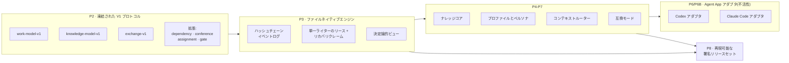

[English](./README.md) | [简体中文](./README.zh-CN.md) | **日本語** | [한국어](./README.ko.md) | [Français](./README.fr.md)

# TCRN Workflow

**ガバナンスされた AI エージェントワークのための決定論的・オフラインファーストなフレームワーク——すべての機能は約束ではなく、機械検証済みのクレームです。**

`ステータス: 0.1.0-rc.4(プレリリース候補)` · `ライセンス: Apache-2.0` · `Node 24.16.0` · `pnpm 11.3.0` · `検証済みクレーム: 34`

---

## なぜこのプロジェクトが存在するのか

AI エージェントは「デリバリー」——作業計画、コード作成、変更レビュー、リリース切り出し——をますます任されるようになっています。しかし、ほとんどのエージェントワークフローには 3 つの構造的弱点があります。

1. **クレームが検証不能。**「エージェントがテストした」は通常ログ 1 行のことで、証明ではありません。ワークフローが*保証すると言うこと*と、コードが*実際に強制すること*の間に、機械で確認できる結び付きがありません。
2. **状態が再現不能。**会話駆動の作業は、履歴を不透明なチャットログと可変データベースに残します。問題が起きたとき、リプレイ・監査・レビューに渡せる決定論的なイベント記録が存在しません。
3. **サプライチェーンの盲点。**エージェントのスキルやワークフローは、リリース同一性も署名もロールバック防止の下限もないままリポジトリからインストールされ、実行するバイトがレビューされたバイトであることを証明する手段がありません。

TCRN Workflow はこの 3 つのギャップを同時に塞ぐために作られました。エージェント駆動のデリバリーを、セーフティクリティカルなソフトウェアリリースと同じ厳密さで扱います:**すべての機能はハーメチックなオフラインテストで証明される安定した理由コードに対応付けられ**、すべてのワークスペース変更は追記専用のハッシュチェーンイベントであり、すべてのリリースは不変・再現可能・署名済みのアーティファクト集合です。

## 得られるもの

| 機能 | 実際の意味 |
| --- | --- |
| **決定論的なファイルネイティブワークスペース** | イベントソーシングされたローカル作業グラフ(Initiative → Epic → Story → Subtask)を正規化 JSON ファイル+ハッシュチェーンで保存——データベースなし、デーモンなし、エクスポートはバイト再現可能。 |
| **フェイルクローズドな検証チェーン** | 1 コマンド(`pnpm verify:p1`)で 20 のゲートを実行:フォーマット、lint、型検査、ビルド、約 29 のテストファイル、信頼マトリクス、アーカイブ/SBOM/ライセンス/脆弱性ポリシー、ソース許可リスト、オフライン境界、プライバシースキャン、CI 強化、検証マップ、クリーン履歴証明。想定外があればチェーンは停止します。 |
| **機械可読なクレーム台帳** | `verification-map.yaml` が 34 の機能クレームを観測可能な理由コードに束縛。クレームの対象が変われば証明の再実行が必須——過大宣言はスタイルの問題ではなくビルド失敗です。 |
| **デュアルホスト Agent App アダプタ** | Codex と Claude Code が V1 公式サポートの 2 ホスト。バイト単位で同一のホスト中立機構を共有し、クロスホスト同等性ダイジェストで証明済み。両アダプタは**不活性なドライラン候補**であり、未インストールのテンプレートデータのみを生成し、ライブホストサポートは一切主張しません。 |
| **オフラインファースト・プライバシークリーン** | 開発モードは Node プロセスレベルのネットワークガードとゼロテレメトリを強制。プライバシーゲートが全追跡バイト、全到達可能 git 履歴、リリースアーカイブを個人識別子とマシンパスについて走査します。 |
| **署名されたリリース信頼** | リリースはタグ同一性(commit、tree、tag object)で束縛され、Ed25519 トラストルート契約で外部検証されます——併設の `tcrn-workflow-helper` リポジトリ参照。 |

## クイックスタート

固定ツールチェーンが必要です:**Node 24.16.0** と **pnpm 11.3.0**(依存ライフサイクルスクリプトは無効のまま)。

```sh
# 1. 唯一の開発依存を取得(明示的・凍結・スクリプトなし)
pnpm install --offline --frozen-lockfile --ignore-scripts

# 2. 完全な検証ゲートを実行(オフライン)
pnpm verify:p1

# 3. ビルド後、ガバナンス下の CLI を使用
pnpm build
node scripts/tcrn-workflow.mjs workspace --help
```

代表的なコマンド(すべてローカル、ネットワークなし、データベースなし):

```sh
# ワークスペースを検証し、決定論的ビューを実体化
node scripts/tcrn-workflow.mjs workspace validate --workspace <dir> --now <ISO時刻>

# CAS バージョン検査付きで作業レコードを作成・遷移
node scripts/tcrn-workflow.mjs work-create ...
node scripts/tcrn-workflow.mjs work-transition ...

# ナレッジコア:メタデータ優先読み取り、明示的本文アクセス、昇格 CAS
node scripts/tcrn-workflow.mjs knowledge-list ...
```

変更系コマンドには明示的なワークスペースパス、厳密な RFC 3339 タイムスタンプ、期待バージョンが必須です——楽観的並行制御は慣習ではなくエンジンが強制します。

## アーキテクチャ概観



プロトコルは追加のみ:`work-model-v1` は凍結済みで、各拡張(dependency、conference、assignment、gate)は受理済みスキーマに触れずに登録されます。

## 設計 Q&A

### なぜマルチスレッドではなく「単一の正準会話スレッド+複数のサブエージェントスレッド」なのか?

最も多い質問です。答えは 3 層あります。

1. **ストレージ層は設計上シングルライター。**ワークスペースは素のファイルシステム上の追記専用ハッシュチェーンイベントログです。ハッシュチェーンでは各イベントの真の後継はちょうど 1 つ——並列ライターはチェーンを破壊するか、さもなくば「`cat` と `sha256sum` で監査できる」性質を壊すコンセンサスプロトコルを要求します。そこでエンジンは排他リースとディスク上のリカバリクレームプロトコルで**同時にライターは 1 つ**を強制します:クラッシュしたライターのリースは隔離されフェイルクローズドに回収され、すべての取得は CAS 検査されます。
2. **推論の並列性はストレージ層の上にある。**並行性は至る所にあります——ただしそれは*互いに独立した新規コンテキストのサブエージェントスレッド*(実装ワーカー、多役割レビューボード、敵対的検証者)としてであり、結論はデータとして戻ります。1 本の正準スレッドが決定権を持ち記録を書く。N 本のサブスレッドは並列に探索・レビュー・反証し、互いのコンテキストを汚染せず、状態上の競合もしません。並列のスループットと、線形で監査可能な意思決定の系譜を両取りします。
3. **ガバナンスには直列化可能な物語が必要。**リリースゲートが「誰が何の証拠で決めたのか」と問うたとき、レシート付きの単一正準スレッドには答えが 1 つあります。共有状態を書き換え合うピアスレッドの群れには答えがありません。

**この答えを支えるテスト**(すべて `tests/p3-file-engine.test.mjs`、`pnpm verify:p3` で実行):

- *リース作成クラッシュとリカバリクレーム競合は回復可能かつシングルライター*——作成途中のライターをクラッシュさせ、古いリースを隔離、競合者がレースしてちょうど 1 つが勝つ。敗者は安定理由コードでフェイルクローズド。
- *遅延クリエイターの追放*——ディレクトリが回収済みの一時停止リース作成者は、アクティブなリカバリクレームを観測してフェイルクローズド(`WORKSPACE_LEASE_INVALID`)しなければならず、新世代を乗っ取ってはならない。これは inode を再利用するファイルシステム上の inode タプル再利用を防ぎます(実 CI の Linux ext4 で発見・修正し、決定論的テストで固定)。
- *全有効ライフサイクルポイントへの実 SIGKILL 注入*——障害インベントリは実操作から発見され、各ポイントに本物の `SIGKILL` を送達。回復は残留ゼロのクリーン状態に収束しなければなりません。
- *64 通りの実挿入順序*がバイト単位で同一のインデックス・リスト・チェックポイントを生成——決定論は仮定ではなく証明されます。
- さらに並行性 4 ケース、ネガティブ 57 ケース、ファイルシステム攻撃マトリクス(シンボリックリンク、ハードリンク、特殊ファイル、置換レース)。

### なぜデータベースではなくファイルなのか?

信頼境界は標準ツールで検査可能でなければならないからです。全レコードは正規化 JSON(キーソート、終端 LF 1 つ)、全イベントは `priorHash`/`eventHash` を持ち、ストア全体をどの言語でも数行で検証できます。データベースはデーモン、バイナリ形式、暗黙の信頼依存を持ち込みます——中核の約束が*「すべてをオフラインで自分で確認できる」*であるフレームワークには、すべて負債です。

### なぜオフラインファーストでフェイルクローズドなのか?

黙ってネットワークに到達するエージェントフレームワークは、発火を待つデータ流出経路です。開発モードはプロセスレベルのネットワークガードを装備し、検証チェーンはプロジェクトコードに暗黙のネットワーク経路がないことを証明します。唯一のネットワークステップ(依存取得、CI ブートストラップ)は明示的かつ固定です。フェイルクローズドとは、各バリデータが最初の想定外バイトで安定理由コードを投げること——流れていく警告はなく、緑か停止のみです。

### なぜ Codex / Claude Code アダプタは「不活性候補」なのか?

ガバナンスされたリリースルートの受理前にライブホストサポートを主張することこそ過大宣言——本フレームワークが防ごうとする失敗そのものだからです。アダプタは決定論的な未インストールのテンプレートバンドルを生成します(バイト単位で証明済み。ユーザーコンテンツを決して壊さない可逆マージの `.claude/settings.json` フックフラグメントを含み、ユーザーレベルの `.claude` パスをすべて拒否)。アクティベーションは別のゲート付き決定です。

### リリースはどう信頼されるのか?

リリース=不変の注釈付きタグ+再現可能なアーティファクトセット(正規 USTAR ソースアーカイブ、SBOM、マニフェスト、来歴、チェックサム、ノート)。`pnpm verify:p8` が再構築しバイト比較します。外部の利用者は併設の **tcrn-workflow-helper** で検証します:Ed25519 署名のリリースマニフェストとポリシー、ロールバック防止エポック下限を、依存ゼロのブートストラップが Workflow コード実行前に検証します。

### テストは実際に何を証明しているのか——数字で

- `verify:p1` チェーンの **20 ゲート**。各ゲートに安定した終端理由コード。
- エンジン、ナレッジコア、アーティファクトライフサイクル、プロファイル、ペルソナ、コンテキストルーター、両アダプタ、交換、互換、要求台帳、リリース候補、プライバシー境界、証明アーティファクト生成器、信頼マトリクスを覆う**約 29 のテストファイル**。
- `verification-map.yaml` の **34 の機械検証クレーム**。
- 独立 3 層での **64 順列決定論証明**(エンジン挿入順、プロファイル層順、アダプタ入力順)。
- **19 行の公開 AOS 要求台帳**(11 行フィクスチャ検証済み、8 行仕様化済み)——成熟度は行ごとに正直に記録され、決して水増しされません。
- **プライバシーゲート**は約 200 の追跡ソースファイル、約 1,470 の git オブジェクト、全到達可能履歴、リリースアーカイブを走査。

<details>
<summary><b>検証ターゲット完全リファレンス</b>(クリックで展開)</summary>

| ターゲット | 証明内容 |
| --- | --- |
| `verify:p1` | クリーンなコミット済みツリー上の完全 20 ゲートチェーン。 |
| `verify:p2` | 凍結 V1 プロトコル契約、決定論的ベクトル、ネガティブ/プロパティテスト、要求台帳、閉スキーマ。 |
| `verify:p3` | ファイルネイティブワークスペース:リース/CAS、クラッシュ回復、隔離、マイグレーション、決定論的ビュー、ファイルシステム攻撃マトリクス。 |
| `verify:p4` / `verify:p4:knowledge` | アーティファクトライフサイクル予算、レダクション、使い捨てアーカイブ適用/復元;ナレッジコアのメタデータ/本文分離、昇格 CAS、64 順列パリティ。 |
| `verify:p5` | 閉じた汎用プロファイル信頼モデル、実効ポリシーダイジェスト、コールドスタートグラフ、8 つの不活性 Core Reference ペルソナ。 |
| `verify:p6` / `verify:p6:adapter` / `verify:p6b` | コンテキストルーターのスコープ/リスク/予算制御と敵対コーパス;Codex アダプタブリッジ;Claude Code アダプタ(4 ファイルテンプレートバンドル、可逆設定フラグメント、禁止パス拒否、CLAUDE.md フォールバック、クロスホストパリティダイジェスト)。 |
| `verify:p7` / `verify:p7:compatibility` | 正準交換、互換マニフェスト、ロールバック防止下限、決定論的インポート/チェックポイント/フォールバック計画。 |
| `verify:p8` | 再現可能なリリース候補:ソースアーカイブ再構築+バイト比較、SBOM、来歴、チェックサム、6 ファイル閉バンドル、外部信頼ネガティブマトリクス。 |
| `verify:privacy` | 追跡バイト、git オブジェクト、アーカイブのどこにも個人識別子とマシンパスがないこと。 |
| `verify:isolated` | ハーメチックな依存実体化環境から同一 P1 チェーンを再実行(CI ゲート)。 |

開発モードはオフラインで、プロセスネットワークガードとゼロテレメトリ。開発依存は 1 つだけ(`ajv@8.17.1`、オフライン Draft 2020-12 スキーマ同等性証明用)で、ライフサイクルスクリプト無効の明示的レジストリ境界で取得。P1 は 4 つの明示的外部境界を保持:呼び出し間 `rootVersion` 連続性は外部下限が必要;OS レベルのネットワークサンドボックスはない;オフラインでは新規外部アドバイザリスキャンを行わない;プライバシー正規表現セットは焦点を絞ったポリシー制御であり汎用 DLP ではない。

</details>

## リポジトリ構成

| パス | 内容 |
| --- | --- |
| `packages/core/` | エンジン、アダプタ、ナレッジコア、プロファイル、ルーター、交換(TypeScript、固定 Node 型変換エンジンでビルド)。 |
| `schemas/` · `specs/` | 凍結 V1 プロトコルスキーマ(閉、Draft 2020-12 同等性証明済み)とその規範仕様。 |
| `tests/` | ハーメチックな証明スイート。 |
| `scripts/` | ガバナンス CLI、検証タスク、証明アーティファクト生成器、プライバシー/ポリシーゲート。 |
| `fixtures/` | 決定論的プロトコルベクトル、敵対コーパス、要求台帳参照。 |
| `docs/` | アーキテクチャ、リリース信頼、バージョニング、リリースノート。 |
| `verification-map.yaml` | クレーム台帳——実際に何が証明されているかはここから。 |

## ステータス(正直に)

- `0.1.0-rc.4` は**プレリリース候補**です。公開 API はまだ安定していません。
- 両ホストアダプタは不活性なドライラン候補です。**ライブの Codex / Claude Code サポートは主張しません**。
- `supportedAosReleases` は空:外部 AOS 互換性は主張しません。
- 外部 Ed25519 信頼検証が成功しない限り、リリースモードは利用できません。

## コントリビュート・サポート・セキュリティ

- 使い方の質問 → GitHub Discussions。再現可能な不具合 → Issues(`SUPPORT.md` 参照)。
- セキュリティ報告 → `SECURITY.md` に従い非公開の脆弱性報告で。
- コントリビューションはすべてのゲートを緑に保つこと——`CONTRIBUTING.md` 参照。基準は:*クレームが検証マップに載って証明が通っていなければ、それは主張していないのと同じ。*

## ライセンス

[Apache-2.0](./LICENSE)
