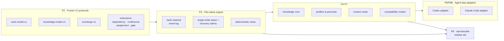

<div align="center">

# TCRN Workflow

### あなたの AI エージェントは「完了しました」と言う。このフレームワークは、それを証明させる。

**AI エージェントのための統制されたデリバリー体制——すべての能力が、約束ではなく機械検証されたクレームである。**

[English](./README.md) · [简体中文](./README.zh-CN.md) · 日本語 · [한국어](./README.ko.md) · [Français](./README.fr.md)

   

    

[なぜこのプロジェクトが存在するのか](#なぜこのプロジェクトが存在するのか) · [あなたに向いているか](#あなたに向いているか) · [得られるもの](#得られるもの) · [クイックスタート](#クイックスタート) · [率直な回答](#率直な回答) · [既知の限界](#既知の限界) · [ライセンス](#ライセンス)

`Verified claims: 65 (hygiene 13 · inertness 13 · runtime 39)`

</div>

---

> **一文で言うと**：このフレームワークが行うすべての保証は機械可読な台帳に書かれ、あなた自身のマシンで実行できるテストに紐づいています——そして保証が成り立たなくなった瞬間、**ビルドが失敗します**。

## なぜこのプロジェクトが存在するのか

AI エージェントにコードを書かせることは、今や簡単です。難しいのは、**それが言っていることを信じる理由**を手に入れることです。

エージェントを使ったことがあるなら、次の三つはすべて経験しているはずです。

1. **「大丈夫、テストしました」**。エージェントはテストが通ったと言います。あなたが実際に手にしているのは、チャットウィンドウの一行のテキストです。ワークフローが*主張*することと、コードが*実際に強制*することの間には何のつながりもなく——コードが変わるにつれ、クレームは静かに陳腐化します。
2. **消えていく履歴**。判断はスクロールで流れた会話と可変ファイルの中にあります。深夜二時に何かが壊れたとき、リプレイするものも、差分を取るものも、レビュアーに渡すものもありません。
3. **信じるしかないインストール**。スキルやワークフローがリポジトリから届きますが、これから実行するバイト列が、誰かが実際にレビューしたバイト列だと証明するものは何もありません。

TCRN Workflow はこの三つをまとめて塞ぎます——エージェント駆動のデリバリーを、安全上重要なリリースと同じように扱うことによって。

- **すべての能力は台帳の中のクレーム**であり、各クレームは安定したエラー名（*reason code*）に紐づき、オフラインで走るテストによって証明されます。
- **ワークスペースへのすべての変更は改竄検知可能なジャーナルの一項目**です——各項目は暗号学的に直前の項目へ連鎖するため、履歴は追記しかできず、静かに書き換えることはできません。
- **すべてのリリースはバイト単位で再構築でき**、公開された digest と照合できます。

全体を支える規則が一つあり、それは実際に試すまで最も信じがたい部分でもあります。**過大宣言はスタイルの問題ではなく、ビルド失敗です**。クレームの適用範囲を変えたのに証明し直さなければ、そこで連鎖は止まります。

## あなたに向いているか

| | |
| --- | --- |
| ✅ **向いています** | 結果を伴う仕事——本番コード、規制対象または監査対象のデリバリー、誰が何を決めたか誰も覚えていないマルチエージェントの引き継ぎ——にエージェントを使っている場合。レビュアーが*信じる*しかない会話ログではなく、*検証できる*成果物が欲しい場合。そして、すべてを自分のマシン内に留めたい場合：データベースなし、デーモンなし、ネットワークなし、テレメトリなし。さらに、あなたのエージェントが厳格な規律に従えるだけのフロンティア級である場合——「既知の限界」を参照。 |
| ❌ **おそらく向きません** | セットアップ不要のチャットアシスタントが欲しい場合、クラウド同期やホスト型ダッシュボードが必要な場合、あるいは追記専用の監査証跡が価値より摩擦になるほど探索的な仕事の場合。ここでの厳密さは無料ではありません——利便性を証拠と交換する、意図的な取引です。 |

## 得られるもの

| 能力 | 実務上の意味 |
| --- | --- |
| **ただのファイルであるワークスペース** | 作業グラフ全体（Initiative → Epic → Story → Subtask）が、正規化された素の JSON ファイルとハッシュチェーンとして存在します——データベースもデーモンもありません。`cat` と `sha256sum` で監査でき、エクスポートはバイト単位で再現可能です。 |
| **一つのコマンド、20 のゲート** | `pnpm verify:p1` が検証チェーン全体を実行します：フォーマット、lint、型チェック、ビルド、約 40 のテストファイル、トラストマトリクス、アーカイブ/SBOM/ライセンス/脆弱性ポリシー、ソース許可リスト、オフライン境界、プライバシースキャン、CI ハードニング、検証マップ、クリーン履歴の証明。想定外のものがあればチェーンは止まります。 |
| **機械が読めるクレーム台帳** | `verification-map.yaml` が 65 のクレーム——13 の framework-hygiene、13 の inertness-proof、39 の runtime-capability——を観測可能な reason code に束縛します。クレームの主語が変われば、その証明は再実行されなければなりません。 |
| **効き目が残っていることを自ら示すガード** | `pnpm guard-check` は登録済みの各ガードをソースから変異除去し、指定されたテストが赤になることを要求します——12 のガードを、プッシュのたびに検証。失われても誰も気づかない保護は、保護ではありません。 |
| **記録される熟議** | カンファレンスと決定ゲートは、同じ改竄検知可能なジャーナルに追記されます。未充足のゲートは対象作業項目が `done` に到達するのを*ブロック*し（`WORKSPACE_GATE_PENDING`）——コマンド時点でも、リプレイ時にも——カンファレンスを閉じると各決定が逆リンク付きの知識候補へ蒸留されます。 |
| **すべての決定に名前がつく** | アクター署名を有効にすると、以降のすべての変更が誰の行為かを宣言しなければなりません——エンジンもそのリプレイも、アクター ID を欠く事象に対してフェイルクローズします。有効化しないワークスペースは、従来とバイト単位で同一のままです。 |
| **取り消せるアクティベーション** | 三つの明示的な手順が、不活性な Claude Code バンドルをライブな統制セッションに変え、アンインストールは `.claude/settings.json` をバイト単位で復元します——実機ホスト上で観測済みで、その間ユーザー自身の既存フックは動き続けました。セッションフックのいかなるエラーも、素の Claude Code としてクリーンに終了します。`~/.claude` 配下を名指ししたり書き込んだりすることは決してありません。 |
| **自らを証明するバックアップ** | スナップショットは決定的なファイル単位マニフェストを出力し、ランブックは「スナップショット → 消去 → リストア」をバイト単位で往復させます。そして本当に重要な二つの失敗モード（部分リストア、別の場所へのリストア）はフェイルクローズします。 |
| **二つのホスト、一つの真実** | Codex と Claude Code のアダプターは、バイト単位で同一のホスト中立機構を共有し、ホスト間一致 digest によって証明されています。どちらも既定では未インストールのテンプレートデータのみを生成します。**Claude Code はその後アクティベートでき、Codex はできません**——「ステータス、正直に」をご覧ください。 |
| **構造としてのオフライン** | 開発モードはプロセスレベルのネットワークガードを導入し、テレメトリはゼロです。プライバシーゲートは、追跡されるすべてのバイト、到達可能なすべての git 履歴、そしてリリースアーカイブを、個人識別子とマシンパスについて走査します。 |
| **自分で導き直せるリリース** | リリースは不変タグと再現可能な成果物一式であり、`pnpm verify:p8` が再構築してバイト比較します。外部の利用者は付属の `tcrn-workflow-helper` 経由で検証し、その digest 自体は独立に入手できる場所で公開されています。 |

<details>
<summary><b>五つの用語を、平たい言葉で</b>（クリックで展開）</summary>

- **フェイルクローズ**——何かがおかしく見えた時点で、推測して進むのではなく、安定したエラー名とともに停止します。流れていく警告はありません。緑か、停止かのどちらかです。
- **ハッシュチェーン**——各ジャーナル項目が直前の項目の指紋を含みます。履歴の書き換えは指紋を変えてしまい、リプレイがそれを拒否します。
- **reason code**——安定した機械可読のエラー名（例：`WORKSPACE_GATE_PENDING`）。ツールやエージェントはこれで分岐できます。散文のエラーテキストは決して契約ではありません。
- **密閉（hermetic）**——ローカルに固定された入力だけで走るテスト。同じ入力なら、どのマシンでも同じ結果になります。
- **CAS / 期待バージョン**——すべての書き込みが、どのバージョンの上に積むつもりかを宣言します。他者が先に書いていれば、黙って上書きするのではなく書き込みが拒否されます。

</details>

## クイックスタート

固定されたツールチェーンが必要です：**Node 24.16.0** と **pnpm 11.3.0**。依存のライフサイクルスクリプトは無効のままです——インストール時にコードは一切実行されません。

```sh
# 1. Install the pinned dev dependencies (explicit, frozen, script-free)
pnpm install --offline --frozen-lockfile --ignore-scripts

# 2. Watch the framework prove itself (20 gates, fully offline)
pnpm verify:p1

# 3. Build, then drive the governed CLI
pnpm build
node scripts/tcrn-workflow.mjs workspace --help
```

代表的な統制コマンド——すべてローカル、ネットワークなし、データベースなし：

```sh
# validate a workspace and materialize its deterministic views
node scripts/tcrn-workflow.mjs workspace validate --workspace <dir> --now <iso-instant>

# create and transition work records with version-checked writes
node scripts/tcrn-workflow.mjs work-create ...
node scripts/tcrn-workflow.mjs work-transition ...

# knowledge core: metadata-first reads, explicit body access, promotion CAS
node scripts/tcrn-workflow.mjs knowledge-list ...
```

すべての変更は、明示的なワークスペースパス、厳密な RFC 3339 タイムスタンプ、そして期待バージョンを要求します——並行安全性は慣習ではなくエンジンが強制します。

## 60 秒で見るアーキテクチャ



最下層に凍結されたプロトコル、その上にファイルネイティブなエンジン、さらに上に能力レイヤー、最上部にホストアダプター——アクティベーション前は不活性で、そのアクティベーションを持つのは Claude Code だけです。プロトコルは追記のみです：`work-model-v1` は凍結され、すべての拡張は受理済みスキーマに触れずに自己登録します。

## 率直な回答

### エージェントは並列が得意なのに、なぜ書き手は一度に一つなのか

ストレージ層と推論層が、異なる問いに答えているからです。

1. **ストレージ層は設計上シングルライターです**。ハッシュチェーンには各事象に対して真正な後継が一つしかありません——並列の書き手はチェーンを壊すか、「`cat` と `sha256sum` で監査できる」という性質を破壊する合意プロトコルを必要とします。そこでエンジンは、ディスク上の復旧プロトコルを伴う排他リースによって、一度に一つの書き手を強制します：クラッシュした書き手のリースは隔離されフェイルクローズで回収され、すべての取得はバージョン検査されます。
2. **並列性はストレージ層の上に住みます**。独立した新鮮なコンテキストのサブエージェントスレッドを好きなだけ走らせてください——実装ワーカー、レビューボード、敵対的検証者。その結論はデータとして戻り、一本の正典スレッドが決定権を持ち記録を書きます。並列性のスループット*と*、線形で監査可能な決定系譜の両方が手に入ります。
3. **ガバナンスには直列化可能な物語が必要です**。チェーンは決定の線形で改竄検知可能な順序を与え、ワークスペースがアクター署名を有効にすれば、すべての決定が宣言され監査可能なアクターに束縛されます。それは順序付き記録に書かれた宣言された同一性であり、認証された同一性や壁時計の真正性の主張ではありません。共有状態を書き換えるピアの群れには、順序も束縛もありません。

<details>
<summary><b>この回答を支えるテスト</b>（すべて <code>tests/p3-file-engine.test.mjs</code>、<code>pnpm verify:p3</code> で実行）</summary>

- *リースのクラッシュと復旧クレームの競合は回復可能でシングルライター*——書き手が作成途中でクラッシュさせられ、その古いリースは隔離され、競合者が競って厳密に一つだけが勝ちます。敗者は安定した reason code でフェイルクローズします。
- *遅延した作成者の追い出し*——ディレクトリが回収された一時停止中のリース作成者は、有効な復旧クレームを観測してフェイルクローズ（`WORKSPACE_LEASE_INVALID`）しなければならず、新しい世代を占拠してはなりません。実際の CI 上の Linux ext4 で発見・修正し、その後決定的なテストで証明しました。
- *あらゆる有効なライフサイクル地点での SIGKILL 注入*——エンジンの障害目録は実際の操作から発見され、各地点で本物の `SIGKILL` が届けられます。復旧は残渣ゼロのクリーンな状態へ収束しなければなりません。
- *64 通りの実挿入順序の並べ替え*が、バイト単位で同一のインデックス・リスト・チェックポイントを生みます——決定性は仮定ではなく証明されています。
- 4 つの並行ケース、57 の否定ケース、そしてファイルシステム攻撃マトリクス（シンボリックリンク、ハードリンク、特殊ファイル、置換レース）が証明を締めくくります。

</details>

### なぜデータベースではなくファイルなのか

信頼境界は標準的なツールで検分できなければならないからです。すべてのレコードは正規化 JSON（ソート済みキー、末尾 LF 一つ）で、すべての事象は自分の `priorHash`/`eventHash` を携え、ストア全体はどんな言語でも数行で検証できます。データベースはデーモン、バイナリ形式、そして暗黙の信頼依存を持ち込みます——*「すべて自分でオフラインに確認できる」*ことを中核の約束とするフレームワークにとって、いずれも負債です。

### なぜオフラインファーストでフェイルクローズなのか

黙ってネットワークに手を伸ばすエージェントフレームワークは、いつ使われてもおかしくない情報流出経路です。開発モードはプロセスレベルのネットワークガードを導入し、検証チェーンはプロジェクトコードに暗黙のネットワーク経路がないことを証明します。ネットワークを使う唯一の手順（依存取得、CI ブートストラップ）は明示的で固定されています。フェイルクローズとは、すべての検証器が最初の想定外のバイトで安定した reason code とともに停止することです。

### Claude Code アダプターの「ライブ」とは何を意味するのか

実機の Claude Code セッションが、そのワークスペースを統治する権威の**読み取り専用サマリー**を受け取る、ということです。それ以上は何もありません。これは仮定ではなく実測されました——そのサマリーの中にしか存在しない値をセッションに尋ね、しかも全ツールを無効化して、ディスクから読み取ることが不可能な状態にしています。

それ以外は意図的に外に置かれています。本フレームワークはホストのツール使用を裁定**せず**、応答を抑制も書き換えも**せず**、`~/.claude` 配下へは**決して**書き込まず、明示的な操作なしにナレッジを昇格**させず**、セッションを編成も**しません**。フックが失敗したときは何も出力せず、セッションは通常の Claude Code として続行します——これは本コードベースで唯一、意図的に fail-closed ではなく fail-open にしている箇所です。セッションを壊しうる統治レイヤーは、黙るだけの統治レイヤーより悪いからです。

Codex に相当する機能はありません。そのアダプターは生成とシミュレーションのみを行い、インストールは行わず、ここにあるものが Codex ホストへ書き込むこともありません。

### リリースはどのように信頼されるのか

リリースとは不変の注釈付きタグと、再現可能な成果物一式（正規化ソースアーカイブ、SBOM、provenance、チェックサム、リリースノート）であり、`pnpm verify:p8` が再構築してバイト比較します。外部の利用者は付属の **tcrn-workflow-helper** 経由で検証します：依存ゼロのブートストラップであり、その SHA-256 自体はダウンロードとは独立に確認できる場所で公開され、コンパイル済みの digest と一致しないバイトのリリースを——Workflow のコードが動く前に——拒否します。

## 約束ではなく、検査された数字

以下の数字はすべてゲートによって強制されます——どれか一つでも漂流すれば、どこかでビルドが失敗します。

- **20 のゲート**が `verify:p1` チェーンにあり、それぞれが安定した終端 reason code を持ちます。
- **65 の機械検証済みクレーム**が `verification-map.yaml` にあります——13 の framework-hygiene、13 の inertness-proof、39 の runtime-capability。上部のクレームバッジは毎回解析され、台帳と照合されます。
- **12 の登録済みガード**。それぞれ変異除去してテストが赤になることを確認し、今も効いていることを証明しています。
- **約 40 の密閉テストファイル**。本物の `SIGKILL` 障害注入、三つの独立レイヤーでの 64 通り並べ替え決定性証明、ファイルシステム攻撃マトリクスを含みます。
- **1 つのエンドツーエンド旗艦証明**（`pnpm verify:e2e`）——統制ループ全体（initiative → epic → story → gate → conference → distill → promote → trace）の密閉リプレイで、チュートリアルの全コマンドを逐語的に実行します。
- **19 項目の公開 AOS 要件台帳**（11 項目は fixture 検証済み、8 項目は仕様記述）——成熟度は行ごとに記録され、決して水増しされません。
- **プライバシーゲート**が、許可リストにある 250 のソースファイル全部（完全一致リストであり、ファイルが一つ増減すればゲートは失敗します）、到達可能なすべての git オブジェクト、そしてリリースアーカイブを対象にします。

<details>
<summary><b>検証ターゲット完全リファレンス</b>（クリックで展開）</summary>

| ターゲット | 何を証明するか |
| --- | --- |
| `verify:p1` | クリーンなコミット済みツリー上の完全な 20 ゲートチェーン。 |
| `verify:p2` | 凍結 V1 プロトコル契約、決定的ベクトル、否定/プロパティテスト、要件台帳、閉じたスキーマ。 |
| `verify:p3` | ファイルネイティブなワークスペース：リース/CAS、クラッシュ復旧、隔離、マイグレーション、決定的ビュー、ファイルシステム攻撃マトリクス。 |
| `verify:p4` / `verify:p4:knowledge` | 成果物ライフサイクルの予算、秘匿化、使い捨てアーカイブの apply/restore；ナレッジコアのメタデータ/本文分離、昇格 CAS、64 並べ替え一致。 |
| `verify:p5` | 閉じた汎用プロファイル信頼モデル、実効ポリシー digest、コールドスタートグラフ、八つの不活性 Core Reference ペルソナ。 |
| `verify:p6` / `verify:p6:adapter` / `verify:p6b` | コンテキストルーターのスコープ/リスク/予算制御と敵対コーパス；Codex アダプターブリッジ；Claude Code アダプター（四ファイルのテンプレートバンドル、可逆な settings フラグメント、禁止パス拒否、CLAUDE.md フォールバック、ホスト間一致 digest）。 |
| `verify:p7` / `verify:p7:compatibility` | 正規化交換、互換性マニフェスト、ロールバック防止の下限、決定的なインポート/チェックポイント/フォールバック計画。 |
| `verify:p8` | 再現可能なリリース候補：ソースアーカイブ再構築とバイト比較、SBOM、provenance、チェックサム、六ファイルの閉じたバンドル、外部信頼の否定マトリクス。 |
| `verify:privacy` | 追跡されるどのバイト、git オブジェクト、アーカイブにも個人識別子とマシンパスがないこと。 |
| `verify:isolated` | 密閉された依存物質化から走る同一の P1 チェーン（CI ゲート）。 |

開発モードはプロセスネットワークガード付きでオフライン、テレメトリはゼロです。ワークスペースの開発依存はちょうど三つ（オフラインの Draft 2020-12 スキーマ一致のための `ajv@8.17.1`、固定型ゲートとしての `typescript@5.9.3`、`@types/node@24.13.2`）で、いずれもライフサイクルスクリプトを無効にした明示的なレジストリ境界を通じて取得されます。P1 は四つの明示的な外部境界を残します：呼び出しをまたぐ `rootVersion` の連続性には外部の下限が必要；OS レベルのネットワークサンドボックスは存在しない；オフラインでは新規の外部アドバイザリスキャンを行わない；プライバシー正規表現集合は焦点を絞ったポリシー制御であり汎用 DLP ではない。

</details>

## リポジトリ構成

| パス | 内容 |
| --- | --- |
| `packages/core/` | エンジン、アダプター、ナレッジコア、プロファイル、ルーター、交換（TypeScript、固定コンパイラで検査）。 |
| `schemas/` · `specs/` | 凍結 V1 プロトコルスキーマ（閉じており、Draft 2020-12 一致を証明済み）とその規範仕様。 |
| `tests/` | 密閉証明スイート。 |
| `scripts/` | 統制 CLI、検証タスク、ガードチェッカー、証明成果物ジェネレーター、プライバシー/ポリシーゲート。 |
| `fixtures/` | 決定的プロトコルベクトル、敵対コーパス、要件台帳の参照。 |
| `docs/` | アーキテクチャ、リリース信頼、バージョニング、リリースノート。 |
| `verification-map.yaml` | クレーム台帳——実際に何が証明されているかは、ここから見てください。 |

## このフレームワークが統治しないもの

多くのプロジェクトは自らの境界を隠します。ここでの境界は構造材です——上記のクレームを証明するのと同じ規律が、それらがどこで終わるかを正確に述べることも要求します。この四点を書き下ろすのは、全文を読んだ注意深い読者でさえ最初の二つを広く読み違えたからです。

- **あなたのプロダクトのソースツリー**。シングルライターのリースが統治するのはワークスペースのイベントチェーンです。二つのエージェントが同時に `src/foo.ts` を編集する状況は、ここにあるものでは何も保護されません——worktree による隔離を使うか、その編集自体をワークスペース経由にしてください。
- **あなたのプロダクトのサプライチェーン**。ネットワークガードが覆うのは P1 プロジェクトコマンドを実行するプロセスです。エージェント自身のシェルも、あなたのプロダクトのビルドも、その外側です。ランタイム依存ゼロは*このフレームワーク*の性質であって、これを使って作るものの性質ではありません。
- **あなたのコードが正しいかどうか**。クレーム台帳が保証するのは、*宣言された*能力が実行可能な証明を持ち続けること、そして過大宣言がビルド失敗になることです。そのクレーム集合が正しいかどうかは台帳には分かりません。何を宣言するかは還元不可能な人間の判断であり、いかなる provenance もそれを代替しません。
- **同一性と時刻**。アクター署名が記録するのは*宣言された*アクター ID であって認証されたものではなく、チェーンが証明するのは順序であって壁時計の真正性ではありません。チェーンは自身の内部の改竄には耐性がありますが、それが載っているファイルシステムの外側には錨を持ちません。

## 既知の限界

上の四つの境界は恒久的な設計判断です。以下はこのリリースの運用上の事実です：どれも reason code によって強制されるか、実測によって釘付けにされているか、未検証の領域として率直に記されています。

**ワークスペースのトポロジーとスケール**

- **ワークスペースあたり書き手は一人**。すべての変更はワークスペースの制御ツリー内のリースで直列化され、競合者はフェイルクローズして再試行します。並列性はストレージ層の上にあります：書き手を増やすのではなく、ワークスペースを増やしてください。
- **プロジェクトまたはイニシアチブ単位でワークスペースを分割**。ワークスペースは数千件台前半のイベント数で体感できるほど遅くなり、単一コマンドが一秒を超えるのはおよそ 6,600 件です（Apple M3、外挿値。生サンプルは `docs/verification/2026-07-20-event-chain-ceiling-samples.json`）。読み取りは書き込みと同じ代価を払い、チェーンに圧縮はありません——組織全体で一つのワークスペースは、まさに罰せられる形です。
- **別々に配備された複数プロジェクトで一つのワークスペースを共有するのは、設計に逆らう使い方です**。機械的には動きます——どの動詞も明示的な絶対パスを取るためです——しかし全書き手が一つのリースに並び、どのアクセス者も五つのルートすべてに同一の正規パスを提示しなければならず（さもなくば `WORKSPACE_SCHEMA_INVALID`）、統合された履歴はスケール限界により早く達します。複数プロジェクトへのサービス提供は一つ上の層の仕事です。ここに同梱される AOS 契約は命名とリンクの台帳にすぎず、`supportedAosReleases` は空です。
- **複数のワークスペースを並べて置くのがサポートされる形です**。何もそれらを登録も発見もしません。各ワークスペースは独立したシングルライターの領域であり、一つのフレームワーク checkout と一つのリリース信頼ルートを共有できます。

**バックアップと可搬性**

- **リストアは同一パスのみ**。五つのルートの同一性は init 時に釘付けにされ、resolve のたびに再検証されます（`WORKSPACE_SCHEMA_INVALID`）。別のパスや別のマシンへのリストアは V1 の範囲外です（`WORKSPACE_MIGRATION_APPLY_UNAVAILABLE`）。バックアップはどこへでも、リストアは元の場所へ。
- **制御ツリー全体をリストアするか、何もしないか**。ナレッジストアとアーティファクトストアはイベントチェーンのハイウォーター digest に束縛されており、単独でリストアされたストアは文鎮化します（`KNOWLEDGE_HIGH_WATER_MISMATCH`）。
- **git は完全性の証人であり、リストアの道具ではありません**。ワークスペースルートに文書化された ignore リスト付きのリポジトリを置けば第二の証人が得られます。実際のリストアはスナップショットマニフェスト経由です。git はストアが要求する空ディレクトリを再作成できないからです。
- **ワークスペース間でストアのファイルをコピーしてはいけません**。各ストアは自分のワークスペースの履歴に束縛されています。ワークスペース間の移動は今日プランニング面です：`exchange-plan`・`exchange-dry-run`・`exchange-validate` は存在し、適用する動詞は存在しません。

**テスト済みの範囲**

- **単一 OS ユーザー、ローカルファイルシステム**。すべてのテストとすべての実機観測はこの範囲で行われました。ユーザー間の共有とネットワークファイルシステムは未検証であり、したがって主張しません。

**ドライバーに関する前提**

- **完全性は駆動モデルの能力に依存しません。依存するのは進捗です**。フェイルクローズは弱いドライバーのあらゆる逸脱を拒否に変えるため、チェーンが汚れることはありません——基準未満のエージェントは何かを壊すのではなく、reason code の上で空転するだけです。モデル能力とともにスケールするのは：この規律の下で進捗すること、注入された権威サマリーに従うこと（届くことは証明済み。従われることは一度も主張していません）、そして記録される内容の質——形の整ったゴミは忠実に保存されます。台帳が証明するのは誰がいつ何を言ったかであり、それが正しかったかではないからです。
- **フレームワークはドライバーに次を前提とします**：散文を解釈するのではなく reason code で分岐できること。CAS で拒否されたら読み直してから再試行し、決して盲目的に再送しないこと。赤いゲートを「止まって報告」として扱い、緑になるまで再実行しないこと。厳密な RFC 3339 時刻を構成し、再生成の順序を守り、生成物や digest を手で編集しないこと。ワークスペースあたり書き手を一人に保つこと。各項目はあなた自身のエージェントで検証できます。
- **互換モデルのリストは公開しません。一つも測っていないからです**。測定済みの唯一の駆動構成は Claude Code 2.1.201 上のフロンティア級 Claude モデルです（レシート：`docs/verification/host/claude-code.json`）。上記の前提を下回る場合に予期すべきは、破損ではなく空転です——果てしない拒否コードの列は、基準未満のドライバーの署名であって、フレームワークの欠陥の署名ではありません。

**統治の面**

- **十二の統治下の動詞には、まだ操作者向けの入口がありません**。プロファイル準入、コンテキストルーティング、互換性プランニング、そしてアダプター群は、出荷される CLI が受け取れない帯域外の権威を必要とし、シェルからは `ADAPTER_HOST_REQUIRED` のような reason code で止まります。アクティベーションのレシートは実在します——証跡ハーネスがそれらの権威をプログラム的に供給しています——操作者向けの機構は後続リリースで追加されます。
- **破壊的なアーティファクト保守は fixture 限定**。`artifact-archive-apply` と `artifact-archive-restore` は機械可読カタログで fixture-only と記されています。実ワークスペースにはドライランのみが存在するため、統治された圧縮が出荷されるまでアーティファクトストアは増え続けます。
- **ナレッジストアは使い捨てであることを明示的に承認しなければなりません**。非 fixture のワークスペースでは、呼び出しごとの明示的承認がある場合にのみ初期化されます（`KNOWLEDGE_DISPOSABLE_ACK_REQUIRED`）。それは派生インデックスであり、決して記録の原本ではありません。

## ステータス、正直に

- `0.1.0-rc.6` は**プレリリース候補**です。公開 API はまだ安定していません。
- **Claude Code のアクティベーションはライブであり、実機ホスト上で観測済みです**。ステップ 1–3 は Claude Code `2.1.201` に対してインストール・アクティベート・アンインストールを行い、九件の観測を記録しました。その中には、権威サマリーが実際にモデルのコンテキストへ到達したことも含まれます。ライブ時にそれが行うのはセッション開始時に読み取り専用のサマリーを注入することだけであり、それ以上は何もしません——意図的に行わないことは上の境界一覧をご覧ください。レシート：`docs/verification/host/claude-code.json`。
- **Codex は読み取り専用で止まります**。`adapter-generate`・`-validate`・`-simulate`・`-fallback`・`-rollback-plan` は実在する決定的なホスト中立ツールです。Codex 用のインストーラーもアクティベーションも存在せず、したがってここにあるものが Codex ホストへ書き込むことはありません。
- `supportedAosReleases` は空です：外部 AOS 互換性は主張しません。
- リリースモードは、付属ヘルパーがそのバイト列を受理することを要求します：ブートストラップ digest は独立に公開され、受理されるリリース digest はその中にコンパイルされています。

## コントリビュート・サポート・セキュリティ

- 使い方の質問 → GitHub Discussions。再現可能な不具合 → Issues（`SUPPORT.md` 参照）。
- セキュリティ報告 → `SECURITY.md` に従い非公開の脆弱性報告へ。
- コントリビューションはすべてのゲートを緑に保つ必要があります——`CONTRIBUTING.md` を参照。基準はこうです：*あなたのクレームが検証マップに、通る証明とともに載っていないなら、それは主張されていない。*

## ライセンス

[Apache-2.0](./LICENSE)
