<div align="center">

# TCRN Workflow

**AI エージェントのためのガバナンス付きデリバリー——すべての機能は約束ではなく、機械検証されたクレームである。**

[English](./README.md) · [简体中文](./README.zh-CN.md) · 日本語 · [한국어](./README.ko.md) · [Français](./README.fr.md)

   

    

[なぜ](#why-this-project-exists) · [対象読者](#who-this-is-for) · [得られるもの](#what-you-get) · [クイックスタート](#quick-start) · [検証](#verification) · [ライセンス](#license)

</div>

---

## なぜこのプロジェクトが存在するのか

エージェントにコードを書かせること自体は、もう誰にでもできます。手に入らないのは、**そのエージェントが「やった」と言うことを実際にやったと信じるに足る根拠**です。

ほぼすべてのエージェントワークフローに、3 つの穴が空いています。

1. **誰にも確認できないクレーム。**「エージェントがテストしました」は、たいていログ 1 行のことです。ワークフローが*保証すると称するもの*と、コードが*実際に強制しているもの*を結ぶ線がどこにもないため、コードが変わるたびに保証は静かに劣化していきます。
2. **リプレイできない履歴。**会話で進める作業は、その記録をチャットログと可変な状態の中に残します。深夜 2 時に何かが壊れたとき、リプレイして差分を取り、レビュアーに渡せる決定論的なイベント連鎖は存在しません。
3. **目隠しのままのインストール。**スキルやワークフローは、リリース同一性を持たないリポジトリからやってきます。自分が実行するバイトが、レビューされたバイトと同じであることを証明する手段はありません。

TCRN Workflow はこの 3 つをすべて塞ぎます。エージェント駆動のデリバリーを、セーフティクリティカルなリリースと同じ扱いにするのです。**すべての機能は、ハーメティックなオフラインテストによって証明された安定した理由コードに対応付けられ**、すべてのワークスペース変更は追記専用のハッシュチェーンイベントとなり、すべてのリリースはバイト単位で再現可能です。

その規律を試す基準は身も蓋もありません。**過大宣言はスタイルの問題ではなく、ビルド失敗です。**クレームの対象を再証明せずに変更すれば、チェーンはそこで止まります。

## 対象読者

**向いているのは**、結果が伴う仕事——本番コード、規制対象や監査対象のデリバリー、誰が何を決めたか誰も覚えていないマルチエージェントの引き継ぎ——にエージェントを使っていて、信用するしかない会話ログではなく、レビュアーが実際に検査できる成果物が必要な人です。エージェントの作業を自分のマシンの中に留めたい人にも向いています——データベースなし、デーモンなし、ネットワークなし、テレメトリなし。

**おそらく向いていないのは**、セットアップ不要のチャット型アシスタントが欲しい人、クラウド同期やホスト型ダッシュボードが必要な人、あるいは追記専用の監査証跡が価値ではなく摩擦になるほど探索的な仕事をしている人です。ここにある厳密さはタダではありません——証拠と引き換えに意図的に払っているコストです。

## 得られるもの

| 機能 | 実際の意味 |
| --- | --- |
| **決定論的なファイルネイティブワークスペース** | イベントソーシングされたローカル作業グラフ(Initiative → Epic → Story → Subtask)を正規化 JSON ファイル+ハッシュチェーンで保存——データベースなし、デーモンなし、エクスポートはバイト再現可能。 |
| **フェイルクローズドな検証チェーン** | 1 コマンド(`pnpm verify:p1`)で 20 のゲートを実行:フォーマット、lint、型検査、ビルド、約 40 のテストファイル、信頼マトリクス、アーカイブ/SBOM/ライセンス/脆弱性ポリシー、ソース許可リスト、オフライン境界、プライバシースキャン、CI 強化、検証マップ、クリーン履歴証明。想定外があればチェーンは停止します。 |
| **機械可読なクレーム台帳** | `verification-map.yaml` が 65 のクレーム——フレームワーク衛生 13、不活性証明 13、ランタイム機能 39——を観測可能な理由コードに束縛します。クレームの対象が変われば証明の再実行が必須——過大宣言はスタイルの問題ではなくビルド失敗です。 |
| **ガバナンス下の合議・ゲート・蒸留** | 9 個のガバナンス CLI 動詞が事前コミットメントのカンファレンスと決定ゲートを追加的なハッシュチェーンイベントとして駆動し、カンファレンスのクローズは議事録の各決定を、それを逆リンクするナレッジ候補へ蒸留します。ゲート強制はフェイルクローズド:保留中のゲートは対象作業項目の `done` への遷移を阻止し(`WORKSPACE_GATE_PENDING`、動詞時とリプレイ時の双方)、ゲートが `satisfied` に到達するのは解決可能なカンファレンス議事録の証拠がある場合のみです。 |
| **境界で強制されるアクター証明** | 一方向イベント `attestation.actor.enabled` を追加すると、以降のすべての変更でアクター ID が必須になります——ライブ追加もリプレイも、これを欠くイベントに対してフェイルクローズド `WORKSPACE_ACTOR_REQUIRED` で失敗します。一度も有効化しないワークスペースは従来とバイト単位で同一で、いったん有効化すると無効化できません。 |
| **オプトインの活性化ラダー** | 明示的でバイト可逆な 3 ステップが不活性な Claude Code バンドルをライブのガバナンス下セッションに変えます:4 ファイルのテンプレートを設置(ステップ 1)、フェイルオープンな `SessionStart` フックを厳密に 1 つマージ(ステップ 2)、唯一の助言ペルソナ Verity を 1024 バイト予算内でレンダリング(ステップ 3)。ハンドラは唯一の認可されたフェイルオープン面であり——あらゆるエラーは素の Claude Code として 0 で終了——`~/.claude` 配下は決して名指しも書き込みもされません。 |
| **スナップショットバックアップとハーメティック復元** | リース保持下の `snapshot-manifest` がファイルごとの決定論的マニフェストを出力し、runbook はスナップショット → 消去 → 復元を元のパスでバイト単位同一に往復します。2 つの教義的失敗モード(部分復元または再配置復元)はフェイルクローズドで失敗します。オプションの git tier-2 は完全性の証人としてのみ機能します。 |
| **デュアルホスト Agent App アダプタ** | Codex と Claude Code が V1 公式サポートの 2 ホスト。バイト単位で同一のホスト中立機構を共有し、クロスホスト同等性ダイジェストで証明済み。両アダプタはデフォルトでは**不活性なドライラン候補**であり、未インストールのテンプレートデータのみを生成し、ライブホストサポートは上記のオプトインでガバナンス下の活性化ラダーを通じてのみ到達します。 |
| **オフラインファースト・プライバシークリーン** | 開発モードは Node プロセスレベルのネットワークガードとゼロテレメトリを強制。プライバシーゲートが全追跡バイト、全到達可能 git 履歴、リリースアーカイブを個人識別子とマシンパスについて走査します。 |
| **検証可能なリリース信頼** | リリースはタグ同一性(commit、tree、tag object)で束縛されます——git のオブジェクト ID は内容のハッシュなので、この束縛はそれ自体で真正性を持ちます。外部の利用者は併設の `tcrn-workflow-helper` を通じて検証します。そのブートストラップのダイジェストは独立に公開されており、受理するリリースダイジェストはブートストラップ自身にコンパイル済みで組み込まれています。 |

## クイックスタート

固定ツールチェーンが必要です:**Node 24.16.0** と **pnpm 11.3.0**(依存ライフサイクルスクリプトは無効のまま)。

```sh
# 1. Acquire the single dev dependency (explicit, frozen, script-free)
pnpm install --offline --frozen-lockfile --ignore-scripts

# 2. Run the full verification gate (offline)
pnpm verify:p1

# 3. Build, then use the governed CLI
pnpm build
node scripts/tcrn-workflow.mjs workspace --help
```

代表的なガバナンス下のコマンド(すべてローカル、ネットワークなし、データベースなし):

```sh
# validate a workspace and materialize its deterministic views
node scripts/tcrn-workflow.mjs workspace validate --workspace <dir> --now <iso-instant>

# create and transition work records with CAS-checked versions
node scripts/tcrn-workflow.mjs work-create ...
node scripts/tcrn-workflow.mjs work-transition ...

# knowledge core: metadata-first reads, explicit body access, promotion CAS
node scripts/tcrn-workflow.mjs knowledge-list ...
```

変更系コマンドには明示的なワークスペースパス、厳密な RFC 3339 タイムスタンプ、期待バージョンが必須です——楽観的並行制御は慣習ではなくエンジンが強制します。

## アーキテクチャ概観

```mermaid
flowchart LR
    subgraph Protocols["P2 · Frozen V1 protocols"]
        WM[work-model-v1]
        KM[knowledge-model-v1]
        EX[exchange-v1]
        XT[extensions:<br/>dependency · conference<br/>assignment · gate]
    end
    subgraph Engine["P3 · File-native engine"]
        EV[hash-chained<br/>event log]
        LS[single-writer lease +<br/>recovery claims]
        VW[deterministic views]
    end
    subgraph Layers["P4-P7"]
        KC[knowledge core]
        PF[profiles & personas]
        CR[context router]
        CM[compatibility modes]
    end
    subgraph Hosts["P6/P6B · Agent App adapters (inert)"]
        CX[Codex adapter]
        CL[Claude Code adapter]
    end
    REL[P8 · reproducible<br/>release set]
    Protocols --> Engine --> Layers --> Hosts
    Engine --> REL
    Layers --> REL
```



プロトコルは追加のみ:`work-model-v1` は凍結済みで、各拡張(dependency、conference、assignment、gate)は受理済みスキーマに触れずに登録されます。

## 設計 Q&A

### なぜマルチスレッドではなく「単一の正準会話スレッド+サブエージェントスレッド」なのか?

最も多い質問です。答えは 3 層あります。

1. **ストレージ層は設計上シングルライター。**ワークスペースは素のファイルシステム上の追記専用ハッシュチェーンイベントログです。ハッシュチェーンでは各イベントの真の後継はちょうど 1 つ——並列ライターはチェーンを破壊するか、さもなくば「`cat` と `sha256sum` で監査できる」性質を壊すコンセンサスプロトコルを要求します。そこでエンジンは排他リースとディスク上のリカバリクレームプロトコルで**同時にライターは 1 つ**を強制します:クラッシュしたライターのリースは隔離されフェイルクローズドに回収され、すべての取得は CAS 検査されます。
2. **推論の並列性はストレージ層の上にある。**並行性は至る所にあります——ただしそれは*互いに独立した新規コンテキストのサブエージェントスレッド*(実装ワーカー、多役割レビューボード、敵対的検証者)としてであり、結論はデータとして戻ります。1 本の正準スレッドが決定権を持ち記録を書く。N 本のサブスレッドは並列に探索・レビュー・反証し、互いのコンテキストを汚染せず、状態上の競合もしません。並列のスループットと、線形で監査可能な意思決定の系譜を両取りします。
3. **ガバナンスには直列化可能な物語が必要。**単一ライターのチェーンは決定の線形かつ改竄検知可能な*順序*を与え、各決定を説明責任のある実行主体へ結び付けることは今や強制されます:ワークスペースが実行主体アテステーション拡張を有効化すると、チェーンが受理するすべてのイベントは実行主体 ID を宣言しなければならず——エンジンとその再生はどちらも、ID を欠くイベントに対してフェイルクローズドで失敗します——アテステーション済みのワークスペースはすべての決定を宣言済みかつ監査可能な実行主体へ結び付けます。これは順序付けられた記録に書き込まれた宣言済みの識別情報であり、認証済みの本人性や実時刻の真正性を主張するものではありません。アテステーションを無効のままにしたワークスペースは従来どおりに振る舞い、説明責任はガバナンススレッドのレシートに委ねられます。共有状態を書き換え合うピアスレッドの群れには、順序も結び付けもありません。

**この答えを支えるテスト**(すべて `tests/p3-file-engine.test.mjs`、`pnpm verify:p3` で実行):

- *リース作成クラッシュとリカバリクレーム競合は回復可能かつシングルライター*——作成途中のライターをクラッシュさせ、古いリースを隔離、競合者がレースしてちょうど 1 つが勝つ。敗者は安定理由コードでフェイルクローズド。
- *遅延クリエイターの追放*——ディレクトリが回収済みの一時停止リース作成者は、アクティブなリカバリクレームを観測してフェイルクローズド(`WORKSPACE_LEASE_INVALID`)しなければならず、新世代を乗っ取ってはならない。これは inode を再利用するファイルシステム上の inode タプル再利用を防ぎます(実 CI の Linux ext4 で発見・修正し、決定論的テストで固定)。
- *全有効ライフサイクルポイントへの実 SIGKILL 注入*——エンジンの障害インベントリは実操作から発見され、各ポイントに本物の `SIGKILL` を送達。回復は残留ゼロのクリーン状態に収束しなければなりません。
- *64 通りの実挿入順序*がバイト単位で同一のインデックス・リスト・チェックポイントを生成——決定論は仮定ではなく証明されます。
- さらに並行性 4 ケース、ネガティブ 57 ケース、ファイルシステム攻撃マトリクス(シンボリックリンク、ハードリンク、特殊ファイル、置換レース)が証明を締めくくります。

### なぜデータベースではなくファイルなのか?

信頼境界は標準ツールで検査可能でなければならないからです。全レコードは正規化 JSON(キーソート、終端 LF 1 つ)、全イベントは `priorHash`/`eventHash` を持ち、ストア全体をどの言語でも数行で検証できます。データベースはデーモン、バイナリ形式、暗黙の信頼依存を持ち込みます——中核の約束が*「すべてをオフラインで自分で確認できる」*であるフレームワークには、すべて負債です。

### なぜオフラインファーストでフェイルクローズドなのか?

黙ってネットワークに到達するエージェントフレームワークは、発火を待つデータ流出経路です。開発モードはプロセスレベルのネットワークガードを装備し、検証チェーンはプロジェクトコードに暗黙のネットワーク経路がないことを証明します。唯一のネットワークステップ(依存取得、CI ブートストラップ)は明示的かつ固定です。フェイルクローズドとは、各バリデータが最初の想定外バイトで安定理由コードを投げること——流れていく警告はなく、緑か停止のみです。

### なぜ Codex / Claude Code アダプタは「不活性候補」なのか?

ガバナンスされたリリースルートの受理前にライブホストサポートを主張することこそ過大宣言——本フレームワークが防ごうとする失敗そのものだからです。アダプタは決定論的な未インストールのテンプレートバンドルを生成します(バイト単位で証明済み。ユーザーコンテンツを決して壊さない可逆マージの `.claude/settings.json` フックフラグメントを含み、ユーザーレベルの `.claude` パスをすべて拒否)。アクティベーションは別のゲート付き決定です。

### リリースはどう信頼されるのか?

リリースとは、不変の注釈付きタグと、再現可能なアーティファクトセット(正規 USTAR ソースアーカイブ、SBOM、来歴、チェックサム、ノート)であり、`pnpm verify:p8` が再構築してバイト比較します。外部の利用者は併設の **tcrn-workflow-helper** を通じて検証します:依存ゼロのブートストラップで、その自身の SHA-256 はダウンロードとは独立に確認できる場所で公開されており、そこにコンパイル済みで組み込まれたダイジェストと一致しないバイトのリリースは、Workflow のコードが動き出す前に拒否されます。

### テストは実際に何を証明しているのか——数字で

- `verify:p1` チェーンの **20 ゲート**。各ゲートに安定した終端理由コード。
- エンジン、ナレッジコア、アーティファクトライフサイクル、プロファイル、ペルソナ、コンテキストルーター、両アダプタ、交換、互換、要求台帳、リリース候補、プライバシー境界、証明アーティファクト生成器、信頼マトリクス、カンファレンス/ゲートのイベントログストアとフェイルクローズドなゲート強制、アクター証明、スナップショットのバックアップと復元、活性化ラダー、エンドツーエンドのガバナンス下ループを覆う**約 40 のテストファイル**。
- **1 つのエンドツーエンド旗艦証明**(`pnpm verify:e2e`)——完全なガバナンス下ループ(initiative → epic → story → ゲート → カンファレンス → 蒸留 → 昇格 → 追跡)の 1 回のハーメティックなリプレイ。すべてのチュートリアルコマンドを逐語的に実行し、生成された各ダイジェストをその生成元まで追跡します。
- `verification-map.yaml` の **65 の機械検証クレーム**。内訳はフレームワーク衛生 13、不活性証明 13、ランタイム機能 39——このランタイム機能の 3 分の 1 が実際に提供されている製品面であり、そう正直に述べています。
- 独立 3 層での **64 順列決定論証明**(エンジン挿入順、プロファイル層順、アダプタ入力順)。
- **19 行の公開 AOS 要求台帳**(11 行フィクスチャ検証済み、8 行仕様化済み)——成熟度は行ごとに記録され、決して水増しされません。
- **プライバシーゲート**は約 200 の追跡ソースファイル、約 1,470 の git オブジェクト、全到達可能履歴、リリースアーカイブを走査。

<details>
<summary><b>検証ターゲット完全リファレンス</b>(クリックで展開)</summary>

| ターゲット | 証明内容 |
| --- | --- |
| `verify:p1` | クリーンなコミット済みツリー上の完全 20 ゲートチェーン。 |
| `verify:p2` | 凍結 V1 プロトコル契約、決定論的ベクトル、ネガティブ/プロパティテスト、要求台帳、閉スキーマ。 |
| `verify:p3` | ファイルネイティブワークスペース:リース/CAS、クラッシュ回復、隔離、マイグレーション、決定論的ビュー、ファイルシステム攻撃マトリクス。 |
| `verify:p4` / `verify:p4:knowledge` | アーティファクトライフサイクル予算、レダクション、使い捨てアーカイブ適用/復元;ナレッジコアのメタデータ/本文分離、昇格 CAS、64 順列パリティ。 |
| `verify:p5` | 閉じた汎用プロファイル信頼モデル、実効ポリシーダイジェスト、コールドスタートグラフ、8 つの不活性 Core Reference ペルソナ。 |
| `verify:p6` / `verify:p6:adapter` / `verify:p6b` | コンテキストルーターのスコープ/リスク/予算制御と敵対コーパス;Codex アダプタブリッジ;Claude Code アダプタ(4 ファイルテンプレートバンドル、可逆設定フラグメント、禁止パス拒否、CLAUDE.md フォールバック、クロスホストパリティダイジェスト)。 |
| `verify:p7` / `verify:p7:compatibility` | 正準交換、互換マニフェスト、ロールバック防止下限、決定論的インポート/チェックポイント/フォールバック計画。 |
| `verify:p8` | 再現可能なリリース候補:ソースアーカイブ再構築+バイト比較、SBOM、来歴、チェックサム、6 ファイル閉バンドル、外部信頼ネガティブマトリクス。 |
| `verify:privacy` | 追跡バイト、git オブジェクト、アーカイブのどこにも個人識別子とマシンパスがないこと。 |
| `verify:isolated` | ハーメチックな依存実体化環境から同一 P1 チェーンを再実行(CI ゲート)。 |

開発モードはオフラインで、プロセスネットワークガードとゼロテレメトリ。開発依存は 1 つだけ(`ajv@8.17.1`、オフライン Draft 2020-12 スキーマ同等性証明用)で、ライフサイクルスクリプト無効の明示的レジストリ境界で取得。P1 は 4 つの明示的外部境界を保持:呼び出し間 `rootVersion` 連続性は外部下限が必要;OS レベルのネットワークサンドボックスはない;オフラインでは新規外部アドバイザリスキャンを行わない;プライバシー正規表現セットは焦点を絞ったポリシー制御であり汎用 DLP ではない。

</details>

## リポジトリ構成

| パス | 内容 |
| --- | --- |
| `packages/core/` | エンジン、アダプタ、ナレッジコア、プロファイル、ルーター、交換(TypeScript、固定 Node 型変換エンジンでビルド)。 |
| `schemas/` · `specs/` | 凍結 V1 プロトコルスキーマ(閉、Draft 2020-12 同等性証明済み)とその規範仕様。 |
| `tests/` | ハーメチックな証明スイート。 |
| `scripts/` | ガバナンス CLI、検証タスク、証明アーティファクト生成器、プライバシー/ポリシーゲート。 |
| `fixtures/` | 決定論的プロトコルベクトル、敵対コーパス、要求台帳参照。 |
| `docs/` | アーキテクチャ、リリース信頼、バージョニング、リリースノート。 |
| `verification-map.yaml` | クレーム台帳——実際に何が証明されているかはここから。 |

## ステータス(正直に)

- `0.1.0-rc.5` は**プレリリース候補**です。公開 API はまだ安定していません。
- 両ホストアダプタは不活性なドライラン候補です。**ライブの Codex / Claude Code サポートは主張しません**。
- `supportedAosReleases` は空:外部 AOS 互換性は主張しません。

## コントリビュート・サポート・セキュリティ

- 使い方の質問 → GitHub Discussions。再現可能な不具合 → Issues(`SUPPORT.md` 参照)。
- セキュリティ報告 → `SECURITY.md` に従い非公開の脆弱性報告で。
- コントリビューションはすべてのゲートを緑に保つこと——`CONTRIBUTING.md` 参照。基準は:*クレームが検証マップに載って証明が通っていなければ、それは主張していないのと同じ。*

## ライセンス

[Apache-2.0](./LICENSE)
