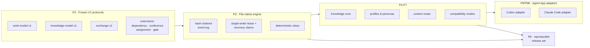

<div align="center">

# TCRN Workflow

### 당신의 AI 에이전트는 "완료했습니다"라고 말합니다. 이 프레임워크는 그것을 증명하게 만듭니다.

**AI 에이전트를 위한 통제된 딜리버리 체계 — 모든 역량이 약속이 아니라 기계가 검증한 주장입니다.**

[English](./README.md) · [简体中文](./README.zh-CN.md) · [日本語](./README.ja.md) · 한국어 · [Français](./README.fr.md)

   

    

[이 프로젝트가 존재하는 이유](#이-프로젝트가-존재하는-이유) · [당신에게 맞는가](#당신에게-맞는가) · [무엇을 얻는가](#무엇을-얻는가) · [빠른 시작](#빠른-시작) · [솔직한 답변](#솔직한-답변) · [라이선스](#라이선스)

`Verified claims: 65 (hygiene 13 · inertness 13 · runtime 39)`

</div>

---

> **한 문장으로 말하면**: 이 프레임워크가 하는 모든 보장은 기계가 읽을 수 있는 원장에 기록되고, 당신이 직접 자기 머신에서 실행할 수 있는 테스트에 묶여 있습니다 — 그리고 어떤 보장이 더 이상 참이 아니게 되는 순간, **빌드가 실패합니다**.

## 이 프로젝트가 존재하는 이유

AI 에이전트에게 코드를 쓰게 하는 일은 이제 쉽습니다. 어려운 것은 **그것이 하는 말을 믿을 근거**를 얻는 일입니다.

에이전트를 써 봤다면 다음 세 가지를 모두 겪었을 것입니다.

1. **"괜찮아요, 테스트했습니다."** 에이전트는 테스트가 통과했다고 말합니다. 당신이 실제로 손에 쥔 것은 채팅 창의 한 줄 텍스트입니다. 워크플로가 *주장*하는 것과 코드가 *실제로 강제*하는 것 사이에는 아무 연결도 없고, 코드가 바뀌면 그 주장은 조용히 낡아 갑니다.
2. **사라지는 히스토리**. 결정은 스크롤되어 사라진 대화와 변경 가능한 파일 속에 있습니다. 새벽 두 시에 무언가 망가지면 다시 재생할 것도, 비교할 것도, 리뷰어에게 건넬 것도 없습니다.
3. **믿음에 기댄 설치**. 스킬이나 워크플로가 저장소에서 도착하지만, 당신이 실행하려는 바이트가 누군가 실제로 검토한 바이트라는 것을 증명하는 것은 아무것도 없습니다.

TCRN Workflow는 이 세 가지를 한꺼번에 막습니다 — 에이전트 주도 딜리버리를 안전이 중요한 릴리스와 똑같이 다루는 방식으로.

- **모든 역량은 원장 속의 주장**이며, 각 주장은 안정적인 오류 이름(*reason code*)에 묶이고 오프라인에서 도는 테스트로 증명됩니다.
- **워크스페이스의 모든 변경은 변조 탐지가 가능한 저널의 한 항목**입니다 — 각 항목은 암호학적으로 직전 항목에 연결되므로, 히스토리는 추가만 가능하고 조용히 다시 쓸 수 없습니다.
- **모든 릴리스는 바이트 단위로 재구축**할 수 있고 공개된 다이제스트와 대조할 수 있습니다.

이 모든 것을 지탱하는 규칙이 하나 있고, 직접 겪어보기 전까지는 가장 믿기 어려운 부분이기도 합니다. **과잉 주장은 스타일 문제가 아니라 빌드 실패입니다**. 주장이 다루는 범위를 바꾸고 다시 증명하지 않으면, 거기서 사슬이 멈춥니다.

## 당신에게 맞는가

| | |
| --- | --- |
| ✅ **맞습니다** | 결과가 따르는 일에 에이전트를 쓰는 경우 — 프로덕션 코드, 규제 또는 감사 대상 딜리버리, 누가 무엇을 결정했는지 아무도 기억하지 못하는 멀티 에이전트 인수인계. 리뷰어가 *믿어야만* 하는 대화 기록이 아니라 *검증할 수 있는* 산출물을 원하는 경우. 그리고 모든 것을 자기 머신 안에 두고 싶은 경우: 데이터베이스 없음, 데몬 없음, 네트워크 없음, 텔레메트리 없음. |
| ❌ **아마 아닙니다** | 설정이 필요 없는 채팅 어시스턴트를 원하거나, 클라우드 동기화나 호스팅 대시보드가 필요하거나, 추가 전용 감사 기록이 가치보다 마찰이 될 만큼 탐색적인 일을 하는 경우. 여기의 엄격함은 공짜가 아닙니다 — 편의를 증거와 맞바꾸는 의도적인 거래입니다. |

## 무엇을 얻는가

| 역량 | 실제로 무슨 뜻인가 |
| --- | --- |
| **그냥 파일인 워크스페이스** | 작업 그래프 전체(Initiative → Epic → Story → Subtask)가 정규화된 평범한 JSON 파일과 해시 체인으로 존재합니다 — 데이터베이스도 데몬도 없습니다. `cat`과 `sha256sum`으로 감사할 수 있고, 내보내기는 바이트 단위로 재현 가능합니다. |
| **명령 하나, 게이트 20개** | `pnpm verify:p1`이 검증 사슬 전체를 실행합니다: 포맷, lint, 타입 검사, 빌드, 약 40개 테스트 파일, 신뢰 매트릭스, 아카이브/SBOM/라이선스/취약점 정책, 소스 허용 목록, 오프라인 경계, 프라이버시 스캔, CI 하드닝, 검증 맵, 클린 히스토리 증명. 예상 밖의 것이 하나라도 있으면 사슬이 멈춥니다. |
| **기계가 읽는 주장 원장** | `verification-map.yaml`이 65개 주장 — framework-hygiene 13개, inertness-proof 13개, runtime-capability 39개 — 을 관측 가능한 reason code에 결속합니다. 주장의 주어가 바뀌면 그 증명은 다시 실행되어야 합니다. |
| **여전히 작동함을 스스로 보이는 가드** | `pnpm guard-check`는 등록된 각 가드를 소스에서 변이 제거하고, 지정된 테스트가 빨간불이 되기를 요구합니다 — 가드 12개, 푸시할 때마다 검증. 사라져도 아무도 알아채지 못할 보호는 보호가 아닙니다. |
| **기록에 남는 숙의** | 콘퍼런스와 결정 게이트는 같은 변조 탐지 저널에 추가됩니다. 충족되지 않은 게이트는 해당 작업 항목이 `done`에 도달하는 것을 *막습니다*(`WORKSPACE_GATE_PENDING`) — 명령 시점에도, 재생 시점에도 다시 — 그리고 콘퍼런스를 닫으면 각 결정이 역링크된 지식 후보로 증류됩니다. |
| **모든 결정에 이름이 붙는다** | 액터 어테스테이션을 켜면 이후 모든 변경이 누가 행했는지 선언해야 합니다 — 엔진과 그 재생 모두 액터 ID가 빠진 이벤트에 대해 페일클로즈합니다. 켜지 않은 워크스페이스는 이전과 바이트 단위로 동일하게 동작합니다. |
| **되돌릴 수 있는 활성화** | 명시적인 세 단계가 비활성 Claude Code 번들을 살아 있는 통제 세션으로 바꾸고, 제거는 `.claude/settings.json`을 바이트 단위로 복원합니다 — 실제 호스트에서 관측되었고, 그동안 사용자가 이미 가지고 있던 훅은 계속 동작했습니다. 세션 훅의 어떤 오류든 평범한 Claude Code로 깨끗하게 빠져나갑니다. `~/.claude` 아래의 무언가를 지목하거나 쓰는 일은 결코 없습니다. |
| **스스로를 증명하는 백업** | 스냅샷은 결정적인 파일별 매니페스트를 냅니다. 런북은 스냅샷 → 삭제 → 복원을 바이트 단위로 왕복시키고, 정말 중요한 두 실패 모드(부분 복원, 다른 위치 복원)는 페일클로즈합니다. |
| **두 호스트, 하나의 진실** | Codex와 Claude Code 어댑터는 바이트 단위로 동일한 호스트 중립 기계를 공유하며, 호스트 간 일치 다이제스트로 증명됩니다. 둘 다 기본적으로는 설치되지 않은 템플릿 데이터만 생성합니다. **Claude Code는 그 뒤 활성화할 수 있고, Codex는 할 수 없습니다** — 「상태, 정직하게」를 보십시오. |
| **구조적으로 오프라인** | 개발 모드는 프로세스 수준 네트워크 가드를 설치하고 텔레메트리는 0입니다. 프라이버시 게이트는 추적되는 모든 바이트, 도달 가능한 모든 git 히스토리, 릴리스 아카이브를 개인 식별자와 머신 경로에 대해 훑습니다. |
| **직접 다시 도출할 수 있는 릴리스** | 릴리스는 불변 태그와 재현 가능한 산출물 묶음이며, `pnpm verify:p8`이 재구축해 바이트 비교합니다. 외부 사용자는 동반 프로젝트 `tcrn-workflow-helper`를 통해 검증하고, 그 다이제스트 자체는 독립적으로 확인할 수 있는 곳에 공개됩니다. |

<details>
<summary><b>다섯 가지 용어, 쉬운 말로</b>(클릭해서 펼치기)</summary>

- **페일클로즈(fail-closed)** — 무언가 이상해 보이면 추측해서 계속 가는 대신 안정적인 오류 이름과 함께 멈춥니다. 스쳐 지나가는 경고는 없습니다. 초록불이거나, 멈춤이거나입니다.
- **해시 체인** — 각 저널 항목이 직전 항목의 지문을 담습니다. 히스토리를 다시 쓰면 지문이 바뀌고, 재생이 그것을 거부합니다.
- **reason code** — 안정적이고 기계가 읽을 수 있는 오류 이름(예: `WORKSPACE_GATE_PENDING`). 도구와 에이전트는 이것으로 분기할 수 있습니다. 산문 형태의 오류 문구는 결코 계약이 아닙니다.
- **밀폐(hermetic)** — 로컬에 고정된 입력만으로 도는 테스트. 같은 입력이면 어떤 머신에서도 같은 결과입니다.
- **CAS / 기대 버전** — 모든 쓰기가 어느 버전 위에 쌓을 작정인지 밝힙니다. 다른 쪽이 먼저 썼다면, 조용히 덮어쓰는 대신 그 쓰기가 거부됩니다.

</details>

## 빠른 시작

고정된 툴체인이 필요합니다: **Node 24.16.0**과 **pnpm 11.3.0**. 의존성 라이프사이클 스크립트는 계속 비활성입니다 — 설치 시 어떤 코드도 실행되지 않습니다.

```sh
# 1. Install the pinned dev dependencies (explicit, frozen, script-free)
pnpm install --offline --frozen-lockfile --ignore-scripts

# 2. Watch the framework prove itself (20 gates, fully offline)
pnpm verify:p1

# 3. Build, then drive the governed CLI
pnpm build
node scripts/tcrn-workflow.mjs workspace --help
```

대표적인 통제 명령 — 모두 로컬, 네트워크 없음, 데이터베이스 없음:

```sh
# validate a workspace and materialize its deterministic views
node scripts/tcrn-workflow.mjs workspace validate --workspace <dir> --now <iso-instant>

# create and transition work records with version-checked writes
node scripts/tcrn-workflow.mjs work-create ...
node scripts/tcrn-workflow.mjs work-transition ...

# knowledge core: metadata-first reads, explicit body access, promotion CAS
node scripts/tcrn-workflow.mjs knowledge-list ...
```

모든 변경은 명시적인 워크스페이스 경로, 엄격한 RFC 3339 타임스탬프, 그리고 기대 버전을 요구합니다 — 동시성 안전성은 관례가 아니라 엔진이 강제합니다.

## 60초로 보는 아키텍처



맨 아래에 동결된 프로토콜, 그 위에 파일 네이티브 엔진, 다시 그 위에 역량 계층, 맨 위에 호스트 어댑터 — 활성화 전에는 비활성이며, 그 활성화를 가진 것은 Claude Code뿐입니다. 프로토콜은 추가 전용입니다: `work-model-v1`은 동결되었고, 모든 확장은 이미 수용된 스키마를 건드리지 않고 스스로 등록합니다.

## 솔직한 답변

### 에이전트는 병렬을 좋아하는데 왜 한 번에 한 명만 쓰는가

저장 계층과 추론 계층이 서로 다른 질문에 답하기 때문입니다.

1. **저장 계층은 설계상 단일 작성자입니다**. 해시 체인은 각 이벤트에 대해 진실한 후속이 정확히 하나뿐입니다 — 병렬 작성자는 체인을 망가뜨리거나, "`cat`과 `sha256sum`으로 감사한다"는 성질을 파괴하는 합의 프로토콜을 요구합니다. 그래서 엔진은 디스크상의 복구 프로토콜을 갖춘 배타적 리스를 통해 한 번에 한 작성자를 강제합니다: 크래시한 작성자의 리스는 격리되어 페일클로즈로 회수되고, 모든 획득은 버전 검사를 거칩니다.
2. **병렬성은 저장 계층 위에 삽니다**. 독립적이고 컨텍스트가 새로운 서브에이전트 스레드를 원하는 만큼 돌리십시오 — 구현 워커, 리뷰 보드, 적대적 검증자. 그 결론은 데이터로 돌아오고, 하나의 정본 스레드가 결정권을 쥐고 기록을 씁니다. 병렬성의 처리량*과* 선형적이고 감사 가능한 결정 계보를 동시에 얻습니다.
3. **거버넌스에는 직렬화 가능한 서사가 필요합니다**. 체인은 결정의 선형적이고 변조 탐지 가능한 순서를 주며, 워크스페이스가 액터 어테스테이션을 켜면 모든 결정이 선언되고 감사 가능한 액터에 결속됩니다. 그것은 순서가 있는 기록에 쓰인 선언된 신원이지, 인증된 신원이나 벽시계 진실에 대한 주장이 아닙니다. 공유 상태를 서로 고치는 동료 스레드 무리에는 순서도 결속도 없습니다.

<details>
<summary><b>이 답변을 뒷받침하는 테스트</b>(모두 <code>tests/p3-file-engine.test.mjs</code>, <code>pnpm verify:p3</code>로 실행)</summary>

- *리스 크래시와 복구 클레임 경합은 복구 가능하며 단일 작성자* — 작성자가 생성 도중 크래시되고, 낡은 리스는 격리되며, 경쟁자들이 겨뤄 정확히 하나만 이깁니다. 패자는 안정적인 reason code로 페일클로즈합니다.
- *지연된 생성자 축출* — 디렉터리가 회수된 일시 정지 상태의 리스 생성자는 활성 복구 클레임을 관측하고 페일클로즈(`WORKSPACE_LEASE_INVALID`)해야 하며, 새 세대를 점유해서는 안 됩니다. 실제 CI의 Linux ext4에서 발견해 고쳤고, 이후 결정적 테스트로 증명했습니다.
- *모든 유효 라이프사이클 지점에서의 SIGKILL 주입* — 엔진의 결함 목록은 실제 작업에서 발견되며, 각 지점에 진짜 `SIGKILL`이 전달됩니다. 복구는 잔여물 없는 깨끗한 상태로 수렴해야 합니다.
- *64가지 실제 삽입 순서 순열*이 바이트 단위로 동일한 인덱스, 목록, 체크포인트를 만듭니다 — 결정성은 가정이 아니라 증명됩니다.
- 동시성 케이스 4개, 부정 케이스 57개, 그리고 파일시스템 공격 매트릭스(심볼릭 링크, 하드 링크, 특수 파일, 교체 경쟁)가 증명을 마무리합니다.

</details>

### 왜 데이터베이스가 아니라 파일인가

신뢰 경계는 표준 도구로 들여다볼 수 있어야 하기 때문입니다. 모든 레코드는 정규 JSON(정렬된 키, 끝에 LF 하나)이고, 모든 이벤트는 자신의 `priorHash`/`eventHash`를 지니며, 저장소 전체를 어떤 언어로든 몇 줄로 검증할 수 있습니다. 데이터베이스는 데몬, 바이너리 포맷, 암묵적 신뢰 의존성을 더합니다 — *"모든 것을 오프라인에서 직접 확인할 수 있다"*를 핵심 약속으로 삼는 프레임워크에는 전부 부채입니다.

### 왜 오프라인 우선이고 페일클로즈인가

조용히 네트워크에 손을 뻗는 에이전트 프레임워크는 언제든 쓰일 수 있는 유출 통로입니다. 개발 모드는 프로세스 수준 네트워크 가드를 설치하고, 검증 사슬은 프로젝트 코드에 암묵적 네트워크 경로가 없음을 증명합니다. 네트워크를 쓰는 유일한 단계(의존성 획득, CI 부트스트랩)는 명시적이고 고정되어 있습니다. 페일클로즈란 모든 검증기가 첫 번째 예상 밖 바이트에서 안정적인 reason code와 함께 멈춘다는 뜻입니다.

### Claude Code 어댑터에서 "라이브"란 무슨 뜻인가

실제 Claude Code 세션이 해당 워크스페이스를 통치하는 권위의 **읽기 전용 요약**을 받는다는 뜻이며, 그 이상은 없습니다. 이는 가정이 아니라 측정되었습니다 — 그 요약 안에만 존재하는 값을 세션에 물었고, 모든 도구를 비활성화해 디스크에서 읽는 것이 불가능하게 했습니다.

나머지는 의도적으로 밖에 둡니다. 이 프레임워크는 호스트의 도구 사용을 재정하지 **않고**, 응답을 억제하거나 고쳐 쓰지 **않으며**, `~/.claude` 아래에는 **결코** 쓰지 않고, 명시적 행위 없이 지식을 승격하지 **않으며**, 세션을 편성하지도 **않습니다**. 훅이 실패하면 아무것도 출력하지 않고 세션은 평범한 Claude Code로 계속됩니다 — 이 코드베이스에서 의도적으로 fail-closed가 아니라 fail-open인 유일한 지점인데, 세션을 망가뜨릴 수 있는 통치 계층은 조용해지는 통치 계층보다 나쁘기 때문입니다.

Codex에는 이에 해당하는 것이 없습니다. 그 어댑터는 생성과 시뮬레이션만 하고 설치는 하지 않으며, 여기 있는 어떤 것도 Codex 호스트에 쓰지 않습니다.

### 릴리스는 어떻게 신뢰되는가

릴리스란 불변의 주석 태그와 재현 가능한 산출물 묶음(정규 소스 아카이브, SBOM, provenance, 체크섬, 릴리스 노트)이며, `pnpm verify:p8`이 재구축해 바이트 비교합니다. 외부 사용자는 동반 프로젝트 **tcrn-workflow-helper**를 통해 검증합니다: 의존성 없는 부트스트랩으로, 자신의 SHA-256이 다운로드와 독립적으로 확인할 수 있는 곳에 공개되어 있으며, 안에 컴파일된 다이제스트와 바이트가 맞지 않는 릴리스는 — Workflow 코드가 한 줄이라도 돌기 전에 — 거부합니다.

## 약속이 아니라 검사된 숫자

아래 모든 숫자는 게이트가 강제합니다 — 하나라도 어긋나면 어딘가에서 빌드가 실패합니다.

- `verify:p1` 사슬의 **게이트 20개**, 각각 안정적인 종단 reason code를 가집니다.
- `verification-map.yaml`의 **기계 검증 주장 65개** — framework-hygiene 13개, inertness-proof 13개, runtime-capability 39개. 위의 주장 배지는 실행할 때마다 파싱되어 원장과 대조됩니다.
- **등록된 가드 12개**, 각각 변이 제거 후 테스트가 빨간불이 되는지 확인해 여전히 작동함을 증명합니다.
- **밀폐 테스트 파일 약 40개**. 진짜 `SIGKILL` 결함 주입, 독립된 세 계층에서의 64순열 결정성 증명, 파일시스템 공격 매트릭스를 포함합니다.
- **엔드투엔드 대표 증명 1개**(`pnpm verify:e2e`) — 통제 루프 전체(initiative → epic → story → gate → conference → distill → promote → trace)의 밀폐 재생으로, 튜토리얼의 모든 명령을 문자 그대로 실행합니다.
- **공개 AOS 요구사항 원장 19항목**(11개는 fixture 검증, 8개는 명세 기재) — 성숙도는 행마다 기록되며 결코 부풀리지 않습니다.
- **프라이버시 게이트**가 허용 목록의 소스 파일 250개 전부(정확히 일치하는 목록이라 파일이 하나 늘거나 줄면 게이트가 실패합니다), 도달 가능한 모든 git 객체, 그리고 릴리스 아카이브를 대상으로 합니다.

<details>
<summary><b>전체 검증 대상 레퍼런스</b>(클릭해서 펼치기)</summary>

| 대상 | 무엇을 증명하는가 |
| --- | --- |
| `verify:p1` | 깨끗한 커밋 트리 위의 완전한 20게이트 사슬. |
| `verify:p2` | 동결된 V1 프로토콜 계약, 결정적 벡터, 부정/속성 테스트, 요구사항 원장, 닫힌 스키마. |
| `verify:p3` | 파일 네이티브 워크스페이스: 리스/CAS, 크래시 복구, 격리, 마이그레이션, 결정적 뷰, 파일시스템 공격 매트릭스. |
| `verify:p4` / `verify:p4:knowledge` | 산출물 라이프사이클 예산, 비식별화, 일회용 아카이브 apply/restore; 지식 코어의 메타데이터/본문 분리, 승격 CAS, 64순열 일치. |
| `verify:p5` | 닫힌 범용 프로파일 신뢰 모델, 실효 정책 다이제스트, 콜드스타트 그래프, 여덟 개의 비활성 Core Reference 페르소나. |
| `verify:p6` / `verify:p6:adapter` / `verify:p6b` | 컨텍스트 라우터의 범위/위험/예산 제어와 적대적 코퍼스; Codex 어댑터 브리지; Claude Code 어댑터(네 파일 템플릿 번들, 가역 settings 조각, 금지 경로 거부, CLAUDE.md 폴백, 호스트 간 일치 다이제스트). |
| `verify:p7` / `verify:p7:compatibility` | 정규 교환, 호환성 매니페스트, 롤백 방지 하한, 결정적 임포트/체크포인트/폴백 계획. |
| `verify:p8` | 재현 가능한 릴리스 후보: 소스 아카이브 재구축과 바이트 비교, SBOM, provenance, 체크섬, 여섯 파일 닫힌 번들, 외부 신뢰 부정 매트릭스. |
| `verify:privacy` | 추적되는 어떤 바이트, git 객체, 아카이브에도 개인 식별자와 머신 경로가 없음. |
| `verify:isolated` | 밀폐된 의존성 구체화에서 도는 동일한 P1 사슬(CI 게이트). |

개발 모드는 프로세스 네트워크 가드와 함께 오프라인이며 텔레메트리는 0입니다. 워크스페이스의 개발 의존성은 정확히 셋(오프라인 Draft 2020-12 스키마 일치를 위한 `ajv@8.17.1`, 고정 타입 게이트인 `typescript@5.9.3`, `@types/node@24.13.2`)이며, 각각 라이프사이클 스크립트를 끈 명시적 레지스트리 경계를 통해 획득됩니다. P1은 명시적 외부 경계 네 가지를 남깁니다: 호출 간 `rootVersion` 연속성에는 외부 하한이 필요하고, OS 수준 네트워크 샌드박스는 없으며, 오프라인에서는 새로운 외부 권고 스캔을 수행하지 않고, 프라이버시 정규식 집합은 초점을 좁힌 정책 제어이지 범용 DLP가 아닙니다.

</details>

## 저장소 구조

| 경로 | 내용 |
| --- | --- |
| `packages/core/` | 엔진, 어댑터, 지식 코어, 프로파일, 라우터, 교환(TypeScript, 고정 컴파일러로 검사). |
| `schemas/` · `specs/` | 동결된 V1 프로토콜 스키마(닫혀 있고 Draft 2020-12 일치가 증명됨)와 그 규범 명세. |
| `tests/` | 밀폐 증명 스위트. |
| `scripts/` | 통제 CLI, 검증 태스크, 가드 체커, 증명 산출물 생성기, 프라이버시/정책 게이트. |
| `fixtures/` | 결정적 프로토콜 벡터, 적대적 코퍼스, 요구사항 원장 참조. |
| `docs/` | 아키텍처, 릴리스 신뢰, 버저닝, 릴리스 노트. |
| `verification-map.yaml` | 주장 원장 — 실제로 무엇이 증명되었는지는 여기서부터 보십시오. |

## 이 프레임워크가 관장하지 않는 것

대부분의 프로젝트는 자기 경계를 숨깁니다. 여기서 경계는 구조재입니다 — 위의 주장을 증명하는 바로 그 규율이, 그것들이 어디서 끝나는지도 정확히 말할 것을 요구합니다. 아래 네 가지를 적어 두는 이유는, 이 문서를 끝까지 읽은 주의 깊은 독자조차 앞의 두 가지를 넓게 읽었기 때문입니다.

- **여러분 제품의 소스 트리**. 단일 작성자 리스가 관장하는 것은 워크스페이스 이벤트 체인입니다. 두 에이전트가 동시에 `src/foo.ts`를 편집하는 상황은 여기 있는 무엇으로도 보호되지 않습니다 — worktree 격리를 쓰거나, 그 편집 자체를 워크스페이스를 거치게 하십시오.
- **여러분 제품의 공급망**. 네트워크 가드가 덮는 것은 P1 프로젝트 명령을 실행하는 프로세스입니다. 에이전트 자신의 셸도, 여러분 제품의 빌드도 그 바깥입니다. 런타임 의존성 0은 *이 프레임워크*의 성질이지, 이것으로 만든 결과물의 성질이 아닙니다.
- **여러분의 코드가 옳은지 여부**. 주장 원장이 보장하는 것은 *선언된* 역량이 실행 가능한 증명을 계속 유지한다는 것, 그리고 과잉 주장이 빌드 실패가 된다는 것입니다. 그 주장 집합이 옳은지는 원장이 알 수 없습니다. 무엇을 주장할지는 환원 불가능한 인간의 판단이며, 어떤 provenance도 그것을 대체하지 못합니다.
- **신원과 시간**. 액터 어테스테이션이 기록하는 것은 *선언된* 액터 ID이지 인증된 신원이 아니고, 체인이 증명하는 것은 순서이지 벽시계 진실이 아닙니다. 체인은 내부 변조에 대해서는 탐지 가능하지만, 그것이 놓인 파일시스템 바깥에는 닻이 없습니다.

## 상태, 정직하게

- `0.1.0-rc.6`는 **프리릴리스 후보**입니다. 공개 API는 아직 안정적이지 않습니다.
- **Claude Code 활성화는 라이브이며, 실제 호스트에서 관측되었습니다**. 1–3단계가 Claude Code `2.1.201`을 상대로 설치·활성화·제거를 수행했고, 권위 요약이 실제로 모델의 컨텍스트에 도달했다는 것을 포함해 아홉 건의 관측이 기록되었습니다. 라이브 상태에서 하는 일은 세션 시작 시 읽기 전용 요약을 주입하는 것뿐이며, 그 이상은 없습니다 — 의도적으로 하지 않는 일은 위의 경계 목록을 보십시오. 영수증: `docs/verification/host/claude-code.json`.
- **Codex는 읽기 전용에서 멈춥니다**. `adapter-generate`·`-validate`·`-simulate`·`-fallback`·`-rollback-plan`은 실재하는 결정적 호스트 중립 도구입니다. Codex 설치 프로그램도 Codex 활성화도 없으며, 따라서 여기 있는 어떤 것도 Codex 호스트에 쓰지 않습니다.
- **규모**. 워크스페이스는 **수천 건 초반**의 이벤트 수에서 체감할 만큼 느려지고, 단일 명령이 1초를 넘는 지점은 약 **6,600**건입니다(Apple M3 실측에서 외삽. `docs/verification/2026-07-20-event-chain-ceiling-samples.json`). 쓰기만큼 읽기에도 영향을 줍니다. 조직 전체를 하나의 체인으로 돌리지 말고 **프로젝트나 이니셔티브 단위로 워크스페이스를 분할**하십시오.
- `supportedAosReleases`는 비어 있습니다: 외부 AOS 호환성은 주장하지 않습니다.
- 릴리스 모드는 동반 헬퍼가 그 바이트를 수용할 것을 요구합니다: 부트스트랩 다이제스트는 독립적으로 공개되고, 수용되는 릴리스 다이제스트는 그 안에 컴파일되어 있습니다.

## 기여, 지원, 보안

- 사용 질문 → GitHub Discussions. 재현 가능한 결함 → Issues(`SUPPORT.md` 참조).
- 보안 신고 → `SECURITY.md`에 따라 비공개 취약점 보고로.
- 기여는 모든 게이트를 초록으로 유지해야 합니다 — `CONTRIBUTING.md` 참조. 기준은 이렇습니다: *당신의 주장이 통과하는 증명과 함께 검증 맵에 없다면, 그것은 주장된 것이 아니다.*

## 라이선스

[Apache-2.0](./LICENSE)
