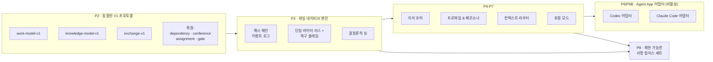

[English](./README.md) | [简体中文](./README.zh-CN.md) | [日本語](./README.ja.md) | **한국어** | [Français](./README.fr.md)

# TCRN Workflow

**거버넌스된 AI 에이전트 작업을 위한 결정론적 오프라인 우선 프레임워크 — 모든 기능은 약속이 아니라 기계로 검증된 클레임입니다.**

`상태: 0.1.0-rc.5 (프리릴리스 후보)` · `라이선스: Apache-2.0` · `Node 24.16.0` · `pnpm 11.3.0` · `검증된 클레임: 65`

---

## 왜 이 프로젝트가 존재하는가

AI 에이전트는 점점 더 "딜리버리" — 작업 계획, 코드 작성, 변경 리뷰, 릴리스 컷 — 를 맡고 있습니다. 그러나 대부분의 에이전트 워크플로에는 세 가지 구조적 약점이 있습니다.

1. **검증 불가능한 클레임.** "에이전트가 테스트했다"는 보통 로그 한 줄이지 증명이 아닙니다. 워크플로가 *보장한다고 말하는 것*과 코드가 *실제로 강제하는 것* 사이에 기계로 확인할 수 있는 연결이 없습니다.
2. **재현 불가능한 상태.** 대화 기반 작업은 이력을 불투명한 채팅 로그와 가변 데이터베이스에 남깁니다. 문제가 생겼을 때 리플레이하고 감사하고 리뷰어에게 넘길 결정론적 이벤트 기록이 없습니다.
3. **공급망 사각지대.** 에이전트 스킬과 워크플로는 릴리스 정체성도, 서명도, 롤백 방지 하한도 없이 저장소에서 설치되며, 실행하는 바이트가 리뷰된 바이트임을 증명할 방법이 없습니다.

TCRN Workflow는 이 세 가지 간극을 동시에 메우기 위해 만들어졌습니다. 에이전트 주도 딜리버리를 안전 필수 소프트웨어 릴리스와 같은 엄격함으로 다룹니다: **모든 기능은 허메틱한 오프라인 테스트로 증명되는 안정적인 사유 코드에 매핑되고**, 모든 워크스페이스 변경은 append-only 해시 체인 이벤트이며, 모든 릴리스는 불변·재현 가능·서명된 아티팩트 집합입니다.

## 무엇을 얻게 되는가

| 기능 | 실제 의미 |
| --- | --- |
| **결정론적 파일 네이티브 워크스페이스** | 이벤트 소싱된 로컬 작업 그래프(Initiative → Epic → Story → Subtask)를 정규화 JSON 파일 + 해시 체인으로 저장 — 데이터베이스 없음, 데몬 없음, 바이트 단위로 재현 가능한 내보내기. |
| **페일 클로즈드 검증 체인** | 명령 하나(`pnpm verify:p1`)로 20개의 게이트 실행: 포맷, 린트, 타입 검사, 빌드, 약 40개 테스트 파일, 신뢰 매트릭스, 아카이브/SBOM/라이선스/취약점 정책, 소스 허용 목록, 오프라인 경계, 프라이버시 스캔, CI 강화, 검증 맵, 클린 히스토리 증명. 예상 밖의 것은 체인을 멈춥니다. |
| **기계가 읽는 클레임 원장** | `verification-map.yaml`이 65개의 기능 클레임을 관측 가능한 사유 코드에 결속합니다. 클레임의 대상이 바뀌면 증명을 다시 실행해야 합니다 — 과대 주장은 스타일 문제가 아니라 빌드 실패입니다. |
| **거버넌스 하의 심의·게이트·증류** | 9개의 거버넌스 CLI 동사가 사전 커밋 콘퍼런스와 결정 게이트를 가산적 해시 체인 이벤트로 구동하며, 콘퍼런스 종료는 회의록의 각 결정을 그것을 역링크하는 지식 후보로 증류합니다. 게이트 강제는 페일 클로즈드입니다: 대기 중인 게이트는 해당 작업 항목의 `done` 전이를 차단하고(`WORKSPACE_GATE_PENDING`, 동사 시점과 리플레이 시점 모두), 게이트는 해결 가능한 콘퍼런스 회의록 증거가 있을 때만 `satisfied`에 도달합니다. |
| **경계에서 강제되는 액터 증명** | 단방향 이벤트 `attestation.actor.enabled`를 추가하면 이후 모든 변경에서 액터 ID가 필수가 됩니다 — 라이브 추가와 리플레이 모두 이를 누락한 이벤트에 대해 페일 클로즈드 `WORKSPACE_ACTOR_REQUIRED`로 실패합니다. 한 번도 활성화하지 않은 워크스페이스는 이전과 바이트 단위로 동일하며, 일단 활성화하면 되돌릴 수 없습니다. |
| **옵트인 활성화 래더** | 명시적이고 바이트 가역적인 3단계가 비활성 Claude Code 번들을 라이브 거버넌스 세션으로 바꿉니다: 4파일 템플릿 설치(1단계), 페일 오픈 `SessionStart` 훅을 정확히 하나 병합(2단계), 유일한 자문 페르소나 Verity를 1024바이트 예산 내에서 렌더링(3단계). 핸들러는 유일하게 인가된 페일 오픈 표면으로 — 어떤 오류든 순수 Claude Code로 0 종료 — `~/.claude` 아래는 결코 명명하거나 기록하지 않습니다. |
| **스냅샷 백업과 헤르메틱 복원** | 리스를 보유한 `snapshot-manifest`가 파일별 결정론적 매니페스트를 방출하고, runbook은 스냅샷 → 삭제 → 복원을 원래 경로에서 바이트 단위로 동일하게 왕복합니다. 두 교리적 실패 모드(부분 복원 또는 재배치 복원)는 페일 클로즈드로 실패합니다. 선택적 git tier-2는 무결성 증인으로만 기능합니다. |
| **듀얼 호스트 Agent App 어댑터** | Codex와 Claude Code가 V1 공식 지원 호스트입니다. 바이트 단위로 동일한 호스트 중립 기계를 공유하며 크로스 호스트 패리티 다이제스트로 증명됩니다. 두 어댑터 모두 기본적으로 **비활성 드라이런 후보**로, 설치되지 않은 템플릿 데이터만 생성하며 라이브 호스트 지원은 위의 옵트인·거버넌스 활성화 래더를 통해서만 도달합니다. |
| **오프라인 우선, 프라이버시 클린** | 개발 모드는 Node 프로세스 수준 네트워크 가드와 제로 텔레메트리를 강제합니다. 프라이버시 게이트가 모든 추적 바이트, 도달 가능한 전체 git 히스토리, 릴리스 아카이브에서 개인 식별자와 머신 경로를 스캔합니다. |
| **서명된 릴리스 신뢰** | 릴리스는 태그 정체성(commit, tree, tag object)으로 결속되고 Ed25519 트러스트 루트 계약으로 외부 검증됩니다 — 동반 저장소 `tcrn-workflow-helper` 참조. |

## 빠른 시작

고정 툴체인이 필요합니다: **Node 24.16.0**과 **pnpm 11.3.0** (의존성 라이프사이클 스크립트는 비활성 유지).

```sh
# 1. 유일한 개발 의존성 획득 (명시적, 동결, 스크립트 없음)
pnpm install --offline --frozen-lockfile --ignore-scripts

# 2. 전체 검증 게이트 실행 (오프라인)
pnpm verify:p1

# 3. 빌드 후 거버넌스 CLI 사용
pnpm build
node scripts/tcrn-workflow.mjs workspace --help
```

대표적인 명령 (모두 로컬, 네트워크 없음, 데이터베이스 없음):

```sh
# 워크스페이스 검증 및 결정론적 뷰 실체화
node scripts/tcrn-workflow.mjs workspace validate --workspace <dir> --now <ISO-instant>

# CAS 버전 검사와 함께 작업 레코드 생성 및 전이
node scripts/tcrn-workflow.mjs work-create ...
node scripts/tcrn-workflow.mjs work-transition ...

# 지식 코어: 메타데이터 우선 읽기, 명시적 본문 접근, 승격 CAS
node scripts/tcrn-workflow.mjs knowledge-list ...
```

변경 명령은 명시적 워크스페이스 경로, 엄격한 RFC 3339 타임스탬프, 기대 버전을 요구합니다 — 낙관적 동시성은 관례가 아니라 엔진이 강제합니다.

## 아키텍처 한눈에 보기



프로토콜은 추가 전용입니다: `work-model-v1`은 동결되었고, 모든 확장(dependency, conference, assignment, gate)은 수락된 스키마를 건드리지 않고 등록됩니다.

## 설계 Q&A

### 왜 멀티스레딩 대신 "하나의 정본 대화 스레드 + 여러 서브 에이전트 스레드"인가?

가장 많이 받는 질문이며, 답은 세 층입니다.

1. **스토리지 계층은 설계상 단일 라이터입니다.** 워크스페이스는 순수 파일시스템 위의 append-only 해시 체인 이벤트 로그입니다. 해시 체인에서 각 이벤트의 진실한 후속은 정확히 하나 — 병렬 라이터는 체인을 망가뜨리거나, "`cat`과 `sha256sum`으로 감사한다"는 속성을 파괴하는 합의 프로토콜을 요구합니다. 그래서 엔진은 배타적 리스와 디스크상의 복구 클레임 프로토콜로 **동시에 하나의 라이터**를 강제합니다: 충돌한 라이터의 리스는 격리되고 페일 클로즈드로 회수되며, 모든 획득은 CAS 검사를 거칩니다.
2. **추론의 병렬성은 스토리지 계층 위에 있습니다.** 동시성은 여전히 어디에나 있습니다 — 다만 *서로 독립적인 새 컨텍스트의 서브 에이전트 스레드*(구현 워커, 다역할 리뷰 보드, 적대적 검증자)로서이며, 결론은 데이터로 돌아옵니다. 하나의 정본 스레드가 결정 권한을 갖고 기록을 씁니다. N개의 서브 스레드는 병렬로 탐색·리뷰·반박하며, 서로의 컨텍스트를 오염시키지 않고 상태 경쟁도 하지 않습니다. 병렬의 처리량과 선형의 감사 가능한 의사결정 계보를 동시에 얻습니다.
3. **거버넌스에는 직렬화 가능한 서사가 필요합니다.** 단일 작성자 체인은 결정의 선형적이고 변조 감지 가능한 *순서*를 제공하며, 각 결정을 책임 있는 행위자에 묶는 일은 이제 강제됩니다: 워크스페이스가 행위자 증명 확장을 활성화하면 체인이 수용하는 모든 이벤트는 행위자 ID를 선언해야 하고 — 엔진과 그 재생 모두 ID가 빠진 이벤트에 대해 페일 클로즈드로 실패합니다 — 그리하여 증명된 워크스페이스는 모든 결정을 선언되고 감사 가능한 행위자에 묶습니다. 이는 순서화된 기록에 기입된 선언된 신원이지, 인증된 신원이나 실제 시각의 진위를 주장하는 것이 아닙니다. 증명을 비활성으로 둔 워크스페이스는 이전과 똑같이 동작하며, 책임은 거버넌스 스레드의 영수증에 맡깁니다. 공유 상태를 서로 고치는 피어 스레드 무리에는 순서도 결속도 없습니다.

**이 답을 뒷받침하는 테스트** (모두 `tests/p3-file-engine.test.mjs`, `pnpm verify:p3`로 실행):

- *리스 생성 충돌과 복구 클레임 경합은 복구 가능하며 단일 라이터* — 생성 중인 라이터를 충돌시키고, 오래된 리스를 격리하고, 경쟁자들이 레이스하여 정확히 하나가 승리합니다. 패자는 안정적 사유 코드로 페일 클로즈드.
- *지연된 생성자 축출* — 디렉터리가 회수된 일시 정지 리스 생성자는 활성 복구 클레임을 관측하고 페일 클로즈드(`WORKSPACE_LEASE_INVALID`)해야 하며, 새 세대를 점거해선 안 됩니다. 이는 inode를 재활용하는 파일시스템의 inode 튜플 재사용을 방어합니다(실제 CI의 Linux ext4에서 발견·수정 후 결정론적 테스트로 고정).
- *모든 유효 라이프사이클 지점에 실제 SIGKILL 주입* — 결함 인벤토리는 실제 연산에서 발견되고, 각 지점에 진짜 `SIGKILL`이 전달됩니다. 복구는 잔여물 없는 깨끗한 상태로 수렴해야 합니다.
- *64가지 실제 삽입 순서 순열*이 바이트 단위로 동일한 인덱스·리스트·체크포인트를 생성 — 결정론은 가정이 아니라 증명됩니다.
- 추가로 동시성 4 케이스, 네거티브 57 케이스, 파일시스템 공격 매트릭스(심볼릭 링크, 하드 링크, 특수 파일, 교체 레이스).

### 왜 데이터베이스가 아니라 파일인가?

신뢰 경계는 표준 도구로 검사 가능해야 하기 때문입니다. 모든 레코드는 정규화 JSON(키 정렬, 종단 LF 하나)이고, 모든 이벤트는 `priorHash`/`eventHash`를 지니며, 스토어 전체를 어떤 언어로든 몇 줄로 검증할 수 있습니다. 데이터베이스는 데몬, 바이너리 포맷, 암묵적 신뢰 의존을 끌어들입니다 — 핵심 약속이 *"모든 것을 오프라인에서 직접 확인할 수 있다"*인 프레임워크에는 전부 부채입니다.

### 왜 오프라인 우선이고 페일 클로즈드인가?

조용히 네트워크에 도달하는 에이전트 프레임워크는 발화를 기다리는 유출 채널입니다. 개발 모드는 프로세스 수준 네트워크 가드를 설치하고, 검증 체인은 프로젝트 코드에 암묵적 네트워크 경로가 없음을 증명합니다. 유일한 네트워크 단계(의존성 획득, CI 부트스트랩)는 명시적이고 고정되어 있습니다. 페일 클로즈드란 모든 검증기가 첫 예상 밖 바이트에서 안정적 사유 코드를 던진다는 뜻 — 스크롤되어 지나가는 경고는 없고, 초록 아니면 정지뿐입니다.

### 왜 Codex와 Claude Code 어댑터는 "비활성 후보"인가?

거버넌스된 릴리스 루트가 수락하기 전에 라이브 호스트 지원을 주장하는 것이 바로 과대 주장 — 이 프레임워크가 막으려는 실패 모드이기 때문입니다. 어댑터는 결정론적이고 설치되지 않은 템플릿 번들을 생성합니다(바이트 단위 증명, 사용자 콘텐츠를 절대 덮어쓰지 않고 사용자 수준 `.claude` 경로를 모두 거부하는 가역 병합 `.claude/settings.json` 훅 프래그먼트 포함). 활성화는 별도의 게이트 결정입니다.

### 릴리스는 어떻게 신뢰되는가?

릴리스 = 불변 주석 태그 + 재현 가능한 아티팩트 세트(정규 USTAR 소스 아카이브, SBOM, 매니페스트, 출처 증명, 체크섬, 노트). `pnpm verify:p8`이 재구축하고 바이트 비교합니다. 외부 소비자는 동반 저장소 **tcrn-workflow-helper**로 검증합니다: Ed25519 서명 릴리스 매니페스트와 정책, 롤백 방지 에포크 하한을, 의존성 제로 부트스트랩이 어떤 Workflow 코드 실행 전에 검증합니다.

### 테스트는 실제로 무엇을 증명하는가 — 숫자로

- `verify:p1` 체인의 **게이트 20개**, 각각 안정적 종단 사유 코드.
- 엔진, 지식 코어, 아티팩트 라이프사이클, 프로파일, 페르소나, 컨텍스트 라우터, 두 어댑터, 교환, 호환, 요구사항 원장, 릴리스 후보, 프라이버시 경계, 증명 아티팩트 생성기, 신뢰 매트릭스, 콘퍼런스/게이트 이벤트 로그 저장소와 페일 클로즈드 게이트 강제, 액터 증명, 스냅샷 백업과 복원, 활성화 래더, 엔드투엔드 거버넌스 루프를 덮는 **약 40개 테스트 파일**.
- **엔드투엔드 기함 증명 1개**(`pnpm verify:e2e`) — 완전한 거버넌스 루프(initiative → epic → story → 게이트 → 콘퍼런스 → 증류 → 승격 → 추적)의 헤르메틱 리플레이 1회. 모든 튜토리얼 명령을 축자적으로 실행하고 생성된 각 다이제스트를 생성원까지 추적합니다.
- `verification-map.yaml`의 **기계 검증 클레임 65개**.
- 독립적인 세 계층의 **64-순열 결정론 증명** (엔진 삽입 순서, 프로파일 계층 순서, 어댑터 입력 순서).
- **19행 공개 AOS 요구사항 원장** (11행 픽스처 검증, 8행 명세화) — 성숙도는 행마다 정직하게 기록되며 절대 부풀리지 않습니다.
- **프라이버시 게이트**는 약 200개 추적 소스 파일, 약 1,470개 git 객체, 도달 가능한 전체 히스토리, 릴리스 아카이브를 스캔합니다.

<details>
<summary><b>검증 타깃 전체 레퍼런스</b> (클릭하여 펼치기)</summary>

| 타깃 | 증명 내용 |
| --- | --- |
| `verify:p1` | 클린 커밋 트리 위의 완전한 20 게이트 체인. |
| `verify:p2` | 동결 V1 프로토콜 계약, 결정론적 벡터, 네거티브/프로퍼티 테스트, 요구사항 원장, 닫힌 스키마. |
| `verify:p3` | 파일 네이티브 워크스페이스: 리스/CAS, 충돌 복구, 격리, 마이그레이션, 결정론적 뷰, 파일시스템 공격 매트릭스. |
| `verify:p4` / `verify:p4:knowledge` | 아티팩트 라이프사이클 예산, 편집(redaction), 일회용 아카이브 적용/복원; 지식 코어 메타데이터/본문 분리, 승격 CAS, 64-순열 패리티. |
| `verify:p5` | 닫힌 범용 프로파일 신뢰 모델, 유효 정책 다이제스트, 콜드 스타트 그래프, 8개의 비활성 Core Reference 페르소나. |
| `verify:p6` / `verify:p6:adapter` / `verify:p6b` | 컨텍스트 라우터의 범위/위험/예산 제어와 적대적 코퍼스; Codex 어댑터 브리지; Claude Code 어댑터(4파일 템플릿 번들, 가역 설정 프래그먼트, 금지 경로 거부, CLAUDE.md 폴백, 크로스 호스트 패리티 다이제스트). |
| `verify:p7` / `verify:p7:compatibility` | 정규 교환, 호환 매니페스트, 롤백 방지 하한, 결정론적 임포트/체크포인트/폴백 계획. |
| `verify:p8` | 재현 가능한 릴리스 후보: 소스 아카이브 재구축 + 바이트 비교, SBOM, 출처, 체크섬, 6파일 닫힌 번들, 외부 신뢰 네거티브 매트릭스. |
| `verify:privacy` | 어떤 추적 바이트, git 객체, 아카이브에도 개인 식별자와 머신 경로가 없음. |
| `verify:isolated` | 허메틱 의존성 실체화 환경에서 동일한 P1 체인 재실행 (CI 게이트). |

개발 모드는 오프라인이며 프로세스 네트워크 가드와 제로 텔레메트리를 갖습니다. 개발 의존성은 하나뿐(`ajv@8.17.1`, 오프라인 Draft 2020-12 스키마 패리티 증명용)이며 라이프사이클 스크립트가 비활성화된 명시적 레지스트리 경계로 획득했습니다. P1은 네 가지 명시적 외부 경계를 유지합니다: 호출 간 `rootVersion` 연속성은 외부 하한 필요; OS 수준 네트워크 샌드박스 없음; 오프라인에서 신규 외부 보안 권고 스캔 없음; 프라이버시 정규식 세트는 초점화된 정책 제어이지 범용 DLP가 아님.

</details>

## 저장소 구조

| 경로 | 내용 |
| --- | --- |
| `packages/core/` | 엔진, 어댑터, 지식 코어, 프로파일, 라우터, 교환 (TypeScript, 고정 Node 타입 변환 엔진으로 빌드). |
| `schemas/` · `specs/` | 동결 V1 프로토콜 스키마(닫힘, Draft 2020-12 패리티 증명)와 규범 명세. |
| `tests/` | 허메틱 증명 스위트. |
| `scripts/` | 거버넌스 CLI, 검증 태스크, 증명 아티팩트 생성기, 프라이버시/정책 게이트. |
| `fixtures/` | 결정론적 프로토콜 벡터, 적대적 코퍼스, 요구사항 원장 참조. |
| `docs/` | 아키텍처, 릴리스 신뢰, 버저닝, 릴리스 노트. |
| `verification-map.yaml` | 클레임 원장 — 실제로 무엇이 증명되었는지 여기서 시작하세요. |

## 상태 (정직하게)

- `0.1.0-rc.5`는 **프리릴리스 후보**입니다. 공개 API는 아직 안정적이지 않습니다.
- 두 호스트 어댑터는 비활성 드라이런 후보입니다. **라이브 Codex / Claude Code 지원은 주장하지 않습니다**.
- `supportedAosReleases`는 비어 있습니다: 외부 AOS 호환성은 주장하지 않습니다.
- 외부 Ed25519 신뢰 검증이 성공하지 않는 한 릴리스 모드는 사용할 수 없습니다.

## 기여, 지원, 보안

- 사용 질문 → GitHub Discussions. 재현 가능한 결함 → Issues (`SUPPORT.md` 참조).
- 보안 보고 → `SECURITY.md`에 따라 비공개 취약점 보고.
- 기여는 모든 게이트를 초록으로 유지해야 합니다 — `CONTRIBUTING.md` 참조. 기준은: *클레임이 검증 맵에 통과한 증명과 함께 올라 있지 않으면, 주장하지 않은 것입니다.*

## 라이선스

[Apache-2.0](./LICENSE)
