<div align="center">

# TCRN Workflow

**AI 에이전트를 위한 거버넌스된 딜리버리 — 모든 기능은 약속이 아니라 기계로 검증된 클레임입니다.**

[English](./README.md) · [简体中文](./README.zh-CN.md) · [日本語](./README.ja.md) · 한국어 · [Français](./README.fr.md)

   

    

[왜 만들었나](#why-this-project-exists) · [누구를 위한 것인가](#who-this-is-for) · [무엇을 얻는가](#what-you-get) · [빠른 시작](#quick-start) · [검증](#verification) · [라이선스](#license)

`Verified claims: 65 (hygiene 13 · inertness 13 · runtime 39)`


</div>

---

## 왜 이 프로젝트가 존재하는가

에이전트에게 코드를 쓰게 하는 것은 이미 어렵지 않습니다. 정작 손에 넣기 어려운 것은 **에이전트가 했다고 말한 일을 실제로 했다고 믿을 근거**입니다.

거의 모든 에이전트 워크플로에서 같은 세 가지 구멍이 드러납니다.

1. **아무도 확인할 수 없는 클레임.** "에이전트가 테스트했습니다"는 대개 로그 한 줄에 불과합니다. 워크플로가 *보장한다고 말하는 것*과 코드가 *실제로 강제하는 것*을 이어주는 것이 없으니, 코드가 바뀌는 동안 그 보장은 소리 없이 무너집니다.
2. **되돌려 볼 수 없는 이력.** 대화로 굴러가는 작업은 그 기록을 채팅 로그와 가변 상태에 남깁니다. 새벽 두 시에 무언가 잘못됐을 때, 리플레이하고 비교하고 리뷰어에게 건넬 결정론적 이벤트 사슬이 없습니다.
3. **눈 감고 하는 설치.** 스킬과 워크플로는 릴리스 정체성 없이 저장소에서 날아오고, 지금 실행하는 바이트가 리뷰를 거친 그 바이트인지 증명할 방법이 없습니다.

TCRN Workflow는 이 셋을 모두 닫습니다. 에이전트 주도 딜리버리를 안전 필수(safety-critical) 릴리스와 똑같이 다룹니다. **모든 기능은 허메틱한 오프라인 테스트로 증명되는 안정적인 사유 코드에 매핑되고**, 모든 워크스페이스 변경은 append-only 해시 체인 이벤트이며, 모든 릴리스는 바이트 단위로 재현 가능합니다.

이 규율을 시험하는 방식은 단순합니다 — **과대 주장은 스타일 문제가 아니라 빌드 실패입니다.** 클레임이 다루는 범위를 바꾸고 다시 증명하지 않으면 체인이 멈춥니다.

## 누구를 위한 것인가

**잘 맞습니다:** 결과에 책임이 따르는 일 — 프로덕션 코드, 규제나 감사를 받는 딜리버리, 누가 무엇을 결정했는지 아무도 기억하지 못하는 다중 에이전트 인계 — 에 에이전트를 투입하고 있고, 믿어야만 하는 대화 기록이 아니라 리뷰어가 직접 확인할 수 있는 산출물이 필요한 경우입니다. 에이전트 작업이 내 기기 안에만 머물기를 바라는 경우에도 그렇습니다. 데이터베이스도, 데몬도, 네트워크도, 텔레메트리도 없습니다.

**아마 맞지 않습니다:** 설정 없이 바로 쓰는 채팅형 어시스턴트를 원하거나, 클라우드 동기화나 호스팅 대시보드가 필요하거나, 작업이 충분히 탐색적이어서 append-only 감사 기록이 가치보다 마찰에 가까운 경우입니다. 여기의 엄격함은 공짜가 아닙니다 — 증거를 얻기 위해 의도적으로 치르는 대가입니다.

## 무엇을 얻는가

| 기능 | 실제 의미 |
| --- | --- |
| **결정론적 파일 네이티브 워크스페이스** | 이벤트 소싱된 로컬 작업 그래프(Initiative → Epic → Story → Subtask)를 해시 체인이 걸린 정규화 JSON 파일로 저장 — 데이터베이스 없음, 데몬 없음, 바이트 단위로 재현 가능한 내보내기. |
| **페일 클로즈드 검증 체인** | 명령 하나(`pnpm verify:p1`)가 20개 게이트를 실행합니다: 포맷, 린트, 타입 검사, 빌드, 약 40개 테스트 파일, 신뢰 매트릭스, 아카이브/SBOM/라이선스/취약점 정책, 소스 허용 목록, 오프라인 경계, 프라이버시 스캔, CI 강화, 검증 맵, 클린 히스토리 증명. 예상 밖의 것이 하나라도 나오면 체인이 멈춥니다. |
| **기계가 읽는 클레임 원장** | `verification-map.yaml`이 65개 클레임 — 프레임워크 위생 13개, 비활성 증명 13개, 런타임 기능 39개 — 을 관측 가능한 사유 코드에 결속합니다. 클레임의 대상이 바뀌면 증명을 다시 실행해야 합니다 — 과대 주장은 스타일 문제가 아니라 빌드 실패입니다. |
| **거버넌스 하의 심의·게이트·증류** | 9개의 거버넌스 CLI 동사가 사전 커밋 콘퍼런스와 결정 게이트를 가산적 해시 체인 이벤트로 구동하며, 콘퍼런스를 닫으면 회의록의 각 결정이 그 결정을 역링크하는 지식 후보로 증류됩니다. 게이트 강제는 페일 클로즈드입니다: 대기 중인 게이트는 해당 작업 항목의 `done` 전이를 차단하고(`WORKSPACE_GATE_PENDING`, 동사 시점과 리플레이 시점 모두), 게이트는 해결 가능한 콘퍼런스 회의록 증거가 있을 때만 `satisfied`에 도달합니다. |
| **경계에서 강제되는 액터 증명** | 단방향 이벤트 `attestation.actor.enabled`를 추가하면 이후 모든 변경에서 액터 ID가 필수가 됩니다 — 라이브 추가와 리플레이 모두 액터 ID가 빠진 이벤트에 대해 페일 클로즈드 `WORKSPACE_ACTOR_REQUIRED`로 실패합니다. 한 번도 활성화하지 않은 워크스페이스는 이전과 바이트 단위로 동일하며, 일단 활성화하면 되돌릴 수 없습니다. |
| **옵트인 활성화 래더** | 명시적이고 바이트 가역적인 3단계가 비활성 Claude Code 번들을 라이브 거버넌스 세션으로 바꿉니다: 4파일 템플릿 설치(1단계), 페일 오픈 `SessionStart` 훅을 정확히 하나 병합(2단계), 유일한 자문 페르소나 Verity를 1024바이트 예산 안에서 렌더링(3단계). 핸들러는 유일하게 인가된 페일 오픈 표면으로 — 어떤 오류든 순수 Claude Code로 0 종료 — `~/.claude` 아래는 결코 명명하지도 기록하지도 않습니다. |
| **스냅샷 백업과 허메틱 복원** | 리스를 보유한 `snapshot-manifest`가 파일별 결정론적 매니페스트를 방출하고, runbook은 스냅샷 → 삭제 → 복원을 원래 경로에서 바이트 단위로 동일하게 왕복합니다. 두 가지 교리적 실패 모드(부분 복원, 경로 이전 복원)는 페일 클로즈드로 실패합니다. 선택적 git tier-2는 무결성 증인 역할만 합니다. |
| **듀얼 호스트 Agent App 어댑터** | Codex와 Claude Code가 V1 공식 지원 호스트 둘입니다. 바이트 단위로 동일한 호스트 중립 기계를 공유하며 크로스 호스트 패리티 다이제스트로 증명됩니다. 두 어댑터 모두 기본적으로 **비활성 드라이런 후보**입니다: 설치되지 않은 템플릿 데이터만 생성하며, 라이브 호스트 지원은 위의 옵트인·게이트 활성화 래더를 통해서만 도달합니다. |
| **오프라인 우선, 프라이버시 클린** | 개발 모드는 Node 프로세스 네트워크 가드와 제로 텔레메트리를 강제합니다. 프라이버시 게이트는 추적되는 모든 바이트, 도달 가능한 전체 git 히스토리, 릴리스 아카이브를 훑어 개인 식별자와 머신 경로를 찾습니다. |
| **검증 가능한 릴리스 신뢰** | 릴리스는 태그 정체성(commit, tree, tag object)으로 결속됩니다 — git 객체 ID는 콘텐츠 해시이므로 이 결속은 그 자체로 자기 인증됩니다. 외부 소비자는 동반 저장소 `tcrn-workflow-helper`로 검증합니다. 이 부트스트랩은 자신의 다이제스트가 별도로 공개되어 있고, 수용 가능한 릴리스 다이제스트가 그 안에 컴파일되어 들어 있습니다. |

## 빠른 시작

고정된 툴체인이 필요합니다: **Node 24.16.0**과 **pnpm 11.3.0** (의존성 라이프사이클 스크립트는 계속 비활성).

```sh
# 1. Acquire the single dev dependency (explicit, frozen, script-free)
pnpm install --offline --frozen-lockfile --ignore-scripts

# 2. Run the full verification gate (offline)
pnpm verify:p1

# 3. Build, then use the governed CLI
pnpm build
node scripts/tcrn-workflow.mjs workspace --help
```

대표적인 거버넌스 명령 (모두 로컬, 네트워크 없음, 데이터베이스 없음):

```sh
# validate a workspace and materialize its deterministic views
node scripts/tcrn-workflow.mjs workspace validate --workspace <dir> --now <iso-instant>

# create and transition work records with CAS-checked versions
node scripts/tcrn-workflow.mjs work-create ...
node scripts/tcrn-workflow.mjs work-transition ...

# knowledge core: metadata-first reads, explicit body access, promotion CAS
node scripts/tcrn-workflow.mjs knowledge-list ...
```

변경 명령은 명시적인 워크스페이스 경로, 엄격한 RFC 3339 타임스탬프, 기대 버전을 요구합니다 — 낙관적 동시성은 관례가 아니라 엔진이 강제합니다.

## 아키텍처 한눈에 보기

```mermaid
flowchart LR
    subgraph Protocols["P2 · Frozen V1 protocols"]
        WM[work-model-v1]
        KM[knowledge-model-v1]
        EX[exchange-v1]
        XT[extensions:<br/>dependency · conference<br/>assignment · gate]
    end
    subgraph Engine["P3 · File-native engine"]
        EV[hash-chained<br/>event log]
        LS[single-writer lease +<br/>recovery claims]
        VW[deterministic views]
    end
    subgraph Layers["P4-P7"]
        KC[knowledge core]
        PF[profiles & personas]
        CR[context router]
        CM[compatibility modes]
    end
    subgraph Hosts["P6/P6B · Agent App adapters (inert)"]
        CX[Codex adapter]
        CL[Claude Code adapter]
    end
    REL[P8 · reproducible<br/>release set]
    Protocols --> Engine --> Layers --> Hosts
    Engine --> REL
    Layers --> REL
```



프로토콜은 추가 전용입니다: `work-model-v1`은 동결되었고, 모든 확장(dependency, conference, assignment, gate)은 수락된 스키마를 건드리지 않고 스스로 등록합니다.

## 설계 Q&A

### 왜 멀티스레딩이 아니라 하나의 정본 대화 스레드 + 서브 에이전트 스레드인가?

가장 많이 받는 질문이고, 답은 세 층으로 나뉩니다.

1. **스토리지 계층은 설계상 단일 라이터입니다.** 워크스페이스는 평범한 파일시스템 위의 append-only 해시 체인 이벤트 로그입니다. 해시 체인에서 각 이벤트의 진실한 후속은 정확히 하나뿐이라, 병렬 라이터는 체인을 망가뜨리거나 "`cat`과 `sha256sum`으로 감사한다"는 속성을 파괴하는 합의 프로토콜을 요구하게 됩니다. 그래서 엔진은 배타적 리스와 디스크상의 복구 클레임 프로토콜을 통해 **한 번에 한 라이터**를 강제합니다: 충돌한 라이터의 리스는 격리되어 페일 클로즈드로 회수되고, 모든 획득은 CAS 검사를 거칩니다.
2. **추론의 병렬성은 스토리지 계층 위에 있습니다.** 동시성은 여전히 어디에나 있습니다 — 다만 *서로 독립적인, 새 컨텍스트를 가진 서브 에이전트 스레드*(구현 워커, 다역할 리뷰 보드, 적대적 검증자)의 형태이며, 그 결론은 데이터로 돌아옵니다. 하나의 정본 스레드가 결정 권한을 쥐고 기록을 쓰고, N개의 서브 스레드가 병렬로 탐색하고 리뷰하고 반박하되 서로의 컨텍스트를 오염시키거나 상태를 두고 경쟁하지 않습니다. 병렬의 처리량과 선형적이고 감사 가능한 의사결정 계보를 동시에 얻습니다.
3. **거버넌스에는 직렬화 가능한 서사가 필요합니다.** 단일 라이터 체인은 결정들의 선형적이고 변조 감지 가능한 *순서*를 제공하며, 각 결정을 책임 있는 액터에 묶는 일도 이제 강제됩니다: 워크스페이스가 액터 증명 확장을 활성화하면 체인이 받아들이는 모든 이벤트는 액터 ID를 선언해야 하고 — 엔진과 그 리플레이 모두 ID가 빠진 이벤트에서 페일 클로즈드로 실패합니다 — 따라서 증명이 켜진 워크스페이스는 모든 결정을 선언되고 감사 가능한 액터에 묶습니다. 이것은 순서 있는 기록에 기입된 *선언된* 신원이지, 인증된 신원이나 실제 시각의 진위를 주장하는 것이 아닙니다. 증명을 끄고 쓰는 워크스페이스는 이전과 똑같이 동작하며, 책임은 거버넌스 스레드의 영수증에 기댑니다. 공유 상태를 서로 고쳐대는 피어 스레드 무리에는 그 순서도 결속도 없습니다.

**이 답을 뒷받침하는 테스트** (모두 `tests/p3-file-engine.test.mjs`, `pnpm verify:p3`로 실행):

- *리스 충돌과 복구 클레임 경합은 복구 가능하며 단일 라이터를 유지한다* — 생성 도중 라이터를 강제 종료시키고, 낡은 리스를 격리하고, 경쟁자들이 레이스하여 정확히 하나가 이깁니다. 패자는 안정적인 사유 코드로 페일 클로즈드됩니다.
- *지연된 생성자 축출* — 디렉터리가 회수된 채 일시 정지되어 있던 리스 생성자는 활성 복구 클레임을 관측하고 페일 클로즈드(`WORKSPACE_LEASE_INVALID`)해야 하며, 새 세대를 점거해서는 안 됩니다. inode를 재활용하는 파일시스템에서의 inode 튜플 재사용을 막기 위한 것입니다(실제 CI의 Linux ext4에서 발견·수정한 뒤 결정론적 테스트로 증명).
- *모든 유효 라이프사이클 지점에 SIGKILL 주입* — 엔진의 결함 인벤토리는 실제 연산에서 발견되며, 각 지점에 진짜 `SIGKILL`이 전달됩니다. 복구는 잔여물 없는 깨끗한 상태로 수렴해야 합니다.
- *64가지 실제 삽입 순서 순열*이 바이트 단위로 동일한 인덱스·리스트·체크포인트를 만들어 냅니다 — 결정론은 가정이 아니라 증명됩니다.
- 동시성 4케이스, 네거티브 57케이스, 그리고 파일시스템 공격 매트릭스(심볼릭 링크, 하드 링크, 특수 파일, 교체 레이스)가 증명을 마무리합니다.

### 왜 데이터베이스가 아니라 파일인가?

신뢰 경계는 표준 도구로 들여다볼 수 있어야 하기 때문입니다. 모든 레코드는 정규화 JSON(키 정렬, 끝에 LF 하나)이고, 모든 이벤트는 자신의 `priorHash`/`eventHash`를 지니며, 스토어 전체를 어떤 언어로든 몇 줄로 검증할 수 있습니다. 데이터베이스는 데몬과 바이너리 포맷과 암묵적 신뢰 의존을 더할 뿐입니다 — 핵심 약속이 *"오프라인에서 전부 직접 확인할 수 있다"*인 프레임워크에는 모두 부채입니다.

### 왜 오프라인 우선이고 페일 클로즈드인가?

조용히 네트워크에 손을 뻗는 에이전트 프레임워크는 터지기를 기다리는 유출 채널입니다. 개발 모드는 프로세스 수준 네트워크 가드를 설치하고, 검증 체인은 프로젝트 코드에 암묵적 네트워크 경로가 없음을 증명합니다. 네트워크를 쓰는 유일한 단계(의존성 획득, CI 부트스트랩)는 명시적이고 고정되어 있습니다. 페일 클로즈드란 모든 검증기가 예상 밖의 첫 바이트에서 안정적인 사유 코드를 던진다는 뜻입니다 — 스크롤되어 지나가는 경고는 없고, 초록 아니면 정지뿐입니다.

### 왜 Codex와 Claude Code 어댑터는 "비활성 후보"인가?

거버넌스된 릴리스 루트가 받아들이기도 전에 라이브 호스트 지원을 주장하는 것이야말로 과대 주장 — 이 프레임워크가 막으려고 존재하는 바로 그 실패 모드이기 때문입니다. 어댑터는 결정론적이고 설치되지 않은 템플릿 번들을 생성합니다(바이트 단위로 증명되며, 사용자 콘텐츠를 절대 덮어쓰지 않고 사용자 수준 `.claude` 경로를 모두 거부하는 바이트 가역 `.claude/settings.json` 훅 프래그먼트 포함). 활성화는 별도의 게이트를 거친 결정입니다.

### 릴리스는 어떻게 신뢰되는가?

릴리스는 불변 주석 태그와 재현 가능한 아티팩트 세트(정규 USTAR 소스 아카이브, SBOM, 출처 증명, 체크섬, 노트)이며, `pnpm verify:p8`이 이를 다시 빌드해 바이트 비교합니다. 외부 소비자는 동반 저장소 **tcrn-workflow-helper**로 검증합니다: 의존성 없는 부트스트랩으로, 자신의 SHA-256이 다운로드와 무관하게 확인할 수 있는 곳에 공개되어 있으며, 바이트가 자기 안에 컴파일된 다이제스트와 일치하지 않는 릴리스는 Workflow 코드가 한 줄이라도 실행되기 전에 거부합니다.

### 테스트는 실제로 무엇을 증명하는가 — 숫자로

- `verify:p1` 체인의 **게이트 20개**, 각각 안정적인 종단 사유 코드를 가집니다.
- 엔진, 지식 코어, 아티팩트 라이프사이클, 프로파일, 페르소나, 컨텍스트 라우터, 두 어댑터, 교환, 호환, 요구사항 원장, 릴리스 후보, 프라이버시 경계, 증명 아티팩트 생성기, 신뢰 매트릭스, 콘퍼런스/게이트 이벤트 로그 저장소와 페일 클로즈드 게이트 강제, 액터 증명, 스냅샷 백업과 복원, 활성화 래더, 그리고 엔드투엔드 거버넌스 루프를 덮는 **약 40개 테스트 파일**.
- **엔드투엔드 기함 증명 1개**(`pnpm verify:e2e`) — 완전한 거버넌스 루프(initiative → epic → story → gate → conference → distill → promote → trace)를 허메틱하게 한 번 리플레이하며, 모든 튜토리얼 명령을 그대로 실행하고 생성된 모든 다이제스트를 생성원까지 추적합니다.
- `verification-map.yaml`의 **기계 검증 클레임 65개**, 프레임워크 위생 13개 · 비활성 증명 13개 · 런타임 기능 39개로 구분됩니다 — 런타임 기능에 해당하는 3분의 1이 실제로 인도되는 제품 표면이며, 그렇게 정직하게 표기합니다.
- 독립적인 세 계층의 **64-순열 결정론 증명** (엔진 삽입 순서, 프로파일 계층 순서, 어댑터 입력 순서).
- **19행 공개 AOS 요구사항 원장** (11행 픽스처 검증, 8행 명세화) — 성숙도는 행마다 기록되며 절대 부풀리지 않습니다.
- **프라이버시 게이트**는 약 200개의 추적 소스 파일, 약 1,470개 git 객체, 도달 가능한 전체 히스토리, 릴리스 아카이브를 대상으로 합니다.

<details>
<summary><b>검증 타깃 전체 레퍼런스</b> (클릭하여 펼치기)</summary>

| 타깃 | 증명 내용 |
| --- | --- |
| `verify:p1` | 클린 커밋 트리 위의 완전한 20 게이트 체인. |
| `verify:p2` | 동결된 V1 프로토콜 계약, 결정론적 벡터, 네거티브/프로퍼티 테스트, 요구사항 원장, 닫힌 스키마. |
| `verify:p3` | 파일 네이티브 워크스페이스: 리스/CAS, 충돌 복구, 격리, 마이그레이션, 결정론적 뷰, 파일시스템 공격 매트릭스. |
| `verify:p4` / `verify:p4:knowledge` | 아티팩트 라이프사이클 예산, 편집(redaction), 일회용 아카이브 적용/복원; 지식 코어 메타데이터/본문 분리, 승격 CAS, 64-순열 패리티. |
| `verify:p5` | 닫힌 범용 프로파일 신뢰 모델, 유효 정책 다이제스트, 콜드 스타트 그래프, 8개의 비활성 Core Reference 페르소나. |
| `verify:p6` / `verify:p6:adapter` / `verify:p6b` | 컨텍스트 라우터의 범위/위험/예산 제어와 적대적 코퍼스; Codex 어댑터 브리지; Claude Code 어댑터(4파일 템플릿 번들, 가역 설정 프래그먼트, 금지 경로 거부, CLAUDE.md 폴백, 크로스 호스트 패리티 다이제스트). |
| `verify:p7` / `verify:p7:compatibility` | 정규 교환, 호환 매니페스트, 롤백 방지 하한, 결정론적 임포트/체크포인트/폴백 계획. |
| `verify:p8` | 재현 가능한 릴리스 후보: 소스 아카이브 재빌드 + 바이트 비교, SBOM, 출처, 체크섬, 6파일 닫힌 번들, 외부 신뢰 네거티브 매트릭스. |
| `verify:privacy` | 어떤 추적 바이트, git 객체, 아카이브에도 개인 식별자나 머신 경로가 없음. |
| `verify:isolated` | 허메틱한 의존성 실체화 환경에서 실행하는 동일한 P1 체인 (CI 게이트). |

개발 모드는 오프라인이며 프로세스 네트워크 가드와 제로 텔레메트리를 갖습니다. 워크스페이스의 개발 의존성은 정확히 하나(`ajv@8.17.1`, 오프라인 Draft 2020-12 스키마 패리티용)이며, 라이프사이클 스크립트가 비활성화된 명시적 레지스트리 경계를 통해 획득합니다. P1은 네 가지 명시적인 외부 경계를 유지합니다: 호출 간 `rootVersion` 연속성은 외부 하한을 필요로 하고, OS 수준 네트워크 샌드박스는 없으며, 오프라인에서는 새로운 외부 보안 권고 스캔을 수행하지 않고, 프라이버시 정규식 세트는 초점을 좁힌 정책 통제이지 범용 DLP가 아닙니다.

</details>

## 저장소 구조

| 경로 | 내용 |
| --- | --- |
| `packages/core/` | 엔진, 어댑터, 지식 코어, 프로파일, 라우터, 교환 (TypeScript, 고정된 Node 타입 변환 엔진으로 빌드). |
| `schemas/` · `specs/` | 동결된 V1 프로토콜 스키마(닫힘, Draft 2020-12 패리티 증명)와 그 규범 명세. |
| `tests/` | 허메틱 증명 스위트. |
| `scripts/` | 거버넌스 CLI, 검증 태스크, 증명 아티팩트 생성기, 프라이버시/정책 게이트. |
| `fixtures/` | 결정론적 프로토콜 벡터, 적대적 코퍼스, 요구사항 원장 참조. |
| `docs/` | 아키텍처, 릴리스 신뢰, 버저닝, 릴리스 노트. |
| `verification-map.yaml` | 클레임 원장 — 실제로 무엇이 증명되었는지 보려면 여기서 시작하세요. |

## 이 프레임워크가 관장하지 않는 것

위의 보장에는 모두 적용 범위가 있으며, 그 범위는 넓게 읽히기 쉽습니다. 아래 네 가지를 굳이 긍정형으로 적는 이유는, 이 문서를 끝까지 읽은 독자조차 앞의 두 가지를 넓게 오독했기 때문입니다.

- **여러분 제품의 소스 트리는 관장하지 않습니다.** 단일 작성자 리스가 관장하는 것은 워크스페이스 이벤트 체인입니다. 두 에이전트가 동시에 `src/foo.ts`를 편집하는 상황은 여기 있는 무엇으로도 보호되지 않습니다. worktree 격리를 쓰거나, 그 편집 자체를 워크스페이스를 거치게 하십시오.
- **여러분 제품의 공급망은 봉인하지 않습니다.** 네트워크 가드가 덮는 것은 P1 프로젝트 명령을 실행하는 프로세스입니다. 에이전트 자신의 셸도, 여러분 제품의 빌드도 그 바깥입니다. 런타임 의존성 0은 **이 프레임워크**의 성질이지, 이것으로 만든 결과물의 성질이 아닙니다.
- **여러분의 코드가 옳다고 주장하지 않습니다.** 클레임 원장이 보장하는 것은 **선언된** 능력이 실행 가능한 증명을 계속 유지한다는 것, 그리고 과잉 선언이 빌드 실패가 된다는 것입니다. 그 클레임 집합이 옳은지는 원장이 알 수 없습니다. 무엇을 선언할지는 환원 불가능한 인간의 판단이며, 어떤 provenance도 그것을 대체하지 못합니다.
- **인증된 신원도, 시각의 진실성도 제공하지 않습니다.** 액터 어테스테이션이 기록하는 것은 **선언된** 액터 ID이지 인증된 신원이 아니고, 체인이 증명하는 것은 순서이지 벽시계의 진실이 아닙니다. 체인은 내부 변조에 대해서는 탐지 가능하지만, 그것이 놓인 파일시스템 바깥에는 닻이 없습니다.

## 상태, 정직하게

- `0.1.0-rc.6`는 **프리릴리스 후보**입니다. 공개 API는 아직 안정적이지 않습니다.
- 두 호스트 어댑터 모두 비활성 드라이런 후보입니다. **라이브 Codex 또는 Claude Code 지원은 주장하지 않습니다**.
- `supportedAosReleases`는 비어 있습니다: 외부 AOS 호환성은 주장하지 않습니다.
- 외부 릴리스 신뢰 검증이 성공하지 않으면 릴리스 모드는 사용할 수 없습니다.

## 기여, 지원, 보안

- 사용 질문 → GitHub Discussions. 재현 가능한 결함 → Issues (`SUPPORT.md` 참조).
- 보안 보고 → `SECURITY.md`에 따른 비공개 취약점 보고.
- 기여는 모든 게이트를 초록으로 유지해야 합니다 — `CONTRIBUTING.md` 참조. 기준은 이렇습니다: *클레임이 통과한 증명과 함께 검증 맵에 올라 있지 않다면, 그것은 주장된 것이 아닙니다.*

## 라이선스

[Apache-2.0](./LICENSE)
