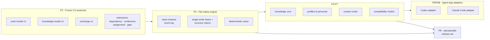

<div align="center">

# TCRN Workflow

### Your AI agents say "done." This framework makes them prove it.

**Governed delivery for AI agents — every capability is a machine-verified claim, not a promise.**

English · [简体中文](./README.zh-CN.md) · [日本語](./README.ja.md) · [한국어](./README.ko.md) · [Français](./README.fr.md)

   

    

[Why](#why-this-project-exists) · [Is this for you?](#is-this-for-you) · [What you get](#what-you-get) · [Quick start](#quick-start) · [Plain answers](#plain-answers-to-fair-questions) · [Known limits](#known-limits) · [License](#license)

`Verified claims: 65 (hygiene 13 · inertness 13 · runtime 39)`

</div>

---

> **The whole idea in one sentence:** every guarantee this framework makes is written in a machine-readable ledger, tied to a test you can run yourself on your own machine — and the moment a guarantee stops being true, **the build fails**.

## Why this project exists

Getting an AI agent to write code is easy now. Getting **a reason to believe what it tells you** is not.

If you have worked with agents, you have met all three of these:

1. **"Trust me, I tested it."** The agent says the tests pass. What you actually have is a line of text in a chat window. Nothing connects what the workflow *claims* to what its code *enforces* — and as the code changes, the claim quietly goes stale.
2. **History that vanishes.** The decisions live in a scrolled-away conversation and mutable files. When something breaks at 2 a.m., there is nothing to replay, nothing to diff, nothing to hand a reviewer.
3. **Installs on faith.** A skill or workflow arrives from a repository, and nothing proves the bytes you are about to run are the bytes somebody actually reviewed.

TCRN Workflow closes all three — by treating agent-driven delivery the way a safety-critical release is treated:

- **Every capability is a claim in a ledger**, and every claim is tied to a stable error name (a *reason code*) proven by a test that runs offline.
- **Every change to your workspace is an entry in a tamper-evident journal** — each entry is cryptographically chained to the one before it, so history cannot be quietly rewritten, only appended.
- **Every release can be rebuilt byte-for-byte** and checked against published digests.

One rule holds the whole thing together, and it is the part people find hardest to believe until they try it: **overclaiming is a build failure, not a style issue.** Change what a claim covers without re-proving it, and the chain stops.

## Is this for you?

| | |
| --- | --- |
| ✅ **Yes, if** | you run agents on work that has consequences — production code, regulated or audited delivery, multi-agent handoffs where nobody remembers who decided what. You want an artifact a reviewer can *check*, not a transcript they must *trust*. You want everything to stay on your machine: no database, no daemon, no network, no telemetry. And your agents are frontier-class enough to follow a strict discipline — see "Known limits". |
| ❌ **Probably not, if** | you want a zero-setup chat assistant, you need cloud sync or a hosted dashboard, or your work is exploratory enough that an append-only audit trail is friction rather than value. The rigor here is not free — it is a deliberate trade for evidence. |

## What you get

| Capability | What it means in practice |
| --- | --- |
| **A workspace that is just files** | Your whole work graph (Initiative → Epic → Story → Subtask) lives in plain, canonically formatted JSON files with a hash chain — no database, no daemon. You can audit it with `cat` and `sha256sum`, and exports are byte-reproducible. |
| **One command, 20 gates** | `pnpm verify:p1` runs the entire verification chain: format, lint, typecheck, build, ~40 test files, trust matrix, archive/SBOM/license/vulnerability policy, source allowlist, offline boundary, privacy scan, CI hardening, verification map, and clean-history proof. Anything unexpected stops the chain. |
| **A claim ledger a machine can read** | `verification-map.yaml` binds 65 claims — 13 framework-hygiene, 13 inertness-proof, 39 runtime-capability — to observable reason codes. If a claim's subject changes, its proof must re-run. |
| **Guards that prove they still bite** | `pnpm guard-check` mutates each registered guard out of the source and requires its named test to go red — 12 guards, verified before every push. A protection that nothing would notice losing is not a protection. |
| **Deliberation on the record** | Conferences and decision gates are appended to the same tamper-evident journal. A pending gate *blocks* its work item from reaching `done` (`WORKSPACE_GATE_PENDING`) — at the command and again on replay — and closing a conference distills each decision into a knowledge candidate that links back to it. |
| **Every decision gets a name** | Enable actor attestation and every later mutation must declare who acted — the engine and its replay both fail closed on any event that omits an actor id. Workspaces that never enable it stay byte-identical to before. |
| **Activation you can undo** | Three explicit steps turn the inert Claude Code bundle into a live governed session, and uninstalling restores `.claude/settings.json` byte for byte — observed on a real host, alongside a user's own pre-existing hook, which keeps working throughout. Any error in the session hook exits cleanly back to plain Claude Code. Nothing under `~/.claude` is ever named or written. |
| **Backups that prove themselves** | A snapshot emits a deterministic per-file manifest; the runbook round-trips snapshot → wipe → restore byte-identically, and the two failure modes that matter (partial or relocated restore) fail closed. |
| **Two hosts, one truth** | Codex and Claude Code adapters share byte-identical host-neutral machinery with a proven cross-host parity digest. Both generate uninstalled template data by default; **Claude Code can then be activated, Codex cannot** — see "Status, honestly". |
| **Offline by construction** | Development mode installs a process-level network guard and sends zero telemetry. The privacy gate scans every tracked byte, all reachable git history, and the release archive for personal identifiers and machine paths. |
| **Releases you can re-derive** | A release is an immutable tag plus a reproducible artifact set, rebuilt and byte-compared by `pnpm verify:p8`. External consumers verify through the companion `tcrn-workflow-helper`, whose own digest is published where you can check it independently. |

<details>
<summary><b>Five terms, in plain words</b> (click to expand)</summary>

- **Fail-closed** — when anything looks wrong, the system stops with a stable error name instead of guessing and carrying on. There are no warnings that scroll by: only green, or stopped.
- **Hash chain** — every journal entry contains a fingerprint of the previous entry. Rewriting history would change the fingerprints, and the replay would refuse it.
- **Reason code** — a stable, machine-readable error name (like `WORKSPACE_GATE_PENDING`). Tools and agents can branch on it; prose error text is never the contract.
- **Hermetic** — a test that runs entirely from local, pinned inputs. Same inputs, same result, on any machine.
- **CAS / expected version** — every write states which version it expects to be building on. If someone else wrote first, the write is refused instead of silently overwriting.

</details>

## Quick start

You need the pinned toolchain: **Node 24.16.0** and **pnpm 11.3.0**. Dependency lifecycle scripts stay disabled — nothing runs code on install.

```sh
# 1. Install the pinned dev dependencies (explicit, frozen, script-free)
pnpm install --offline --frozen-lockfile --ignore-scripts

# 2. Watch the framework prove itself (20 gates, fully offline)
pnpm verify:p1

# 3. Build, then drive the governed CLI
pnpm build
node scripts/tcrn-workflow.mjs commands
```

Typical governed commands — all local, no network, no database:

```sh
# validate a workspace and materialize its deterministic views
node scripts/tcrn-workflow.mjs validate --workspace <dir>

# create and transition work records with version-checked writes
node scripts/tcrn-workflow.mjs work-create ...
node scripts/tcrn-workflow.mjs work-transition ...

# knowledge core: metadata-first reads, explicit body access, promotion CAS
node scripts/tcrn-workflow.mjs knowledge-list ...
```

Every mutation requires an explicit workspace path, a strict RFC 3339 timestamp, and an expected version — concurrency safety is enforced by the engine, not by convention.

## Architecture in 60 seconds



Frozen protocols at the bottom, a file-native engine above them, capability layers above that, and host adapters at the top — inert until activation, which only Claude Code has. The protocols are additive-only: `work-model-v1` is frozen, and every extension registers itself without touching accepted schemas.

## Plain answers to fair questions

### Why one writer at a time, when agents love parallelism?

Because the storage layer and the reasoning layer answer different questions:

1. **The storage layer is single-writer by design.** A hash chain has exactly one truthful successor per event — parallel writers would either corrupt the chain or require a consensus protocol that destroys the "audit it with `cat` and `sha256sum`" property. So the engine enforces one writer at a time through an exclusive lease with an on-disk recovery protocol: a crashed writer's lease is quarantined and reclaimed fail-closed, and every acquisition is version-checked.
2. **Parallelism lives above the storage layer.** Run as many independent, fresh-context sub-agent threads as you like — implementation workers, review boards, adversarial verifiers. Their conclusions come back as data; one canonical thread holds decision authority and writes the record. You get the throughput of parallelism *and* a linear, auditable decision lineage.
3. **Governance needs a serializable story.** The chain gives a linear, tamper-evident order of decisions, and — once a workspace enables actor attestation — every decision is bound to a declared, auditable actor. That is a declared identity written into the ordered record, not a claim of authenticated identity or wall-clock truth. A swarm of peers mutating shared state has neither the order nor the binding.

<details>
<summary><b>The tests behind this answer</b> (all in <code>tests/p3-file-engine.test.mjs</code>, run by <code>pnpm verify:p3</code>)</summary>

- *Lease crash and recovery-claim contention are recoverable and single-writer* — a writer is crashed mid-creation, its stale lease is quarantined, contenders race and exactly one wins; the loser fails closed with a stable reason code.
- *Delayed-creator eviction* — a paused lease creator whose directory was reclaimed must observe the active recovery claim and fail closed (`WORKSPACE_LEASE_INVALID`) instead of colonizing the fresh generation. Found and fixed on Linux ext4 through real CI, then proven with a deterministic test.
- *SIGKILL injection at every effective lifecycle point* — the engine's fault inventory is discovered from real operations, and a real `SIGKILL` is delivered at each point; recovery must converge to a clean state with zero residue.
- *64 real insertion-order permutations* produce byte-identical indexes, lists, and checkpoints — determinism is proven, not assumed.
- 4 concurrency cases, 57 negative cases, and a filesystem attack matrix (symlinks, hard links, special files, replacement races) round out the proof.

</details>

### Why files instead of a database?

Because the trust boundary must be inspectable with standard tools. Every record is canonical JSON (sorted keys, one trailing LF), every event carries its `priorHash`/`eventHash`, and the whole store can be verified by any language in a few lines. A database would add a daemon, a binary format, and an implicit trust dependency — all liabilities for a framework whose core promise is *"you can check everything yourself, offline."*

### Why offline-first and fail-closed?

An agent framework that silently reaches the network is an exfiltration channel waiting to happen. Development mode installs a process-level network guard; the verification chain proves project code has no implicit network path; the only network steps (dependency acquisition, CI bootstrap) are explicit and pinned. Fail-closed means every validator stops with a stable reason code on the first unexpected byte.

### What does "live" mean for the Claude Code adapter?

That a real Claude Code session receives a read-only summary of the workspace's governing authority, and nothing beyond it. It was measured rather than assumed: the summary was confirmed to reach the model by asking a session for a value that existed only in that summary, with every tool disabled so it could not have been read from disk instead.

Everything else stays deliberately out. The framework does not adjudicate the host's tool use, does not suppress or rewrite responses, never writes under `~/.claude`, does not promote knowledge without an explicit action, and does not orchestrate sessions. A hook that fails prints nothing and the session continues as plain Claude Code — the one place this codebase fails open rather than closed, because a governance layer that can break a session is worse than one that goes quiet.

Codex has no equivalent. Its adapter generates and simulates; it does not install, and nothing here writes to a Codex host.

### How is a release trusted?

A release is an immutable annotated tag plus a reproducible artifact set (canonical source archive, SBOM, provenance, checksums, notes), rebuilt and byte-compared by `pnpm verify:p8`. External consumers verify through the companion **tcrn-workflow-helper**: a dependency-free bootstrap, whose own SHA-256 is published where you can check it independently of the download, refuses any release whose bytes do not match the digests compiled into it — before any Workflow code runs.

## Numbers that are checked, not promised

Every number below is enforced by a gate — if one drifts, a build fails somewhere.

- **20 gates** in the `verify:p1` chain, each with a stable terminal reason code.
- **65 machine-verified claims** in `verification-map.yaml` — 13 framework-hygiene, 13 inertness-proof, 39 runtime-capability. The claims badge above is parsed and compared against the ledger on every run.
- **12 registered guards**, each proven to still bite by mutating it out and watching its test go red.
- **~40 hermetic test files**, including real `SIGKILL` fault injection, 64-permutation determinism proofs in three independent layers, and a filesystem attack matrix.
- **1 end-to-end flagship proof** (`pnpm verify:e2e`) — a hermetic replay of the full governed loop (initiative → epic → story → gate → conference → distill → promote → trace), every tutorial command executed verbatim.
- **19-entry public AOS requirements ledger** (11 fixture-verified, 8 specified) — maturity is recorded per row, never inflated.
- **Privacy gate** over all 250 allowlisted source files (an exact-match list — one file added or removed fails the gate), every reachable git object, and the release archive.

<details>
<summary><b>Full verification-target reference</b> (click to expand)</summary>

| Target | Proves |
| --- | --- |
| `verify:p1` | The complete 20-gate chain on a clean committed tree. |
| `verify:p2` | Frozen V1 protocol contracts, deterministic vectors, negative/property tests, requirements ledger, closed schemas. |
| `verify:p3` | File-native workspace: leases/CAS, crash recovery, quarantine, migrations, deterministic views, filesystem attack matrix. |
| `verify:p4` / `verify:p4:knowledge` | Artifact lifecycle budgets, redaction, disposable archive apply/restore; knowledge core metadata/body separation, promotion CAS, 64-permutation parity. |
| `verify:p5` | Closed generic-profile trust model, effective-policy digests, cold-start graph, eight inert Core Reference personas. |
| `verify:p6` / `verify:p6:adapter` / `verify:p6b` | Context router scope/risk/budget controls and hostile corpus; Codex adapter bridge; Claude Code adapter (four-file template bundle, reversible settings fragment, forbidden-path rejection, CLAUDE.md fallback, cross-host parity digest). |
| `verify:p7` / `verify:p7:compatibility` | Canonical exchange, compatibility manifest, anti-rollback floor, deterministic import/checkpoint/fallback plans. |
| `verify:p8` | Reproducible release candidate: source archive rebuild + byte comparison, SBOM, provenance, checksums, six-file closed bundle, external trust negative matrix. |
| `verify:privacy` | No personal identifiers or machine paths in any tracked byte, git object, or archive. |
| `verify:isolated` | The same P1 chain from a hermetic dependency materialization (CI-gated). |

Development mode is offline with a process network guard and zero telemetry. The workspace has exactly three dev dependencies (`ajv@8.17.1` for offline Draft 2020-12 schema parity, `typescript@5.9.3` as the pinned type gate, `@types/node@24.13.2`), each acquired through an explicit registry boundary with lifecycle scripts disabled. P1 retains four explicit external boundaries: cross-invocation `rootVersion` continuity requires an external floor; there is no OS-level network sandbox; no fresh external advisory scan is performed offline; the privacy regex set is a focused policy control, not general DLP.

</details>

## Repository layout

| Path | Contents |
| --- | --- |
| `packages/core/` | Engine, adapters, knowledge core, profiles, router, exchange (TypeScript, checked by the pinned compiler). |
| `schemas/` · `specs/` | Frozen V1 protocol schemas (closed, Draft 2020-12-parity-proven) and their normative specs. |
| `tests/` | The hermetic proof suite. |
| `scripts/` | Governed CLI, verification tasks, guard checker, proof-artifact generator, privacy/policy gates. |
| `fixtures/` | Deterministic protocol vectors, hostile corpora, requirements ledger references. |
| `docs/` | Architecture, release trust, versioning, release notes. |
| `verification-map.yaml` | The claim ledger — start here to see what is actually proven. |

## What this does not govern

Most projects hide their edges. Ours are load-bearing — the same discipline that proves the claims above also requires stating exactly where they stop. These four boundaries are written down because a careful reader still over-read the first two:

- **Your product's source tree.** The single-writer lease governs the workspace event chain. Two agents editing `src/foo.ts` at the same time are not protected by anything here — use worktree isolation or route those edits through the workspace yourself.
- **Your product's supply chain.** The network guard covers the process running P1 project commands. Your agent's own shell, and your product's build, are outside it. Zero runtime dependencies is a property of *this* framework, not of what you build with it.
- **Whether your code is correct.** The claim ledger guarantees that a *declared* capability keeps an executable proof, and that overclaiming fails the build. It cannot tell you the claim set is the right one. Choosing what to claim is irreducibly a human judgement, and no amount of provenance substitutes for it.
- **Identity and time.** Actor attestation records a *declared* actor id, not an authenticated one, and the chain proves ordering, not wall-clock truth. The chain is tamper-evident against edits within it; it is not anchored outside the filesystem it lives on.

## Known limits

The four boundaries above are permanent design decisions. The limits below are the operational facts of this release: each one is enforced by a reason code, pinned by a measurement, or stated plainly as an untested area.

**Workspace topology and scale**

- **One writer per workspace.** Every mutation serializes on a lease inside the workspace's control tree; competitors fail closed and retry. Parallelism belongs above the storage layer: many workspaces, not many writers.
- **Partition workspaces per project or initiative.** A workspace slows perceptibly in the low thousands of events, and a single command crosses one second around 6,600 (Apple M3, extrapolated; raw samples in `docs/verification/2026-07-20-event-chain-ceiling-samples.json`). Reads pay the same cost as writes, and the chain has no compaction — one organisation-wide workspace is exactly the shape this punishes.
- **Sharing one workspace across separately-deployed projects fights the design.** It works mechanically, since every verb takes an explicit absolute path — but all writers queue on a single lease, every accessor must present identical canonical paths for all five roots (`WORKSPACE_SCHEMA_INVALID` otherwise), and the merged history reaches the scale limit sooner. Serving many projects is a job for a layer above this one; the AOS contract shipped here is a naming-and-linkage ledger only, and `supportedAosReleases` is empty.
- **Many side-by-side workspaces are the supported shape.** Nothing registers or discovers them; each is an independent single-writer domain, and they may share one framework checkout and one release-trust root.

**Backup and portability**

- **Restore is same-path-only.** All five root identities are pinned at init and re-checked on every resolve (`WORKSPACE_SCHEMA_INVALID`); restoring to another path or machine is out of scope for V1 (`WORKSPACE_MIGRATION_APPLY_UNAVAILABLE`). Back up anywhere; restore in place.
- **Restore the whole control tree or nothing.** The knowledge and artifact stores bind the event chain's high-water digest, so a store restored on its own bricks (`KNOWLEDGE_HIGH_WATER_MISMATCH`).
- **git is an integrity witness, not a restore tool.** A repository at the workspace root with the documented ignore list gives you a second witness; actual restores go through the snapshot manifest, because git cannot recreate the empty directories the stores require.
- **Never copy store files between workspaces.** Each store is bound to its own workspace's history. Cross-workspace movement is a planning surface today: `exchange-plan`, `exchange-dry-run` and `exchange-validate` exist, and an applying verb does not.

**Tested envelope**

- **One OS user, local filesystem.** That is where every test and every real-host observation ran. Cross-user sharing and network filesystems are untested and therefore unclaimed.

**Driver assumptions**

- **Integrity does not depend on the driving model; progress does.** Fail-closed turns a weak driver's every boundary miss into a refusal, so the chain cannot be dirtied — a below-baseline agent thrashes on reason codes instead of corrupting anything. What does scale with model capability: making progress under the discipline, heeding the injected authority summary (proven to arrive; never claimed to be obeyed), and the quality of what gets recorded — well-formed garbage is faithfully preserved, because the ledger proves who said what, not that it was right.
- **The framework assumes a driver that can:** branch on reason codes rather than interpret prose; re-read then retry after a CAS refusal, never blind-replay; treat a red gate as stop-and-report, not retry-until-green; produce strict RFC 3339 instants, follow regeneration order, and never hand-edit generated files or digests; keep one writer per workspace. Every item is testable against your own agent.
- **No compatible-model list is published, because none was measured.** The only measured driving configuration is a frontier Claude model on Claude Code 2.1.201 (receipt: `docs/verification/host/claude-code.json`). Below the assumptions above, expect thrash, not corruption — an endless stream of refusal codes is the signature of a driver below baseline, not of a framework defect.

**Governance surface**

- **Twelve governed verbs have no operator entry point yet.** Profile admission, context routing, compatibility planning and the adapter families require out-of-band authorities that the shipped CLI cannot accept; from a shell they stop at codes like `ADAPTER_HOST_REQUIRED`. The activation receipts are real — the evidence harness supplies those authorities programmatically — and a later release adds the operator mechanism.
- **Destructive artifact maintenance is fixture-only.** `artifact-archive-apply` and `artifact-archive-restore` are marked fixture-only in the machine-readable catalog; real workspaces get dry-runs only, so artifact stores grow until governed compaction ships.
- **The knowledge store must be acknowledged as disposable.** On non-fixture workspaces it initializes only under an explicit per-invocation acknowledgment (`KNOWLEDGE_DISPOSABLE_ACK_REQUIRED`): it is a derived index, never the system of record.

## Status, honestly

- `0.1.0` is the **first accepted release**. Semantic Versioning applies; in the 0.x range the public API may still change between minor versions.
- **Claude Code activation is live and has been observed on a real host.** Steps 1–3 install, activate and uninstall against Claude Code `2.1.201`; nine observations were recorded, including that the authority summary actually arrives in the model's context. What it does when live is inject a read-only summary at session start, nothing more — see the boundary list above for what it deliberately does not do. Receipt: `docs/verification/host/claude-code.json`.
- **Codex stops at read-only.** `adapter-generate`, `-validate`, `-simulate`, `-fallback` and `-rollback-plan` are real, deterministic, host-neutral tooling. There is no Codex installer and no Codex activation, so nothing is written to a Codex host by anything here.
- `supportedAosReleases` is empty: no external AOS compatibility is claimed.
- Release mode requires the companion helper to accept the bytes: its bootstrap digest is published independently, and the accepted release digests are compiled into it.

## Contributing, support, security

- Usage questions → GitHub Discussions. Reproducible defects → Issues (see `SUPPORT.md`).
- Security reports → private vulnerability reporting per `SECURITY.md`.
- Contributions must keep every gate green — see `CONTRIBUTING.md`. The bar is: *if your claim isn't in the verification map with a passing proof, it isn't claimed.*

## License

[Apache-2.0](./LICENSE)
