**English** | [简体中文](./README.zh-CN.md) | [日本語](./README.ja.md) | [한국어](./README.ko.md) | [Français](./README.fr.md)

# TCRN Workflow

**A deterministic, offline-first framework for governed AI-agent work — where every capability is a machine-verified claim, not a promise.**

`Status: 0.1.0-rc.4 (pre-release candidate)` · `License: Apache-2.0` · `Node 24.16.0` · `pnpm 11.3.0` · `Verified claims: 64 (hygiene 13 · inertness 13 · runtime 38)`

---

## Why this project exists

AI agents are increasingly asked to *deliver* — plan work, write code, review changes, cut releases. But most agent workflows share three structural weaknesses:

1. **Unverifiable claims.** "The agent tested it" usually means a log line, not a proof. There is no machine-checkable link between what a workflow *says* it guarantees and what its code *actually* enforces.
2. **Non-reproducible state.** Conversation-driven work leaves its history in opaque chat logs and mutable databases. When something goes wrong, there is no deterministic event record to replay, audit, or hand to a reviewer.
3. **Supply-chain blindness.** Agent skills and workflows are installed from repositories with no release identity, no signature, no anti-rollback floor, and no way to prove the bytes you run are the bytes that were reviewed.

TCRN Workflow was built to close all three gaps at once. It treats agent-driven delivery with the same rigor as a safety-critical software release: **every capability maps to a stable reason code proven by a hermetic, offline test**, every workspace mutation is an append-only hash-chained event, and every release is an immutable, reproducible, signed artifact set.

## What you get

| Capability | What it means in practice |
| --- | --- |
| **Deterministic file-native workspace** | An event-sourced local work graph (Initiative → Epic → Story → Subtask) stored as canonical JSON files with a hash chain — no database, no daemon, byte-reproducible exports. |
| **Fail-closed verification chain** | One command (`pnpm verify:p1`) runs 20 gates: format, lint, typecheck, build, ~29 test files, trust matrix, archive/SBOM/license/vulnerability policy, source allowlist, offline boundary, privacy scan, CI hardening, verification map, and clean-history proof. Anything unexpected stops the chain. |
| **Machine-readable claim ledger** | `verification-map.yaml` binds 64 claims — 13 framework-hygiene, 13 inertness-proof, 38 runtime-capability — to observable reason codes. If a claim's subject changes, its proof must re-run — overclaiming is a build failure, not a style issue. |
| **Dual-host Agent App adapters** | Codex and Claude Code are the two officially supported V1 hosts, sharing byte-identical host-neutral machinery with a proven cross-host parity digest. Both adapters are **inert dry-run candidates**: they generate uninstalled template data only, and no live host support is asserted. |
| **Offline-first, privacy-clean** | Development mode enforces a Node process network guard and zero telemetry. The privacy gate scans every tracked byte, all reachable git history, and the release archive for personal identifiers and machine paths. |
| **Signed release trust** | Releases are bound by tag identity (commit, tree, tag object) and verified externally through an Ed25519 trust-root contract — see the companion `tcrn-workflow-helper` repository. |

## Quick start

Requires the pinned toolchain: **Node 24.16.0** and **pnpm 11.3.0** (dependency lifecycle scripts stay disabled).

```sh
# 1. Acquire the single dev dependency (explicit, frozen, script-free)
pnpm install --offline --frozen-lockfile --ignore-scripts

# 2. Run the full verification gate (offline)
pnpm verify:p1

# 3. Build, then use the governed CLI
pnpm build
node scripts/tcrn-workflow.mjs workspace --help
```

Typical governed commands (all local, no network, no database):

```sh
# validate a workspace and materialize its deterministic views
node scripts/tcrn-workflow.mjs workspace validate --workspace <dir> --now <iso-instant>

# create and transition work records with CAS-checked versions
node scripts/tcrn-workflow.mjs work-create ...
node scripts/tcrn-workflow.mjs work-transition ...

# knowledge core: metadata-first reads, explicit body access, promotion CAS
node scripts/tcrn-workflow.mjs knowledge-list ...
```

Mutation commands require an explicit workspace path, a strict RFC 3339 timestamp, and an expected version — optimistic concurrency is enforced by the engine, not by convention.

## Architecture at a glance

```mermaid
flowchart LR
    subgraph Protocols["P2 · Frozen V1 protocols"]
        WM[work-model-v1]
        KM[knowledge-model-v1]
        EX[exchange-v1]
        XT[extensions:<br/>dependency · conference<br/>assignment · gate]
    end
    subgraph Engine["P3 · File-native engine"]
        EV[hash-chained<br/>event log]
        LS[single-writer lease +<br/>recovery claims]
        VW[deterministic views]
    end
    subgraph Layers["P4-P7"]
        KC[knowledge core]
        PF[profiles & personas]
        CR[context router]
        CM[compatibility modes]
    end
    subgraph Hosts["P6/P6B · Agent App adapters (inert)"]
        CX[Codex adapter]
        CL[Claude Code adapter]
    end
    REL[P8 · reproducible<br/>signed release set]
    Protocols --> Engine --> Layers --> Hosts
    Engine --> REL
    Layers --> REL
```



The protocols are additive-only: `work-model-v1` is frozen, and every extension (dependency, conference, assignment, gate) registers itself without touching accepted schemas.

## Design Q&A

### Why one canonical conversation thread with sub-agent threads, instead of multithreading?

This is the most common question, and the answer has three layers:

1. **The storage layer is single-writer by design.** The workspace is an append-only, hash-chained event log on a plain filesystem. A hash chain has exactly one truthful successor per event — parallel writers would either corrupt the chain or require a consensus protocol that destroys the "audit it with `cat` and `sha256sum`" property. So the engine enforces **one writer at a time** through an exclusive lease with an on-disk recovery-claim protocol: a crashed writer's lease is quarantined and reclaimed fail-closed, and every acquisition is CAS-checked.
2. **Reasoning parallelism lives above the storage layer.** Concurrency is still everywhere — but as *independent fresh-context sub-agent threads* (implementation workers, multi-role review boards, adversarial verifiers) whose conclusions come back as data. One canonical thread holds decision authority and writes the record; N sub-threads explore, review, and refute in parallel without contaminating each other's context or racing on state. You get the throughput of parallelism with a linear, auditable decision lineage.
3. **Governance requires a serializable story.** The single-writer chain gives a linear, tamper-evident *order* of decisions, and binding each decision to an accountable actor is now enforced: once a workspace enables the actor-attestation extension, every event the chain admits must declare an actor id — the engine and its replay both fail closed on any event that omits one — so an attested workspace binds every decision to a declared, auditable actor. That is a declared identity written into the ordered record, not a claim of authenticated identity or wall-clock truth; workspaces that leave attestation disabled behave exactly as before and rest accountability on the governance thread's receipts. A swarm of peer threads mutating shared state has neither the order nor the binding.

**The tests behind this answer** (all in `tests/p3-file-engine.test.mjs`, run by `pnpm verify:p3`):

- *Lease crash and recovery-claim contention are recoverable and single-writer* — a writer is crashed mid-creation, its stale lease is quarantined, contenders race and exactly one wins; the loser fails closed with a stable reason code.
- *Delayed-creator eviction* — a paused lease creator whose directory was reclaimed must observe the active recovery claim and fail closed (`WORKSPACE_LEASE_INVALID`) instead of colonizing the fresh generation. This guards against inode-tuple reuse on filesystems that recycle inodes (found and fixed on Linux ext4 through real CI, then proven with a deterministic test).
- *SIGKILL injection at every effective lifecycle point* — the engine's fault inventory is discovered from real operations, and a real `SIGKILL` is delivered at each point; recovery must converge to a clean state with zero residue.
- *64 real insertion-order permutations* produce byte-identical indexes, lists, and checkpoints — determinism is proven, not assumed.
- 4 concurrency cases, 57 negative cases, and a filesystem attack matrix (symlinks, hard links, special files, replacement races) round out the proof.

### Why files instead of a database?

Because the trust boundary must be inspectable with standard tools. Every record is canonical JSON (sorted keys, one trailing LF), every event carries its `priorHash`/`eventHash`, and the whole store can be verified by any language in a few lines. A database would add a daemon, a binary format, and an implicit trust dependency — all liabilities for a framework whose core promise is *"you can check everything yourself, offline."*

### Why offline-first and fail-closed?

An agent framework that silently reaches the network is an exfiltration channel waiting to happen. Development mode installs a process-level network guard; the verification chain proves project code has no implicit network path; the only network steps (dependency acquisition, CI bootstrap) are explicit and pinned. Fail-closed means every validator throws a stable reason code on the first unexpected byte — there are no warnings that scroll by, only green or stopped.

### Why are the Codex and Claude Code adapters "inert candidates"?

Because claiming live host support before a governed release route has accepted it would be an overclaim — the exact failure mode this framework exists to prevent. The adapters generate deterministic, uninstalled template bundles (proven byte-exact, including a byte-reversible `.claude/settings.json` hook fragment that never clobbers user content and rejects every user-level `.claude` path). Activation is a separate, gated decision.

### How is a release trusted?

A release is an immutable annotated tag plus a reproducible artifact set (canonical USTAR source archive, SBOM, manifest, provenance, checksums, notes) rebuilt and byte-compared by `pnpm verify:p8`. External consumers verify through the companion **tcrn-workflow-helper**: an Ed25519-signed release manifest and policy with an anti-rollback epoch floor, validated by a dependency-free bootstrap before any Workflow code runs.

### What do the tests actually prove — in numbers?

- **20 gates** in the `verify:p1` chain, each with a stable terminal reason code.
- **~29 test files** covering the engine, knowledge core, artifact lifecycle, profiles, personas, context router, both adapters, exchange, compatibility, requirements ledger, release candidate, privacy boundary, proof-artifact generator, and trust matrix.
- **64 machine-verified claims** in `verification-map.yaml`, partitioned as 13 framework-hygiene, 13 inertness-proof, and 38 runtime-capability — the runtime-capability third is the delivered product surface, stated honestly.
- **64-permutation determinism proofs** in three independent layers (engine insertion orders, profile layer orders, adapter input orders).
- **19-entry public AOS requirements ledger** (11 fixture-verified, 8 specified) — maturity is recorded per row, never inflated.
- **Privacy gate** over ~200 tracked source files, ~1,470 git objects, full reachable history, and the release archive.

<details>
<summary><b>Full verification-target reference</b> (click to expand)</summary>

| Target | Proves |
| --- | --- |
| `verify:p1` | The complete 20-gate chain on a clean committed tree. |
| `verify:p2` | Frozen V1 protocol contracts, deterministic vectors, negative/property tests, requirements ledger, closed schemas. |
| `verify:p3` | File-native workspace: leases/CAS, crash recovery, quarantine, migrations, deterministic views, filesystem attack matrix. |
| `verify:p4` / `verify:p4:knowledge` | Artifact lifecycle budgets, redaction, disposable archive apply/restore; knowledge core metadata/body separation, promotion CAS, 64-permutation parity. |
| `verify:p5` | Closed generic-profile trust model, effective-policy digests, cold-start graph, eight inert Core Reference personas. |
| `verify:p6` / `verify:p6:adapter` / `verify:p6b` | Context router scope/risk/budget controls and hostile corpus; Codex adapter bridge; Claude Code adapter (four-file template bundle, reversible settings fragment, forbidden-path rejection, CLAUDE.md fallback, cross-host parity digest). |
| `verify:p7` / `verify:p7:compatibility` | Canonical exchange, compatibility manifest, anti-rollback floor, deterministic import/checkpoint/fallback plans. |
| `verify:p8` | Reproducible release candidate: source archive rebuild + byte comparison, SBOM, provenance, checksums, six-file closed bundle, external trust negative matrix. |
| `verify:privacy` | No personal identifiers or machine paths in any tracked byte, git object, or archive. |
| `verify:isolated` | The same P1 chain from a hermetic dependency materialization (CI-gated). |

Development mode is offline with a process network guard and zero telemetry. The workspace has exactly one dev dependency (`ajv@8.17.1`, for offline Draft 2020-12 schema parity), acquired through an explicit registry boundary with lifecycle scripts disabled. P1 retains four explicit external boundaries: cross-invocation `rootVersion` continuity requires an external floor; there is no OS-level network sandbox; no fresh external advisory scan is performed offline; the privacy regex set is a focused policy control, not general DLP.

</details>

## Repository layout

| Path | Contents |
| --- | --- |
| `packages/core/` | Engine, adapters, knowledge core, profiles, router, exchange (TypeScript, built by the pinned Node type-transform engine). |
| `schemas/` · `specs/` | Frozen V1 protocol schemas (closed, Draft 2020-12-parity-proven) and their normative specs. |
| `tests/` | The hermetic proof suite. |
| `scripts/` | Governed CLI, verification tasks, proof-artifact generator, privacy/policy gates. |
| `fixtures/` | Deterministic protocol vectors, hostile corpora, requirements ledger references. |
| `docs/` | Architecture, release trust, versioning, release notes. |
| `verification-map.yaml` | The claim ledger — start here to see what is actually proven. |

## Status, honestly

- `0.1.0-rc.4` is a **pre-release candidate**. The public API is not yet stable.
- Both host adapters are inert dry-run candidates; **no live Codex or Claude Code support is asserted**.
- `supportedAosReleases` is empty: no external AOS compatibility is claimed.
- Release mode is unavailable unless the external Ed25519 trust verification succeeds.

## Contributing, support, security

- Usage questions → GitHub Discussions. Reproducible defects → Issues (see `SUPPORT.md`).
- Security reports → private vulnerability reporting per `SECURITY.md`.
- Contributions must keep every gate green — see `CONTRIBUTING.md`. The bar is: *if your claim isn't in the verification map with a passing proof, it isn't claimed.*

## License

[Apache-2.0](./LICENSE)
