<div align="center">

# TCRN Workflow

**为 AI 智能体打造的受治理交付体系——每一项能力都是机器验证过的声明,而不是一句承诺。**

[English](./README.md) · 简体中文 · [日本語](./README.ja.md) · [한국어](./README.ko.md) · [Français](./README.fr.md)

   

    

[为什么做这个项目](#why-this-project-exists) · [适合谁用](#who-this-is-for) · [你会得到什么](#what-you-get) · [快速开始](#quick-start) · [验证](#verification) · [许可证](#license)

</div>

---

## Why this project exists

让智能体写出代码,今天已经不难。真正难拿到的,是**相信它确实做了它说做过的事的理由。**

几乎每一个智能体工作流,都逃不掉这三个缺口:

1. **没人能查验的声明。**"智能体测过了"通常只等于一行日志。工作流*声称*保证的东西,与代码*实际*强制的东西之间没有任何连接,于是随着代码演进,保证会悄无声息地失效。
2. **无法重放的历史。**对话驱动的工作把记录留在聊天日志和可变状态里。凌晨两点出事时,你手上没有一条确定性的事件链可以重放、对比,或者交到评审者手上。
3. **闭着眼睛完成的安装。**技能与工作流从仓库直接装进来,既没有发布身份,也无从证明你运行的字节就是被评审过的那些字节。

TCRN Workflow 把这三个缺口一并补上。它用对待安全关键发布的方式来对待智能体交付:**每一项能力都映射到一个由密封离线测试证明的稳定原因码**,每一次工作区变更都是只追加的哈希链事件,每一个发布都逐字节可复现。

检验这套纪律的标准很直白——**过度声明是构建失败,不是文风问题。**改变一条声明所覆盖的范围却不重新证明它,链条就会停下。

## Who this is for

**如果你**让智能体处理有后果的工作——生产代码、受监管或需审计的交付、没人记得清谁拍板了什么的多智能体交接——并且你需要的是评审者可以查验的工件,而不是他们只能选择信任的对话记录,那么这套东西适合你。如果你希望智能体的工作始终留在自己的机器上——无数据库、无守护进程、无网络、无遥测——同样适合。

**如果你**想要一个零配置的聊天式助手、需要云同步或托管看板,或者你的工作探索性强到让只追加的审计轨迹成为负担而非价值,那它**大概不适合你**。这里的严格是有代价的:它是为了换取证据而做出的刻意取舍。

## What you get

| 能力 | 实际含义 |
| --- | --- |
| **确定性文件原生工作区** | 事件溯源的本地工作图(Initiative → Epic → Story → Subtask),以规范 JSON 文件加哈希链存储——无数据库、无守护进程、导出逐字节可复现。 |
| **失败即关闭的验证链** | 一条命令(`pnpm verify:p1`)跑完 20 道门:格式、lint、类型检查、构建、约 40 个测试文件、信任矩阵、归档/SBOM/许可证/漏洞策略、源码白名单、离线边界、隐私扫描、CI 硬化、验证映射,以及干净历史证明。任何意料之外的情况都会终止链条。 |
| **机器可读的声明账本** | `verification-map.yaml` 把 65 条声明——13 条框架卫生、13 条惰性证明、39 条运行时能力——绑定到可观察的原因码。声明的主体一旦变化,其证明就必须重跑;过度声明是构建失败,不是文风问题。 |
| **受治理的合议、门与蒸馏** | 九个受治理的 CLI 动词把预承诺合议与决策门作为可加的哈希链事件运行,合议关闭时会把会议纪要里的每条决策蒸馏成一条回链它的知识候选。门的强制是失败即关闭:待定的门会阻止其工作项流转到 `done`(`WORKSPACE_GATE_PENDING`,动词执行时与重放时各拦一次),而门只有在具备可解析的合议纪要证据时才能到达 `satisfied`。 |
| **在边界强制的执行者留痕** | 追加单向事件 `attestation.actor.enabled` 之后,其后每一次变更都必须带上执行者 ID——在线追加与重放都会对任何缺失它的事件失败即关闭 `WORKSPACE_ACTOR_REQUIRED`。从未启用它的工作区与此前逐字节相同;一旦启用便无法再关闭。 |
| **可选的激活阶梯** | 三个显式、逐字节可逆的步骤,把惰性的 Claude Code 包变成在线的受治理会话:安装四文件模板(步骤 1),合并恰好一个失败即放行的 `SessionStart` 钩子(步骤 2),在 1024 字节预算内渲染唯一的建议型人格 Verity(步骤 3)。该处理器是唯一获授权的失败即放行面——任何错误都以 0 退出、回落为纯 Claude Code——并且 `~/.claude` 之下的任何位置都不会被命名或写入。 |
| **快照备份与密封式恢复** | 持有租约的 `snapshot-manifest` 产出逐文件的确定性清单;runbook 在原路径上逐字节相同地往返快照 → 擦除 → 恢复,两种教义性失败模式(部分恢复与异地恢复)均失败即关闭。可选的 git tier-2 仅作为完整性见证。 |
| **双宿主 Agent App 适配器** | Codex 与 Claude Code 是 V1 官方支持的两个宿主,共享逐字节相同的宿主中立机制,并有经证明的跨宿主一致性摘要。两个适配器默认都是**惰性干跑候选**:只生成未安装的模板数据,在线宿主支持只能经由上述可选且受门控的激活阶梯抵达。 |
| **离线优先、隐私干净** | 开发模式强制 Node 进程级网络守卫与零遥测。隐私门会扫描每一个被跟踪的字节、全部可达的 git 历史,以及发布归档,查找个人标识与机器路径。 |
| **可验证的发布信任** | 发布由标签身份(commit、tree、tag object)绑定——git 对象 ID 就是内容哈希,因此这层绑定是自证的。外部消费者通过配套的 `tcrn-workflow-helper` 校验:它的引导程序摘要独立发布,而被接受的发布摘要则编译在它内部。 |

## Quick start

需要钉定的工具链:**Node 24.16.0** 与 **pnpm 11.3.0**(依赖生命周期脚本保持禁用)。

```sh
# 1. Acquire the single dev dependency (explicit, frozen, script-free)
pnpm install --offline --frozen-lockfile --ignore-scripts

# 2. Run the full verification gate (offline)
pnpm verify:p1

# 3. Build, then use the governed CLI
pnpm build
node scripts/tcrn-workflow.mjs workspace --help
```

典型的受治理命令(全部本地执行,无网络、无数据库):

```sh
# validate a workspace and materialize its deterministic views
node scripts/tcrn-workflow.mjs workspace validate --workspace <dir> --now <iso-instant>

# create and transition work records with CAS-checked versions
node scripts/tcrn-workflow.mjs work-create ...
node scripts/tcrn-workflow.mjs work-transition ...

# knowledge core: metadata-first reads, explicit body access, promotion CAS
node scripts/tcrn-workflow.mjs knowledge-list ...
```

变更类命令必须提供显式的工作区路径、严格的 RFC 3339 时间戳,以及期望版本——乐观并发由引擎强制,而不是靠约定。

## Architecture at a glance

```mermaid
flowchart LR
    subgraph Protocols["P2 · Frozen V1 protocols"]
        WM[work-model-v1]
        KM[knowledge-model-v1]
        EX[exchange-v1]
        XT[extensions:<br/>dependency · conference<br/>assignment · gate]
    end
    subgraph Engine["P3 · File-native engine"]
        EV[hash-chained<br/>event log]
        LS[single-writer lease +<br/>recovery claims]
        VW[deterministic views]
    end
    subgraph Layers["P4-P7"]
        KC[knowledge core]
        PF[profiles & personas]
        CR[context router]
        CM[compatibility modes]
    end
    subgraph Hosts["P6/P6B · Agent App adapters (inert)"]
        CX[Codex adapter]
        CL[Claude Code adapter]
    end
    REL[P8 · reproducible<br/>release set]
    Protocols --> Engine --> Layers --> Hosts
    Engine --> REL
    Layers --> REL
```



协议只做加法:`work-model-v1` 已冻结,每一个扩展(dependency、conference、assignment、gate)都以注册方式加入,不触碰已接受的模式。

## Design Q&A

### 为什么是一条规范对话主线加子智能体线程,而不是多线程?

这是被问得最多的问题,答案分三层:

1. **存储层在设计上就是单写者。**工作区是纯文件系统上只追加的哈希链事件日志。哈希链对每个事件只有一个真实的后继——并行写者要么破坏链条,要么就需要一个共识协议,而后者会摧毁"用 `cat` 和 `sha256sum` 就能审计"这一性质。因此引擎通过独占租约配合磁盘上的恢复声明协议强制**同一时刻只有一个写者**:崩溃写者的租约会被隔离并以失败即关闭的方式回收,每一次获取都经过 CAS 校验。
2. **推理层面的并行发生在存储层之上。**并发依然无处不在——但它的形态是*彼此独立、上下文全新的子智能体线程*(实现工作者、多角色评审团、对抗性核证者),它们的结论以数据形式返回。一条规范主线持有决策权并落写记录;N 条子线程并行地探索、评审与反驳,既不互相污染上下文,也不在状态上产生竞态。你拿到了并行的吞吐,同时保住了线性且可审计的决策脉络。
3. **治理需要一个可串行化的叙事。**单写者链给出决策的线性、防篡改*顺序*,而把每个决策绑定到可问责的执行者如今也已被强制:一旦工作区启用执行者留痕扩展,链所接纳的每个事件都必须声明执行者 ID——引擎及其重放都会对任何缺失 ID 的事件失败即关闭——因此一个已留痕的工作区会把每个决策都绑定到一个已声明、可审计的执行者。这是写入有序记录中的**已声明身份**,而不是对经过认证的身份或挂钟时间真值的主张;保持留痕停用的工作区行为与从前完全一致,其问责依托于治理主线留下的收据。一群互相修改共享状态的对等线程,既没有顺序,也没有绑定。

**支撑这一答案的测试**(全部位于 `tests/p3-file-engine.test.mjs`,由 `pnpm verify:p3` 执行):

- *租约崩溃与恢复声明争用可恢复且保持单写者*——写者在创建过程中被崩溃,其过期租约被隔离,竞争者赛跑且恰好一个胜出;败者以稳定原因码失败即关闭。
- *延迟创建者驱逐*——目录已被回收的暂停中租约创建者,必须观察到活跃的恢复声明并失败即关闭(`WORKSPACE_LEASE_INVALID`),而不是去占据新一代目录。这防御的是会回收 inode 的文件系统上的 inode 元组复用问题(在真实 CI 的 Linux ext4 上发现并修复,随后以确定性测试固化)。
- *在每一个有效生命周期点注入 SIGKILL*——引擎的故障清单从真实操作中发现,并在每个点投递真实的 `SIGKILL`;恢复必须收敛到零残留的干净状态。
- *64 种真实插入顺序排列*产生逐字节相同的索引、列表与检查点——确定性是被证明的,不是被假定的。
- 另有 4 个并发用例、57 个负向用例,以及一套文件系统攻击矩阵(符号链接、硬链接、特殊文件、替换竞态),共同构成完整证明。

### 为什么用文件而不是数据库?

因为信任边界必须能用标准工具检视。每条记录都是规范 JSON(键排序、单个结尾换行),每个事件都携带自己的 `priorHash`/`eventHash`,整个存储用任何语言几行代码就能验证。数据库会带来守护进程、二进制格式和隐式的信任依赖——对一个核心承诺是*"一切你都能自己离线查验"*的框架来说,这些都是负债。

### 为什么离线优先、失败即关闭?

一个会悄悄联网的智能体框架,就是一条随时会被触发的数据外泄通道。开发模式会安装进程级网络守卫;验证链证明项目代码不存在隐式网络路径;仅有的联网步骤(依赖获取、CI 引导)都是显式且钉定的。失败即关闭意味着每个校验器在遇到第一个意外字节时就抛出稳定原因码——不存在一闪而过的警告,只有绿色,或者停下。

### 为什么 Codex 与 Claude Code 适配器是"惰性候选"?

因为在受治理的发布路线接受它之前就宣称在线宿主支持,本身就是过度声明——而这正是本框架要防止的失败模式。适配器生成确定性的、未安装的模板包(已逐字节证明,其中包括一个逐字节可逆的 `.claude/settings.json` 钩子片段,它绝不覆盖用户内容,并拒绝一切用户级 `.claude` 路径)。激活是一个独立的、受门控的决定。

### 一个发布凭什么被信任?

一个发布等于一个不可变的注解标签,加上一套可复现的工件集(规范 USTAR 源码归档、SBOM、来源证明、校验和、说明),由 `pnpm verify:p8` 重建并逐字节比对。外部消费者通过配套的 **tcrn-workflow-helper** 校验:那是一个零依赖的引导程序,它自身的 SHA-256 发布在你可以独立于下载渠道去核对的地方,并且会在任何 Workflow 代码运行之前,拒绝任何字节与其内部编译的摘要不匹配的发布。

### 这些测试到底证明了什么——用数字说话?

- `verify:p1` 链条中的 **20 道门**,每一道都有稳定的终态原因码。
- **约 40 个测试文件**,覆盖引擎、知识核心、工件生命周期、配置、人格、上下文路由、两个适配器、交换、兼容性、需求账本、发布候选、隐私边界、证明工件生成器、信任矩阵、合议/门事件日志存储与失败即关闭的门强制、执行者留痕、快照备份与恢复、激活阶梯,以及端到端的受治理循环。
- **1 个端到端旗舰证明**(`pnpm verify:e2e`)——对完整受治理循环(initiative → epic → story → 门 → 合议 → 蒸馏 → 晋升 → 追溯)的一次密封式重放,每条教程命令都逐字执行,每个产出的摘要都可追溯到它的产生者。
- `verification-map.yaml` 中 **65 条机器验证声明**,划分为 13 条框架卫生、13 条惰性证明与 39 条运行时能力——运行时能力这三分之一才是真正交付的产品面,如实标注。
- 三个独立层次上的 **64 排列确定性证明**(引擎插入顺序、配置层顺序、适配器输入顺序)。
- **19 行的公开 AOS 需求账本**(11 行夹具已验证、8 行已规格化)——成熟度逐行记录,绝不虚标。
- **隐私门**覆盖约 200 个被跟踪的源文件、约 1470 个 git 对象、全部可达历史,以及发布归档。

<details>
<summary><b>完整验证目标参考</b>(点击展开)</summary>

| 目标 | 证明内容 |
| --- | --- |
| `verify:p1` | 干净已提交树上的完整 20 门链条。 |
| `verify:p2` | 冻结的 V1 协议契约、确定性向量、负向/属性测试、需求账本、封闭模式。 |
| `verify:p3` | 文件原生工作区:租约/CAS、崩溃恢复、隔离区、迁移、确定性视图、文件系统攻击矩阵。 |
| `verify:p4` / `verify:p4:knowledge` | 工件生命周期预算、脱敏、一次性归档的应用/恢复;知识核心的元数据/正文分离、晋升 CAS、64 排列一致性。 |
| `verify:p5` | 封闭的通用配置信任模型、有效策略摘要、冷启动图、八个惰性 Core Reference 人格。 |
| `verify:p6` / `verify:p6:adapter` / `verify:p6b` | 上下文路由的范围/风险/预算控制与敌意语料;Codex 适配器桥;Claude Code 适配器(四文件模板包、可逆设置片段、禁止路径拒斥、CLAUDE.md 回退、跨宿主一致性摘要)。 |
| `verify:p7` / `verify:p7:compatibility` | 规范交换、兼容性清单、防回滚下限、确定性的导入/检查点/回退方案。 |
| `verify:p8` | 可复现的发布候选:源码归档重建加字节比对、SBOM、来源证明、校验和、六文件封闭包、外部信任负向矩阵。 |
| `verify:privacy` | 任何被跟踪的字节、git 对象或归档中都不含个人标识与机器路径。 |
| `verify:isolated` | 从密封的依赖物化环境重跑同一条 P1 链条(CI 门控)。 |

开发模式离线运行,带进程级网络守卫与零遥测。工作区只有一个开发依赖(`ajv@8.17.1`,用于离线 Draft 2020-12 模式一致性),它经由显式的注册表边界获取且禁用生命周期脚本。P1 保留四条显式的外部边界:跨调用的 `rootVersion` 连续性需要一个外部下限;不存在操作系统级网络沙箱;离线状态下不执行新的外部安全通告扫描;隐私正则集是一项聚焦的策略控制,而非通用 DLP。

</details>

## Repository layout

| 路径 | 内容 |
| --- | --- |
| `packages/core/` | 引擎、适配器、知识核心、配置、路由、交换(TypeScript,由钉定的 Node 类型转换引擎构建)。 |
| `schemas/` · `specs/` | 冻结的 V1 协议模式(封闭、已证 Draft 2020-12 一致)及其规范文本。 |
| `tests/` | 密封的证明套件。 |
| `scripts/` | 受治理 CLI、验证任务、证明工件生成器、隐私/策略门。 |
| `fixtures/` | 确定性协议向量、敌意语料、需求账本引用。 |
| `docs/` | 架构、发布信任、版本策略、发布说明。 |
| `verification-map.yaml` | 声明账本——想知道什么被真正证明了,从这里开始。 |

## Status, honestly

- `0.1.0-rc.5` 是一个**预发布候选**。公共 API 尚未稳定。
- 两个宿主适配器都是惰性干跑候选;**不声称任何在线的 Codex 或 Claude Code 支持**。
- `supportedAosReleases` 为空:不声称任何外部 AOS 兼容性。

## Contributing, support, security

- 使用类问题 → GitHub Discussions;可复现的缺陷 → Issues(见 `SUPPORT.md`)。
- 安全报告 → 按 `SECURITY.md` 走私密漏洞报告流程。
- 贡献必须让每一道门保持绿色——见 `CONTRIBUTING.md`。标准是:*声明若不在验证映射中并带着通过的证明,就等于没有声明。*

## License

[Apache-2.0](./LICENSE)
