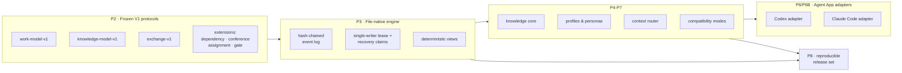

<div align="center">

# TCRN Workflow

### 你的 AI 智能体说"做完了"。这套框架让它拿出证据。

**为 AI 智能体打造的受治理交付体系——每一项能力都是机器验证过的声明，而不是一句承诺。**

[English](./README.md) · 简体中文 · [日本語](./README.ja.md) · [한국어](./README.ko.md) · [Français](./README.fr.md)

   

    

[为什么做这个项目](#为什么做这个项目) · [这是否适合你](#这是否适合你) · [你会得到什么](#你会得到什么) · [快速开始](#快速开始) · [真正用起来](#真正用起来) · [直白的回答](#直白的回答) · [已知限制](#已知限制) · [许可证](#许可证)

`Verified claims: 65 (hygiene 13 · inertness 13 · runtime 39)`

</div>

---

> **一句话说清整件事**：这套框架做出的每一个保证，都写在一份机器可读的账本里，绑定到一个你可以在自己机器上亲自运行的测试——而一旦某个保证不再成立，**构建就会失败**。

## 为什么做这个项目

让 AI 智能体写出代码，今天已经很容易。让你**有理由相信它告诉你的事**，则不然。

如果你用过智能体，下面三件事你一定都遇到过：

1. **"放心，我测过了。"** 智能体说测试通过了。你实际拿到的，是聊天窗口里的一行文字。工作流*声称*的东西与代码*实际强制*的东西之间没有任何连接——随着代码演进，声明会悄无声息地失效。
2. **会消失的历史**。决策留在一段被滚走的对话和一堆可变文件里。凌晨两点出事时，没有东西可以重放、可以对比、可以交到评审者手上。
3. **凭信任完成的安装**。技能或工作流从某个仓库装进来，而没有任何东西能证明：你即将运行的字节，就是有人真正评审过的那些字节。

TCRN Workflow 把这三个缺口一并补上——办法是用对待安全关键发布的方式来对待智能体交付：

- **每一项能力都是账本里的一条声明**，每条声明都绑定到一个稳定的错误名称（*reason code*），并由一个离线运行的测试来证明。
- **对工作区的每一次改动都是防篡改日志里的一条记录**——每条记录都以密码学方式链到前一条，因此历史只能追加，无法被悄悄改写。
- **每一次发布都能被逐字节重建**，并与已发布的摘要比对。

有一条规则支撑着整套体系，也是人们在亲自试过之前最难相信的一条：**过度声明是构建失败，不是文风问题**。改变一条声明所覆盖的范围却不重新证明它，链条就会停下。

## 这是否适合你

| | |
| --- | --- |
| ✅ **适合，如果** | 你让智能体处理有后果的工作——生产代码、受监管或需审计的交付、没人记得清是谁做了决定的多智能体交接。你想要的是评审者能*查验*的产物，而不是他们只能*相信*的一段对话记录。你还希望一切留在自己机器上：无数据库、无守护进程、无网络、无遥测。并且你的智能体有足够能力遵守一套严格纪律——见「已知限制」。 |
| ❌ **可能不适合，如果** | 你想要一个零配置的聊天助手，你需要云同步或托管面板，或者你的工作探索性强到让只追加的审计链成为阻力而非价值。这里的严格不是免费的——它是一次刻意的交换：用便利换证据。 |

## 你会得到什么

| 能力 | 落到实处是什么 |
| --- | --- |
| **一个就是文件的工作区** | 你的整张工作图谱（Initiative → Epic → Story → Subtask）以规范化的纯 JSON 文件加哈希链存放——无数据库，无守护进程。你可以用 `cat` 和 `sha256sum` 审计它，导出结果逐字节可复现。 |
| **一条命令，20 道门** | `pnpm verify:p1` 跑完整条验证链：格式、lint、类型检查、构建、约 40 个测试文件、信任矩阵、归档/SBOM/许可证/漏洞策略、源文件白名单、离线边界、隐私扫描、CI 加固、验证映射、干净历史证明。任何意料之外的东西都会让链条停下。 |
| **一份机器能读的声明账本** | `verification-map.yaml` 把 65 条声明——13 条 framework-hygiene、13 条 inertness-proof、39 条 runtime-capability——绑定到可观测的 reason code。一条声明的主语变了，它的证明就必须重跑。 |
| **会自证仍然有效的守卫** | `pnpm guard-check` 把每一条已登记的守卫从源码中变异掉，并要求它命名的测试变红——12 条守卫，每次推送前验证。一个丢掉了也没人会察觉的保护，不算保护。 |
| **记录在案的审议** | 会议与决策门被追加到同一条防篡改日志上。一个未满足的门会*阻止*其工作项到达 `done`（`WORKSPACE_GATE_PENDING`）——在命令处，重放时再来一次——而关闭一次会议会把每条决策蒸馏成一条回链的知识候选。 |
| **每个决策都有名字** | 启用执行者留痕后，之后每一次改动都必须声明是谁在操作——引擎及其重放都会对任何缺失执行者 ID 的事件失败即关闭。从未启用它的工作区，行为与从前逐字节一致。 |
| **可以撤销的激活** | 三个显式步骤把惰性的 Claude Code 包变成一次实时受治理会话，而卸载会把 `.claude/settings.json` 逐字节还原——这已在真实宿主上被观测，且用户自己既有的钩子全程照常工作。会话钩子中的任何错误都会干净退出，回落为普通的 Claude Code。从不命名或写入 `~/.claude` 下的任何东西。 |
| **能自我证明的备份** | 快照会产出确定性的逐文件清单；运行手册可以完成"快照 → 清空 → 恢复"的逐字节往返，而真正要紧的两种失败模式（部分恢复、异地恢复）都失败即关闭。 |
| **两个宿主，同一份真相** | Codex 与 Claude Code 适配器共享逐字节一致的宿主中立机制，并有一个已证明的跨宿主一致性摘要。两者默认都只生成未安装的模板数据；**Claude Code 随后可被激活，Codex 不能**——见「状态，如实相告」。 |
| **构造上就离线** | 开发模式安装一道进程级网络守卫，且零遥测。隐私门会扫描每一个被跟踪的字节、全部可达的 git 历史，以及发布归档，寻找个人标识与机器路径。 |
| **可以自己重新推导的发布** | 一次发布是一个不可变标签加一组可复现产物，由 `pnpm verify:p8` 重建并逐字节比对。外部使用者通过配套的 `tcrn-workflow-helper` 校验，而它自身的摘要发布在你可以独立获取的地方。 |

<details>
<summary><b>五个术语，用大白话讲</b>（点击展开）</summary>

- **失败即关闭（fail-closed）**——一旦有任何东西看起来不对，系统就带着一个稳定的错误名称停下，而不是猜一下继续走。这里没有滚过去的警告：只有绿色，或者停下。
- **哈希链（hash chain）**——每条日志记录都包含前一条的指纹。改写历史会改变这些指纹，而重放会拒绝它。
- **reason code**——一个稳定、机器可读的错误名称（比如 `WORKSPACE_GATE_PENDING`）。工具和智能体可以据此分支；散文式的错误文本从来不是契约。
- **密封式（hermetic）**——一个完全依靠本地、已钉定输入运行的测试。同样的输入，在任何机器上都给出同样的结果。
- **CAS / 期望版本**——每次写入都要声明它期望建立在哪个版本之上。如果别人先写了，这次写入会被拒绝，而不是静默覆盖。

</details>

## 快速开始

你需要钉定的工具链：**Node 24.16.0** 与 **pnpm 11.3.0**。依赖的生命周期脚本保持禁用——安装时不会有任何代码被执行。

```sh
# 1. Install the pinned dev dependencies (explicit, frozen, script-free)
pnpm install --offline --frozen-lockfile --ignore-scripts

# 2. Watch the framework prove itself (20 gates, fully offline)
pnpm verify:p1

# 3. Build, then drive the governed CLI
pnpm build
node scripts/tcrn-workflow.mjs commands
```

典型的受治理命令——全部本地执行，无网络，无数据库：

```sh
# validate a workspace and materialize its deterministic views
node scripts/tcrn-workflow.mjs validate --workspace <dir>

# create and transition work records with version-checked writes
node scripts/tcrn-workflow.mjs work-create ...
node scripts/tcrn-workflow.mjs work-transition ...

# knowledge core: metadata-first reads, explicit body access, promotion CAS
node scripts/tcrn-workflow.mjs knowledge-list ...
```

每一次改动都要求显式的工作区路径、严格的 RFC 3339 时间戳，以及一个期望版本——并发安全由引擎强制，而不是靠约定。

## 真正用起来

上面的快速开始证明的是框架本身。*使用*它是另一件事——而且刻意不是敲命令。

**想亲手把受治理闭环完整走一遍**——工作区 → 倡议 → 史诗 → 故事 → 门 → 会议 → 蒸馏知识 → 追溯——请照[教程](docs/tutorial/governed-loop.md)做。教程里的每一条命令都会被 `pnpm verify:e2e` 逐字执行，所以它不可能悄悄腐坏。

**真实工作中，你的 agent 执笔，你来裁决。** 预期的操作者是一个 AI agent——Claude Code 或 Codex——并把配套的 **tcrn-workflow-helper** Skill（与本仓库并列发布） 放进它的 skills 目录。这份 Skill 承载着作业纪律：一个用平实语言解释每一步的首次运行向导，把工作时刻映射到对应记录动词的路由指引，以及一条硬规则贯穿始终的记录纪律——**没有你的明确同意，什么都不会写入**。

之后的一个工作会话是这样的：

1. **你像平常一样和 agent 讨论工作。** 当对话产出有后果的东西——一个决定、一次分解、一件完成的交付——agent 会*提议*把它记录下来，讲明记录什么、用哪个动词。你说是，它才写；你说不，就此作罢。
2. **有争议的「完成」要过门。** 未满足的门会拒绝转换——在命令处拒绝一次，回放时再拒绝一次——直到它援引已关闭的会议纪要得到满足；`owner_intent_required` 的门还会额外拒绝任何不在你带外名册里的执笔人。
3. **审议就是会议，以具名角色发声。** 引擎出厂即带 8 个惰性的 *Core Reference persona*——一份摘要绑定的角色名册，每个都有使命、权威边界与明确的拒绝项：**Minerva**（工作流架构）、**Verity**（验证）、**Sable**（安全与隐私）、**Janus**（验收把关）、**Ilya**（实现）、**Mara**（产品）、**Mneme**（知识治理）、**Arturo**（编排）。它们是**参考数据，不是运行中的代理**。你的驱动 agent **以它们的身份**争论:一个有争议的问题被扇给那些 mandate 真正冲突的角色,每份立场以其**角色**（而非模型名）逐字落账——于是记录能显示是哪种 mandate 主张了什么、他们为何需要沟通。纪要裁决审议;已关闭的决定可以蒸馏成经策展的知识。
4. **会话与会话之间，记录就是记忆。** `status` 与各 list 动词把它读回来，`work-show` 携带每个工作项的权威范围与裁决它的纪要，快照按你选定的节奏保护整条链。

你始终是决策者；引擎强制执行已决定的事；链就是证明。低于纪律水位的 agent 只会在原因码上空转，而不会弄脏任何东西——「已知边界」写明了纪律的确切要求。

## 60 秒看懂架构



底层是冻结的协议，其上是文件原生引擎，再上是能力层，最上是宿主适配器——在激活之前是惰性的，而只有 Claude Code 有激活。协议是只追加的：`work-model-v1` 已冻结，每个扩展都自行注册，不触碰已接受的 schema。

## 直白的回答

### 智能体天生适合并行，为什么只允许一个写者

因为存储层和推理层回答的是不同的问题：

1. **存储层在设计上就是单写者**。哈希链对每个事件只有一个真实的后继——并行写者要么破坏链条，要么需要一个共识协议，而后者会摧毁"用 `cat` 和 `sha256sum` 就能审计"这一性质。因此引擎通过独占租约配合磁盘上的恢复协议，强制同一时刻只有一个写者：崩溃写者的租约会被隔离并以失败即关闭的方式回收，每一次获取都经过版本校验。
2. **并行发生在存储层之上**。你想跑多少条彼此独立、上下文全新的子智能体线程都可以——实现工作者、评审团、对抗性核证者。它们的结论以数据形式返回；一条规范主线持有决策权并落写记录。你同时拿到了并行的吞吐**和**线性可审计的决策脉络。
3. **治理需要一个可串行化的叙事**。链给出决策的线性、防篡改顺序，而一旦工作区启用执行者留痕，每个决策都会绑定到一个已声明、可审计的执行者。这是写入有序记录中的已声明身份，而不是对经过认证的身份或挂钟时间真值的主张。一群互相修改共享状态的对等线程，既没有顺序，也没有绑定。

<details>
<summary><b>支撑这个回答的测试</b>（全部位于 <code>tests/p3-file-engine.test.mjs</code>，由 <code>pnpm verify:p3</code> 运行）</summary>

- *租约崩溃与恢复声明争用是可恢复且单写者的*——一个写者在创建中途被崩溃，其陈旧租约被隔离，竞争者赛跑且恰好一个获胜；失败者带着稳定的 reason code 失败即关闭。
- *延迟创建者驱逐*——一个被暂停、目录已被回收的租约创建者，必须观测到活跃的恢复声明并失败即关闭（`WORKSPACE_LEASE_INVALID`），而不是去占据全新的世代。此问题是在真实 CI 的 Linux ext4 上发现并修复的，随后用一个确定性测试证明。
- *在每一个有效生命周期点注入 SIGKILL*——引擎的故障清单是从真实操作中发现的，并在每个点投递一次真实的 `SIGKILL`；恢复必须收敛到干净状态，零残留。
- *64 种真实插入顺序排列*产出逐字节一致的索引、列表与检查点——确定性是被证明的，不是被假定的。
- 4 个并发用例、57 个负例，以及一套文件系统攻击矩阵（符号链接、硬链接、特殊文件、替换竞态）把证明补完。

</details>

### 为什么用文件而不是数据库

因为信任边界必须能用标准工具检视。每条记录都是规范化 JSON（键有序，一个结尾换行），每个事件都带着自己的 `priorHash`/`eventHash`，整个存储可以用任何语言几行代码校验完。数据库会引入一个守护进程、一种二进制格式，以及一项隐式的信任依赖——对一个核心承诺是*"你可以自己离线查验一切"*的框架来说，这些都是负债。

### 为什么坚持离线优先与失败即关闭

一个会悄悄访问网络的智能体框架，就是一条等着被使用的数据外泄通道。开发模式安装一道进程级网络守卫；验证链证明项目代码没有隐式网络路径；仅有的网络步骤（依赖获取、CI 引导）都是显式且钉定的。失败即关闭意味着每个校验器在遇到第一个意外字节时就带着稳定的 reason code 停下。

### Claude Code 适配器的"实时"是什么意思

意思是：一次真实的 Claude Code 会话会收到一份关于该工作区治理权威的**只读摘要**，除此之外什么都没有。这是实测出来的，不是假定的——我们向一个会话询问一个只存在于那份摘要里的值，并禁用了全部工具，使它不可能改从磁盘读到。

其余一切刻意留在外面。本框架**不**裁决宿主的工具使用、**不**抑制或改写回复、**从不**写入 `~/.claude`、**不**在没有显式动作时晋升知识、也**不**编排会话。钩子失败时不打印任何东西，会话作为普通 Claude Code 继续——这是本代码库唯一一处刻意 fail-open 而非 fail-closed 的地方，因为一个能弄坏会话的治理层，比一个会安静下来的治理层更糟。

Codex 没有对应能力。它的适配器只做生成与仿真，不做安装，本仓也不会向 Codex 宿主写入任何东西。

### 一次发布是如何被信任的

一次发布是一个不可变的注解标签，加上一组可复现产物（规范化源码归档、SBOM、provenance、校验和、发布说明），由 `pnpm verify:p8` 重建并逐字节比对。外部使用者通过配套的 **tcrn-workflow-helper** 校验：一个零依赖的引导程序，其自身的 SHA-256 发布在你可以独立于下载渠道核验的地方，它会拒绝任何字节与编译进它的摘要不符的发布——在任何 Workflow 代码运行之前。

## 被查验过的数字，不是被承诺的数字

下面每一个数字都由一道门强制——任何一个漂移，某处的构建就会失败。

- **20 道门**在 `verify:p1` 链中，每一道都有稳定的终态 reason code。
- **65 条机器验证的声明**在 `verification-map.yaml` 中——13 条 framework-hygiene、13 条 inertness-proof、39 条 runtime-capability。上方的声明徽章每次运行都会被解析并与账本比对。
- **12 条已登记的守卫**，每一条都通过把它变异掉、观察其测试变红，来证明它仍然在咬。
- **约 40 个密封测试文件**，包含真实的 `SIGKILL` 故障注入、三个独立层各自的 64 种排列确定性证明，以及一套文件系统攻击矩阵。
- **1 个端到端旗舰证明**（`pnpm verify:e2e`）——对完整受治理闭环（initiative → epic → story → gate → conference → distill → promote → trace）的一次密封重放，每一条教程命令都被逐字执行。
- **19 条公开 AOS 需求台账**（11 条经 fixture 验证，8 条为规格声明）——成熟度逐行如实记录，从不夸大。
- **隐私门**覆盖全部 250 个白名单源文件（一份精确匹配清单——多一个或少一个文件，门就失败）、每一个可达的 git 对象，以及发布归档。

<details>
<summary><b>完整验证目标参考</b>（点击展开）</summary>

| 目标 | 证明什么 |
| --- | --- |
| `verify:p1` | 干净已提交树上的完整 20 道门链。 |
| `verify:p2` | 冻结的 V1 协议契约、确定性向量、负例/属性测试、需求台账、封闭 schema。 |
| `verify:p3` | 文件原生工作区：租约/CAS、崩溃恢复、隔离、迁移、确定性视图、文件系统攻击矩阵。 |
| `verify:p4` / `verify:p4:knowledge` | 制品生命周期预算、脱敏、一次性归档 apply/restore；知识核心的元数据/正文分离、晋升 CAS、64 排列一致性。 |
| `verify:p5` | 封闭的通用 profile 信任模型、有效策略摘要、冷启动图、八个惰性 Core Reference 角色。 |
| `verify:p6` / `verify:p6:adapter` / `verify:p6b` | 上下文路由器的范围/风险/预算控制与敌意语料；Codex 适配器桥接；Claude Code 适配器（四文件模板包、可逆 settings 片段、禁止路径拒绝、CLAUDE.md 回退、跨宿主一致性摘要）。 |
| `verify:p7` / `verify:p7:compatibility` | 规范化交换、兼容性清单、防回滚下限、确定性的导入/检查点/回退计划。 |
| `verify:p8` | 可复现的发布候选：源码归档重建 + 逐字节比对、SBOM、provenance、校验和、六文件封闭包、外部信任负例矩阵。 |
| `verify:privacy` | 任何被跟踪的字节、git 对象或归档中都没有个人标识与机器路径。 |
| `verify:isolated` | 从一次密封的依赖物化中跑出的同一条 P1 链（CI 门控）。 |

开发模式是离线的，带进程网络守卫且零遥测。工作区恰好有三个开发依赖（`ajv@8.17.1` 用于离线 Draft 2020-12 schema 对等、`typescript@5.9.3` 作为钉定的类型门、`@types/node@24.13.2`），每一个都通过显式的 registry 边界获取，且生命周期脚本禁用。P1 保留四条显式的外部边界：跨调用的 `rootVersion` 连续性需要一个外部下限；不存在 OS 级网络沙箱；离线状态下不执行新鲜的外部通告扫描；隐私正则集是一项聚焦的策略控制，不是通用 DLP。

</details>

## 仓库结构

| 路径 | 内容 |
| --- | --- |
| `packages/core/` | 引擎、适配器、知识核心、profile、路由器、交换（TypeScript，由钉定的编译器检查）。 |
| `schemas/` · `specs/` | 冻结的 V1 协议 schema（封闭、已证明与 Draft 2020-12 对等）及其规范文本。 |
| `tests/` | 密封证明套件。 |
| `scripts/` | 受治理 CLI、验证任务、守卫检查器、证明产物生成器、隐私/策略门。 |
| `fixtures/` | 确定性协议向量、敌意语料、需求台账参考。 |
| `docs/` | 架构、发布信任、版本策略、发布说明。 |
| `verification-map.yaml` | 声明账本——想知道到底证明了什么，从这里开始看。 |

## 这套框架不治理什么

多数项目会藏起自己的边界。我们的边界是承重的——证明上述声明的那套纪律，同样要求把它们的终点说清楚。以下四条之所以被写下来，是因为一位读完全文的读者仍然把前两条读宽了：

- **不治理你的产品源码树**。单写者租约治理的是工作区事件链。两个智能体同时改 `src/foo.ts`，本框架不提供任何保护——请自行用 worktree 隔离，或把这类编辑路由进工作区。
- **不密封你的产品供应链**。网络守卫覆盖的是运行 P1 项目命令的那个进程。你的智能体自己的 shell、以及你产品的构建，都在其外。零运行时依赖是*本框架*的性质，不是你用它造出来的东西的性质。
- **不断言你的代码正确**。声明账本保证的是：一项*已声明*的能力持续持有可执行的证明，且过度声明会让构建失败。它无法告诉你这组声明选得对不对。选择声明什么是不可约的人的判断，再多的 provenance 也替代不了。
- **不提供认证身份与时间真值**。执行者留痕记录的是*已声明*的执行者 ID，不是经过认证的身份；链证明的是顺序，不是挂钟真值。链对其内部的篡改是可察的，但它没有被锚定在它所处的文件系统之外。

## 已知限制

上面那四条边界是永久的设计决定。下面这些则是本版本的运行事实：每一条要么由一个 reason code 强制执行，要么被一次实测钉住，要么如实标为未验证领域。

**工作区拓扑与规模**

- **每个工作区只有一个写者**。所有变更在工作区控制树内的租约上串行；竞争者失败即关闭并重试。并行属于存储层之上：多开工作区，而不是多开写者。
- **按项目或倡议切分工作区**。一个工作区在低千位事件量上就会可感知地变慢，单条命令跨过一秒约在 6,600 事件（Apple M3，外推值；原始样本在 `docs/verification/2026-07-20-event-chain-ceiling-samples.json`）。读取与写入付同样的代价，且链没有压缩——一个全组织共用的工作区正是被惩罚的形态。
- **让分开部署的多个项目共用一个工作区，是在跟设计对抗**。机械上可行——每个动词都接显式绝对路径——但所有写者在同一把租约上排队，每个访问方必须给出完全一致的五根规范路径（否则 `WORKSPACE_SCHEMA_INVALID`），合并的历史也会更早撞上规模上限。为多个项目提供服务是更上一层的职责；本仓附带的 AOS 契约只是一份命名与链接账本，且 `supportedAosReleases` 为空。
- **多个工作区并排摆放是受支持的形态**。没有任何东西注册或发现它们；每个都是独立的单写者域，并且可以共用一份框架 checkout 与一份发布信任根。

**备份与可迁移性**

- **恢复只能回原路径**。五根身份在 init 时被钉死并在每次 resolve 时复核（`WORKSPACE_SCHEMA_INVALID`）；恢复到另一路径或另一台机器超出 V1 范围（`WORKSPACE_MIGRATION_APPLY_UNAVAILABLE`）。备份可以放到任何地方；恢复必须就地。
- **要么恢复整棵控制树，要么什么都不恢复**。知识库与制品库绑定事件链的高水位摘要，单独恢复任何一个都会砖掉（`KNOWLEDGE_HIGH_WATER_MISMATCH`）。
- **git 是完整性见证，不是恢复工具**。在工作区根上建仓并配上文档给出的忽略清单，你会得到第二个见证；真正的恢复走快照清单，因为 git 无法重建各个店所要求的空目录。
- **绝不在工作区之间拷贝存储文件**。每个店都绑定它自己工作区的历史。跨工作区移动今天是一个规划面：`exchange-plan`、`exchange-dry-run` 与 `exchange-validate` 存在，执行动词不存在。

**已测试的边界**

- **单个操作系统用户、本地文件系统**。全部测试与全部真机观测都在这个范围内完成。跨用户共享与网络文件系统未经测试，因此不作主张。

**驱动方假定**

- **完整性不依赖驱动模型的能力，进展才依赖**。失败即关闭把弱驱动的每一次越界都变成一次拒绝，链不可能被弄脏——低于基线的智能体只会在 reason code 上空转，而不是损坏任何东西。真正随模型能力缩放的是：在这套纪律下取得进展、听从注入的权威摘要（已证明它到达，从未主张它被听从）、以及被记录内容的质量——形状合法的垃圾会被如实保存，因为账本证明的是谁在何时说了什么，不是说得对不对。
- **框架假定驱动方能够**：按 reason code 分支而非解读散文；CAS 被拒后先重读再重试，绝不盲目重放；把门红当作停下上报，而非重跑到绿；构造严格 RFC 3339 时刻、遵守再生成顺序、绝不手改生成文件与摘要；每个工作区只保持一个写者。每一条都可以拿你自己的智能体自测。
- **不发布兼容模型清单，因为一个都没有测过**。唯一被测过的驱动配置是 Claude Code 2.1.201 上的前沿 Claude 模型（收据：`docs/verification/host/claude-code.json`）。低于上述假定时，预期是空转而非损坏——无穷无尽的拒绝码是驱动方低于基线的签名，不是框架缺陷的签名。

**治理面**

- **十二个受治理动词还没有操作者入口**。profile 准入、上下文路由、兼容规划与适配器各族需要发行 CLI 尚不能接受的带外授权；从 shell 调用会停在 `ADAPTER_HOST_REQUIRED` 一类的 reason code 上。激活收据是真实的——证据装具以程序方式供给这些授权——操作者机制由后续版本补上。
- **破坏性的制品维护仅限 FIXTURE**。`artifact-archive-apply` 与 `artifact-archive-restore` 在机器可读目录里标为 fixture-only；真实工作区只有 dry-run，所以制品库会持续增长，直到受治理的压缩能力发布。
- **知识库必须被显式确认为可弃**。在非 FIXTURE 工作区上，它只在每次调用附带显式确认时才初始化（`KNOWLEDGE_DISPOSABLE_ACK_REQUIRED`）：它是派生索引，永远不是事实来源。

## 状态，如实相告

- `0.1.0` 是**首个正式接受的发布**。适用语义化版本；0.x 区间内公共 API 仍可能在次要版本之间变化。
- **Claude Code 的激活是实时的，并已在真实宿主上被观测**。步骤 1–3 针对 Claude Code `2.1.201` 完成安装、激活与卸载；共记录九条观测，其中包括权威摘要确实抵达了模型的上下文。它实时运行时所做的，就是在会话开始时注入一段只读摘要，仅此而已——它刻意不做的事，见上面的边界清单。收据：`docs/verification/host/claude-code.json`。
- **Codex 止步于只读**。`adapter-generate`、`-validate`、`-simulate`、`-fallback`、`-rollback-plan` 是真实、确定性的宿主中立工具。这里没有 Codex 安装器，也没有 Codex 激活，因此本仓的任何东西都不会写入 Codex 宿主。
- `supportedAosReleases` 为空：不声称任何外部 AOS 兼容性。
- 发布模式要求配套的 helper 接受这些字节：它的引导程序摘要独立发布，而被接受的发布摘要编译在它内部。

## 参与贡献、支持与安全

- 使用问题 → GitHub Discussions。可复现的缺陷 → Issues（见 `SUPPORT.md`）。
- 安全报告 → 按 `SECURITY.md` 走私密漏洞报告。
- 贡献必须让每一道门保持绿色——见 `CONTRIBUTING.md`。标准是：*如果你的声明不在验证映射里、没有一个通过的证明，那它就不算被声明过。*

## 许可证

[Apache-2.0](./LICENSE)
