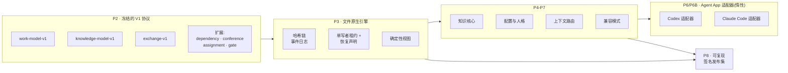

[English](./README.md) | **简体中文** | [日本語](./README.ja.md) | [한국어](./README.ko.md) | [Français](./README.fr.md)

# TCRN Workflow

**面向受治理 AI 智能体工作的确定性、离线优先框架——每一项能力都是机器验证过的声明,而不是一句承诺。**

`状态: 0.1.0-rc.4(预发布候选)` · `许可证: Apache-2.0` · `Node 24.16.0` · `pnpm 11.3.0` · `已验证声明: 65`

---

## 为什么要做这个项目

AI 智能体正被越来越多地要求"交付"——规划工作、编写代码、评审变更、切发布。但绝大多数智能体工作流都有三个结构性弱点:

1. **声明不可验证。**"智能体测过了"通常只是一行日志,不是证明。工作流*声称*保证的东西,与代码*实际*强制的东西之间,没有任何机器可查验的绑定。
2. **状态不可复现。**对话驱动的工作把历史留在不透明的聊天记录和可变数据库里。一旦出问题,没有确定性的事件记录可以重放、审计,或交给评审者。
3. **供应链盲区。**智能体技能与工作流直接从仓库安装,没有发布身份、没有签名、没有防回滚下限,也无法证明你运行的字节就是被评审过的字节。

TCRN Workflow 的目标是同时补上这三个缺口。它用对待安全关键软件发布的严格程度来对待智能体交付:**每一项能力都映射到一个由封闭离线测试证明的稳定原因码**,每一次工作区变更都是只追加的哈希链事件,每一个发布都是不可变、可复现、经签名的工件集。

## 你会得到什么

| 能力 | 实际含义 |
| --- | --- |
| **确定性文件原生工作区** | 事件溯源的本地工作图(Initiative → Epic → Story → Subtask),以规范 JSON 文件 + 哈希链存储——无数据库、无守护进程、导出字节可复现。 |
| **失败即关闭的验证链** | 一条命令(`pnpm verify:p1`)跑 20 道门:格式、lint、类型检查、构建、约 40 个测试文件、信任矩阵、归档/SBOM/许可证/漏洞策略、源码白名单、离线边界、隐私扫描、CI 硬化、验证映射、干净历史证明。任何意外都会终止链条。 |
| **机器可读的声明账本** | `verification-map.yaml` 把 65 项能力声明绑定到可观察的原因码。声明的主体一旦变化,其证明必须重跑——过度声明是构建失败,不是文风问题。 |
| **受治理的合议、门与蒸馏** | 九个受治理的 CLI 动词把预承诺合议与决策门作为可加的哈希链事件驱动,合议关闭会把会议纪要的每条决策蒸馏为一条回链它的知识候选。门的强制是失败即关闭:待定门会阻止其工作项向 `done` 的转移(`WORKSPACE_GATE_PENDING`,动词时与重放时皆然),门只有在具备可解析的合议纪要证据时才能到达 `satisfied`。 |
| **在边界强制的执行者证明** | 追加单向事件 `attestation.actor.enabled` 后,其后每次变更都必须带执行者 ID——在线追加与重放都会对缺失它的事件失败即关闭 `WORKSPACE_ACTOR_REQUIRED`。从不启用的工作区与此前逐字节相同;一旦启用便无法关闭。 |
| **可选的激活阶梯** | 三个显式且逐字节可逆的步骤把惰性的 Claude Code 包变为在线的受治理会话:安装四文件模板(步骤 1),合并恰好一个失败即放行的 `SessionStart` 钩子(步骤 2),在 1024 字节预算内渲染唯一的建议人格 Verity(步骤 3)。处理器是唯一获授权的失败即放行面——任何错误都以 0 退出并回落为纯 Claude Code——`~/.claude` 之下从不被命名或写入。 |
| **快照备份与密封式恢复** | 持租约的 `snapshot-manifest` 产出逐文件的确定性清单;runbook 在原路径上逐字节相同地往返快照 → 擦除 → 恢复,两种教义性失败模式(部分恢复或迁移恢复)均失败即关闭。可选的 git tier-2 仅作完整性见证。 |
| **双宿主 Agent App 适配器** | Codex 与 Claude Code 是 V1 官方支持的两个宿主,共享逐字节相同的宿主中立机制,并有跨宿主一致性摘要证明。两个适配器默认均为**惰性干跑候选**:只生成未安装的模板数据,在线宿主支持仅通过上述可选且受治理的激活阶梯到达。 |
| **离线优先、隐私干净** | 开发模式强制 Node 进程级网络守卫、零遥测。隐私门扫描每一个被跟踪字节、全部可达 git 历史与发布归档,查验个人标识与机器路径。 |
| **签名发布信任** | 发布由标签身份(commit、tree、tag object)绑定,并通过 Ed25519 信任根契约做外部校验——见配套的 `tcrn-workflow-helper` 仓库。 |

## 快速开始

需要钉定工具链:**Node 24.16.0** 与 **pnpm 11.3.0**(依赖生命周期脚本保持禁用)。

```sh
# 1. 获取唯一的开发依赖(显式、冻结、无脚本)
pnpm install --offline --frozen-lockfile --ignore-scripts

# 2. 跑完整验证门(离线)
pnpm verify:p1

# 3. 构建后使用受治理 CLI
pnpm build
node scripts/tcrn-workflow.mjs workspace --help
```

典型受治理命令(全部本地,无网络、无数据库):

```sh
# 校验工作区并物化其确定性视图
node scripts/tcrn-workflow.mjs workspace validate --workspace <目录> --now <ISO时刻>

# 以 CAS 版本检查创建与流转工作记录
node scripts/tcrn-workflow.mjs work-create ...
node scripts/tcrn-workflow.mjs work-transition ...

# 知识核心:元数据优先读取、显式正文访问、晋升 CAS
node scripts/tcrn-workflow.mjs knowledge-list ...
```

变更类命令必须提供显式工作区路径、严格 RFC 3339 时间戳与期望版本——乐观并发由引擎强制,而非约定。

## 架构一览



协议只做加法:`work-model-v1` 已冻结,所有扩展(dependency、conference、assignment、gate)以注册方式加入,不触碰已接受的模式。

## 设计问答(QA)

### 为什么采用"单一规范对话线程 + 多子智能体线程",而不是多线程?

这是被问得最多的问题,答案有三层:

1. **存储层天生单写者。**工作区是纯文件系统上只追加的哈希链事件日志。哈希链对每个事件只有一个真实的后继——并行写者要么破坏链条,要么就需要一个共识协议,而那会摧毁"用 `cat` 和 `sha256sum` 就能审计"的性质。所以引擎通过独占租约 + 磁盘上的恢复声明协议强制**同一时刻只有一个写者**:崩溃写者的租约会被隔离并以失败即关闭的方式回收,每次获取都经 CAS 校验。
2. **推理并行在存储层之上。**并发无处不在——但形式是*相互独立、全新上下文的子智能体线程*(实现工作者、多角色评审板、对抗核证者),它们的结论以数据形式返回。一条规范线程持有决策权并落写记录;N 条子线程并行探索、评审、驳斥,既不互相污染上下文,也不在状态上竞态。你获得并行的吞吐,同时保住线性可审计的决策脉络。
3. **治理需要可串行化的叙事。**单写者链给出决策的线性、防篡改*顺序*,而把每个决策绑定到可问责的执行者现在是被强制的:一旦工作区启用执行者留痕扩展,链所接纳的每个事件都必须声明一个执行者 ID——引擎及其重放都会对任何缺失 ID 的事件失败即关闭——因此一个已留痕的工作区把每个决策都绑定到一个已声明、可审计的执行者。这是写入有序记录的已声明身份,而非对经过认证的身份或挂钟时间真值的主张;将留痕保持停用的工作区一如既往地运行,并把问责托付给治理线程的收据。一群互相修改共享状态的对等线程,既无顺序也无绑定。

**支撑这个答案的测试**(均在 `tests/p3-file-engine.test.mjs`,由 `pnpm verify:p3` 执行):

- *租约创建崩溃与恢复声明竞争可恢复且单写者*——写者在创建中被崩溃,过期租约被隔离,竞争者赛跑且恰有一个胜出;败者以稳定原因码失败即关闭。
- *延迟创建者驱逐*——目录已被回收的暂停租约创建者,必须观察到活跃恢复声明并失败关闭(`WORKSPACE_LEASE_INVALID`),而不是殖民新一代目录。这防御了会回收 inode 的文件系统上的 inode 元组复用(在真实 CI 的 Linux ext4 上发现并修复,再以确定性测试固化)。
- *在每个有效生命周期点注入真实 SIGKILL*——故障清单从真实操作中发现,并在每个点投递真实 `SIGKILL`;恢复必须收敛到零残留的干净状态。
- *64 种真实插入顺序排列*产生逐字节相同的索引、列表与检查点——确定性是被证明的,不是被假设的。
- 另有 4 个并发用例、57 个负向用例,以及文件系统攻击矩阵(符号链接、硬链接、特殊文件、替换竞态)。

### 为什么用文件而不是数据库?

因为信任边界必须能用标准工具检视。每条记录都是规范 JSON(键排序、单个结尾换行),每个事件携带 `priorHash`/`eventHash`,整个存储可以用任何语言几行代码验证。数据库会引入守护进程、二进制格式与隐式信任依赖——对一个核心承诺是*"你可以离线亲自查验一切"*的框架而言,这些都是负债。

### 为什么离线优先、失败即关闭?

一个会悄悄联网的智能体框架,就是一条待触发的数据外泄通道。开发模式安装进程级网络守卫;验证链证明项目代码没有隐式网络路径;仅有的联网步骤(依赖获取、CI 引导)是显式且钉定的。失败即关闭意味着每个校验器在第一个意外字节处抛出稳定原因码——没有滚过屏幕的警告,只有绿色或停止。

### 为什么 Codex 与 Claude Code 适配器是"惰性候选"?

因为在受治理的发布路线接受之前就声称在线宿主支持,恰是过度声明——正是本框架要防止的失败模式。适配器生成确定性的未安装模板包(逐字节证明,包括可逆合并的 `.claude/settings.json` 钩子片段:绝不覆盖用户内容,并拒绝一切用户级 `.claude` 路径)。激活是另一个独立的门控决策。

### 发布如何被信任?

发布 = 不可变注解标签 + 可复现工件集(规范 USTAR 源归档、SBOM、清单、来源证明、校验和、说明),由 `pnpm verify:p8` 重建并逐字节比对。外部消费者通过配套的 **tcrn-workflow-helper** 校验:Ed25519 签名的发布清单与策略、防回滚纪元下限,由零依赖引导程序在任何 Workflow 代码运行前完成校验。

### 测试到底证明了什么——用数字说话

- `verify:p1` 链条 **20 道门**,每道有稳定终态原因码。
- **约 40 个测试文件**,覆盖引擎、知识核心、工件生命周期、配置、人格、上下文路由、双适配器、交换、兼容、需求账本、发布候选、隐私边界、证明工件生成器、信任矩阵、合议/门事件日志存储与失败即关闭的门强制、执行者证明、快照备份与恢复、激活阶梯,以及端到端受治理循环。
- **1 个端到端旗舰证明**(`pnpm verify:e2e`)——对完整受治理循环(initiative → epic → story → 门 → 合议 → 蒸馏 → 晋升 → 追溯)的一次密封式重放,逐字执行每条教程命令,并把每个产出的摘要追溯到其产生者。
- `verification-map.yaml` 中 **65 项机器验证声明**。
- 三个独立层次的 **64 排列确定性证明**(引擎插入序、配置层序、适配器输入序)。
- **19 行公共 AOS 需求账本**(11 行夹具已验证、8 行已规格化)——成熟度逐行如实记录,绝不虚标。
- **隐私门**覆盖约 200 个跟踪源文件、约 1470 个 git 对象、全部可达历史与发布归档。

<details>
<summary><b>完整验证目标参考</b>(点击展开)</summary>

| 目标 | 证明内容 |
| --- | --- |
| `verify:p1` | 干净已提交树上的完整 20 门链条。 |
| `verify:p2` | 冻结 V1 协议契约、确定性向量、负向/属性测试、需求账本、封闭模式。 |
| `verify:p3` | 文件原生工作区:租约/CAS、崩溃恢复、隔离区、迁移、确定性视图、文件系统攻击矩阵。 |
| `verify:p4` / `verify:p4:knowledge` | 工件生命周期预算、脱敏、一次性归档应用/恢复;知识核心元数据/正文分离、晋升 CAS、64 排列一致性。 |
| `verify:p5` | 封闭通用配置信任模型、有效策略摘要、冷启动图、八个惰性 Core Reference 人格。 |
| `verify:p6` / `verify:p6:adapter` / `verify:p6b` | 上下文路由的范围/风险/预算控制与敌意语料;Codex 适配器桥;Claude Code 适配器(四文件模板包、可逆设置片段、禁止路径拒斥、CLAUDE.md 回退、跨宿主一致性摘要)。 |
| `verify:p7` / `verify:p7:compatibility` | 规范交换、兼容清单、防回滚下限、确定性导入/检查点/回退方案。 |
| `verify:p8` | 可复现发布候选:源归档重建 + 字节比对、SBOM、来源证明、校验和、六文件封闭包、外部信任负向矩阵。 |
| `verify:privacy` | 任何跟踪字节、git 对象或归档中都没有个人标识与机器路径。 |
| `verify:isolated` | 从封闭依赖物化环境重跑同一 P1 链条(CI 门控)。 |

开发模式离线运行,带进程网络守卫与零遥测。工作区只有一个开发依赖(`ajv@8.17.1`,用于离线 Draft 2020-12 模式一致性证明),经显式注册表边界获取且禁用生命周期脚本。P1 保留四条显式外部边界:跨调用 `rootVersion` 连续性需外部下限;没有操作系统级网络沙箱;离线不执行新鲜外部安全通告扫描;隐私正则集是聚焦的策略控制,不是通用 DLP。

</details>

## 仓库结构

| 路径 | 内容 |
| --- | --- |
| `packages/core/` | 引擎、适配器、知识核心、配置、路由、交换(TypeScript,由钉定 Node 类型转换引擎构建)。 |
| `schemas/` · `specs/` | 冻结的 V1 协议模式(封闭、已证 Draft 2020-12 一致)及其规范文本。 |
| `tests/` | 封闭证明套件。 |
| `scripts/` | 受治理 CLI、验证任务、证明工件生成器、隐私/策略门。 |
| `fixtures/` | 确定性协议向量、敌意语料、需求账本引用。 |
| `docs/` | 架构、发布信任、版本策略、发布说明。 |
| `verification-map.yaml` | 声明账本——想知道什么被真正证明了,从这里开始。 |

## 状态(如实陈述)

- `0.1.0-rc.4` 是**预发布候选**。公共 API 尚未稳定。
- 两个宿主适配器均为惰性干跑候选;**不声称任何在线 Codex 或 Claude Code 支持**。
- `supportedAosReleases` 为空:不声称任何外部 AOS 兼容性。
- 除非外部 Ed25519 信任校验成功,发布模式不可用。

## 贡献、支持与安全

- 使用问题 → GitHub Discussions;可复现缺陷 → Issues(见 `SUPPORT.md`)。
- 安全报告 → 按 `SECURITY.md` 走私密漏洞报告。
- 贡献必须保持所有门为绿——见 `CONTRIBUTING.md`。标准是:*声明若不在验证映射里并带着通过的证明,就等于没有声明。*

## 许可证

[Apache-2.0](./LICENSE)
